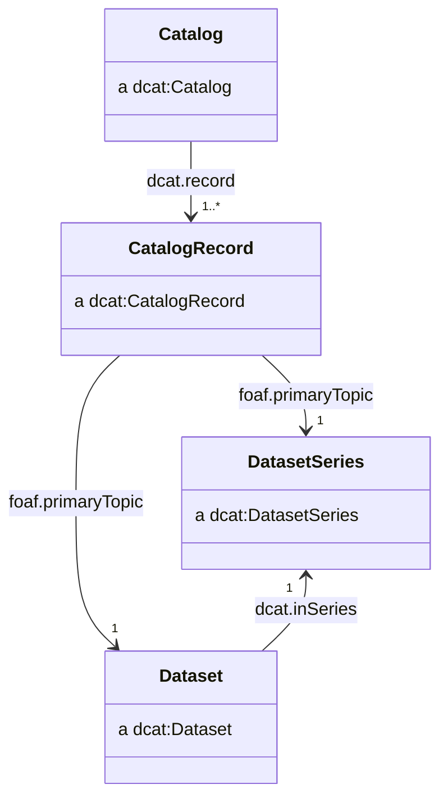
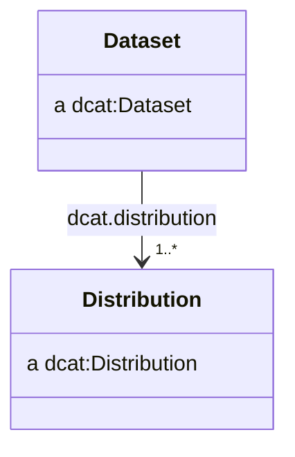
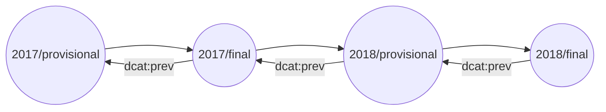
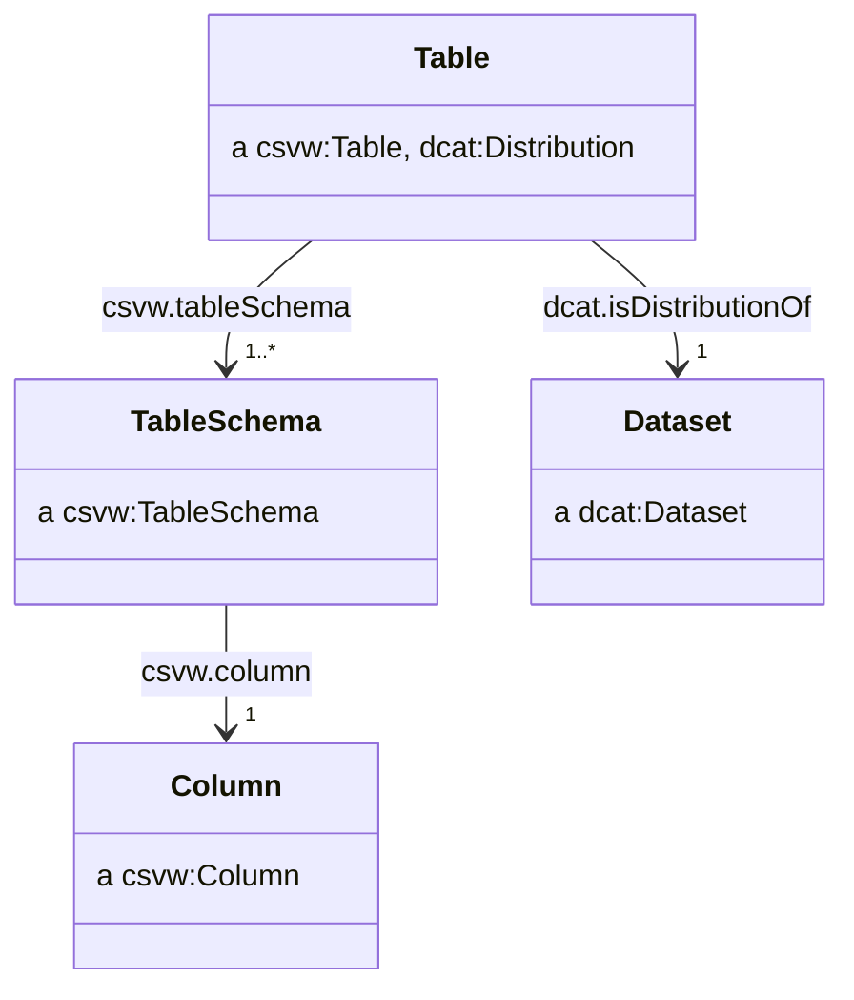
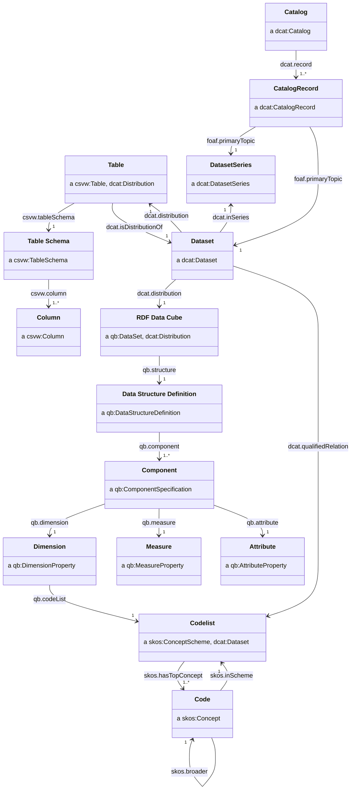

# Application Profile

_Working draft._

The key words must, must not, required, shall, shall not, should, should not, recommended, may, and optional are to be interpreted as described in RFC 2119.

- [Application Profile](#application-profile)
  - [Preamble](#preamble)
    - [Data on the Web Best Practises](#data-on-the-web-best-practises)
    - [Five star data](#five-star-data)
    - [FAIR principles](#fair-principles)
    - [CSV on the Web](#csv-on-the-web)
  - [Specifications used](#specifications-used)
  - [Cataloguing](#cataloguing)
    - [Classes](#classes)
    - [Catalog](#catalog)
    - [Catalogue record](#catalogue-record)
    - [Dataset](#dataset)
    - [Dataset series](#dataset-series)
    - [Distributions](#distributions)
    - [Named graphs for catalogue metadata](#named-graphs-for-catalogue-metadata)
    - [Content negotiation of distributions](#content-negotiation-of-distributions)
    - [Editions](#editions)
      - [Scheduled revisions (provisional and final releases)](#scheduled-revisions-provisional-and-final-releases)
    - [Versions](#versions)
  - [Publish CSV on the web (CSVW)](#publish-csv-on-the-web-csvw)
    - [Structural CSV metadata](#structural-csv-metadata)
    - [CSVs as self-contained datasets](#csvs-as-self-contained-datasets)
    - [Discoverability of CSVW](#discoverability-of-csvw)
    - [Foreign-key constraints](#foreign-key-constraints)
  - [Appendicies](#appendicies)
    - [Publishers, creators and contacts](#publishers-creators-and-contacts)
    - [Class diagram](#class-diagram)
    - [Future work](#future-work)
      - [Provenance](#provenance)

## Preamble

The UK government often [publishes its statistics](https://www.gov.uk/search/research-and-statistics?content_store_document_type=statistics_published&order=updated-newest) in presentational spreadsheets. While this succeeds in getting important information into the public domain, we recognise there are still barriers and challenges in accessing and using the data we produce:

- Analysts need to wrangle data because data are in unstandardised and presentational formats.
- A user must locate and navigate through many large spreadsheets to understand what data are available.
- Metadata are provided in an unstructured or unstandardised ways.
- Data are in silos, making it difficult to link or relate statistics from different sources.
- The accessibility and usability of statistics varies from dataset to dataset.

We have explored how to follow best practices when publishing statistics, in particular through the use of the CSV on the Web (CSVW), Data Catalog (DCAT) and RDF Data Cube (QB) standards and vocabularies. This document is an application profile of these standards, describing a recommendation on how to use these standards together in order to achieve the data on the web best practices, 5-star data, and the FAIR data principles.

### Data on the Web Best Practises

The [Data on the Web Best Practices (DWBP)](https://www.w3.org/TR/dwbp/) describes recommendations for publishing data to the web. If followed, we can enable these benefits:

> - **Comprehension**: humans will have a better understanding about the data structure, the data meaning, the metadata and the nature of the dataset.
> - **Processability**: machines will be able to automatically process and manipulate the data within a dataset.
> - **Discoverability** machines will be able to automatically discover a dataset or data within a dataset.
> - **Reuse**: the chances of dataset reuse by different groups of data consumers will increase.
> - **Trust**: the confidence that consumers have in the dataset will improve.
> - **Linkability**: it will be possible to create links between data resources (datasets and data items).
> - **Access**: humans and machines will be able to access up to date data in a variety of forms.
> - **Interoperability**: it will be easier to reach consensus among data publishers and consumers.

### Five star data

5★ Open Data has a five point scale which describes data on the web which increases the utility of said data for each increase from one to five stars.

|   Stars    | Requirements                                                                                         |
| :--------: | :--------------------------------------------------------------------------------------------------- |
| ★☆☆☆☆      | data needs to be able to be published on the web,                                                    |
| ★★☆☆☆      | data needs to be machine-readable,                                                                   |
| ★★★☆☆      | data needs to be non-proprietary,                                                                    |
| ★★★★☆      | identifiers need to be used to denote things, so that people can talk about resources unambiguously, |
| ★★★★★      | data needs to able to be linkied to other data to provide context.                                   |

### FAIR principles

To aid humans who increasingly rely on computational support to deal with increased volumes of data, complexity, and creation speed of data, the [FAIR principles](https://www.go-fair.org/fair-principles/) were conceived.

The FAIR principles describe data which is:

> - **Findable**: data and metadata encoded for machines and humans
> - **Accessible**: using standard protocols for access and authentication of data
> - **Interoperable**: data and metadata is represented in an appropriate knowledge representation standard
> - **Reusable**: using common vocabularies for knowledge representation allows for reuse and remixing of data

### CSV on the Web

> CSVW extends standard CSV with the ingredients for a reliable, flexible and extensible data exchange format. Most importantly, CSVW accommodates metadata. [^csvw-intro]

The [CSV on the Web (CSVW) standard](https://w3c.github.io/csvw/syntax/) provides a method for describing and clarifying the content of CSV tabular data.

The CSV format is at its best when machine readable. CSVW improves machine-readability by pairing CSV with a JSON document to provide additional metadata to describe the content of the CSV file.

One such improvement to CSVs is providing data type information for cells contents so they can be mapped as decimals, integers, dates, etc. without ambiguity. Furthermore, CSVW is extensible to fully 5-star linked-data, providing a mapping to the contents of a CSV file to RDF.

## Specifications used

The Application Profile uses terms from various existing specifications. Classes and properties specified in the following sections come from the following namespaces.

| Namespace | Namespace IRI                                 | Specification name                                                                   |
| --------- | --------------------------------------------- | ------------------------------------------------------------------------------------ |
| `adms`    | `http://www.w3.org/ns/adms#`                  | Asset Description Metadata Schema                                                    |
| `dcat`    | `http://www.w3.org/ns/dcat#`                  | Data Catalog Vocabulary                                                              |
| `dcterms` | `http://purl.org/dc/terms/`                   | DCMI (Dublin Core Metadata Initiative) Metadata Terms                                |
| `dpv`     | `http://www.w3.org/ns/dpv#`                   | Data Privacy Vocabulary (DPV)                                                        |
| `foaf`    | `http://xmlns.com/foaf/0.1/`                  | FOAF (Friend of a friend) Vocabulary                                                 |
| `owl`     | `http://www.w3.org/2002/07/owl#`              | OWL Web Ontology Language                                                            |
| `prov`    | `http://www.w3.org/ns/prov#`                  | Provenance Vocabulary                                                                |
| `qb`      | `http://purl.org/linked-data/cube#`           | RDF Data Cube Vocabulary                                                             |
| `rdfs`    | `http://www.w3.org/2000/01/rdf-schema#`       | RDF (Resource Description Framework) Vocabulary Description Language 1.0: RDF Schema |
| `skos`    | `http://www.w3.org/2004/02/skos/core#`        | SKOS Simple Knowledge Organization System - Reference                                |
| `spdx`    | `http://spdx.org/rdf/terms#`                  | Software Package Data Exchange                                                       |
| `vcard`   | `http://www.w3.org/2006/vcard/ns#`            | File format standard for electronic business cards                                   |
| `wdrs`    | `http://www.w3.org/2007/05/powder-s#`         | Protocol for Web Description Resources (POWDER-S)                                    |
| `xkos`    | `http://rdf-vocabulary.ddialliance.org/xkos#` | XKOS: an SKOS extension for representing statistical classifications                 |
| `xsd`     | `http://www.w3.org/2001/XMLSchema#`           | XML Schema Part 2: Datatypes Second Edition                                          |


## Cataloguing

A catalogue is a collection of metadata about datasets which has been gathered and curated. Catalogues are often used to provide a single point of access to a collection of datasets, and to provide a means of discovering datasets. We adopt the [DCAT](https://www.w3.org/TR/vocab-dcat-3/) vocabulary for describing catalogues and their contents.

### Classes



We recommend the use of `dcat:Catalog`, `dcat:CatalogRecord`, `dcat:DatasetSeries` and `dcat:Dataset` classes.

### Catalog

We recommend catalogues have IRIs of the form:

- ```http://{domain}/catalogue```
- ```http://{domain}/catalogue/{catalogue_slug}```

For example:

- ```http://data.gov.uk/catalogue```
- ```http://data.gov.uk/catalogue/climate-change```

We recommend the use of the following properties:

| Property                | Requirement level | Notes                                                                      |
| ----------------------- | ----------------- | -------------------------------------------------------------------------- |
| `dcterms:title`         | mandatory         | See [titles](#titles)                                                      |
| `dcterms:description`   | mandatory         | See [descriptions](#descriptions)                                          |
| `dcterms:publisher`     | mandatory         | See [publishers, creators and contacts](#publishers-creators-and-contacts) |
| `dcterms:creator`       | recommended       | See [publishers, creators and contacts](#publishers-creators-and-contacts) |
| `dcat:contactPoint`     | recommended       | See [publishers, creators and contacts](#publishers-creators-and-contacts) |
| `dcterms:issued`        | recommended       | See [dates and times](#dates-and-times)                                    |
| `dcterms:modified`      | recommended       | See [dates and times](#dates-and-times)                                    |
| `dcterms:themeTaxonomy` | optional          | See [themes](#themes)                                                      |

For example:

```ttl
@prefix dcat: <http://www.w3.org/ns/dcat#> .
@prefix dcterms: <http://purl.org/dc/terms/> .

<http://data.gov.uk/catalogue/climate-change> a dcat:Catalog ;
    dcterms:title "Climate change datasets"@en ;
    dcterms:description "A catalogue of datasets about climate change"@en ;
    dcterms:publisher <http://www.gov.uk/government/organisations/department-for-business-energy-and-industrial-strategy> ;
    dcterms:creator <http://www.gov.uk/government/organisations/department-for-business-energy-and-industrial-strategy> ;
    dcat:contactPoint <http://data.gov.uk/catalogue/climate-change/contact> ;
    dcterms:issued "2015-01-01"^^xsd:date ;
    dcterms:modified "2015-01-01"^^xsd:date ;
    dcterms:themeTaxonomy <http://data.gov.uk/themes> ;
    .
```

### Catalogue record

We recommend creaing a IRI for catalogue records by appending `/record` or `#record` to the IRI of the resource being described by the catalogue record:

- `http://{dataset_iri}/record`
- `http://{dataset_iri}#record`

For example:

- `http://data.gov.uk/dataset/my-dataset/record`
- `http://data.gov.uk/dataset/my-dataset#record`

| Property               | Requirement level | Notes                                                                          |
| ---------------------- | ----------------- | ------------------------------------------------------------------------------ |
| `dcterms:issued`       | mandatory         | See [dates and times](#dates-and-times)                                        |
| `foaf:primaryTopic`    | mandatory         | This points to the IRI of the `dcat:Dataset` described by the catalogue record |
| `prov:wasAttributedTo` | recommended       |                                                                                |
| `dcterms:modified`     | recommended       | See [dates and times](#dates-and-times)                                        |

### Dataset

We recommend standalone datasets have IRIs in the form of

- `http://{domain}/dataset/{dataset_slug}`

For example:

- `http://data.gov.uk/dataset/my-dataset`

For datasets belonging to a dataset series, we recommend extending the series IRI to form the dataset IRI. We recommend the `edition_slug` adopt identifiers from the [`reference.data.gov.uk` service](https://github.com/epimorphics/IntervalServer/blob/master/interval-uris.md).

- `http://{domain}/series/{series_slug}/dataset/{edition_slug}`

For example:

- `http://data.gov.uk/series/some-dataset-series/dataset/2018-Q3`

We recommend the use of the following properties:

| Property                     | Requirement level | Notes                                                                      |
| ---------------------------- | ----------------- | -------------------------------------------------------------------------- |
| `dcterms:title`              | mandatory         | See [titles](#titles)                                                      |
| `dcterms:description`        | mandatory         | See [descriptions](#descriptions)                                          |
| `dcterms:publisher`          | mandatory         | See [publishers, creators and contacts](#publishers-creators-and-contacts) |
| `dcterms:license`            | mandatory         | See [licenses](#licenses)                                                  |
| `dcat:distribution`          | recommended       | See [distributions](#distributions)                                        |
| `dcterms:creator`            | recommended       | See [publishers, creators and contacts](#publishers-creators-and-contacts) |
| `dcat:contactPoint`          | recommended       | See [publishers, creators and contacts](#publishers-creators-and-contacts) |
| `dcterms:issued`             | recommended       | See [dates and times](#dates-and-times)                                    |
| `dcterms:modified`           | recommended       | See [dates and times](#dates-and-times)                                    |
| `dcat:keyword`               | recommended       | See [keywords](#keywords)                                                  |
| `dcat:theme`                 | recommended       | See [themes](#themes)                                                      |
| `dcterms:accrualPeriodicity` | recommended       | See [frequency](#frequency)                                                |
| `dcterms:spatial`            | recommended       | See [geography](#geography)                                                |
| `dcterms:temporal`           | recommended       | See [dates and times](#dates-and-times)                                    |
| `dcat:inSeries`              | recommended       | See [editions](#editions)                                                  |
| `dcat:hasCurrentVersion`     | recommended       | See [versions](#versions)                                                  |
| `dcat:hasVersion`            | recommended       | See [versions](#versions)                                                  |
| `dcat:version`               | recommended       | See [versions](#versions)                                                  |
| `adms:versionNotes`          | recommended       | See [versions](#versions)                                                  |
| `dcat:prev`                  | recommended       | See [versions](#versions)                                                  |
| `dcat:landingPage`           | optional          |                                                                            |
| `dcterms:identifier`         | optional          |                                                                            |
| `dcterms:isReferencedBy`     | optional          |                                                                            |

For example:

```ttl
<http://data.gov.uk/series/greenhouse-gas-emissions/dataset/2018> a dcat:Dataset ;
    dcterms:title "Final UK greenhouse gas emissions national statistics: 1990 to 2018"@en ;
    dcterms:description "Final estimates of UK territorial greenhouse gas emissions..."@en ;
    dcterms:license <http://www.nationalarchives.gov.uk/doc/open-government-licence/version/3/> ;
    dcterms:publisher <http://www.gov.uk/government/organisations/department-for-business-energy-and-industrial-strategy> ;
    dcterms:issued "2020-02-04T09:30:00"^^xsd:dateTime ;
    dcterms:modified "2020-07-30T08:30:06"^^xsd:dateTime ;
    dcat:keyword "greenhouse gases"@en, "carbon emissions"@en, "greenhouse gas emissions"@en ;
    dcat:theme <http://osr.statisticsauthority.gov.uk/themes/transport-environment-climate-change/> ;
    dcat:contactPoint <http://data.gov.uk/series/greenhouse-gas-emissions/dataset/2018/contact> ;
    dcat:distribution <http://data.gov.uk/series/greenhouse-gas-emissions/dataset/2018/datacube>, 
        <http://data.gov.uk/series/greenhouse-gas-emissions/dataset/2018.csv>, 
        <http://data.gov.uk/series/greenhouse-gas-emissions/dataset/2018.json> ;
    dcterms:isReferencedBy <http://www.gov.uk/government/statistics/final-uk-greenhouse-gas-emissions-national-statistics-1990-to-2018> ;
    dcat:landingPage "http://data.gov.uk/series/greenhouse-gas-emissions/dataset/2018"^^xsd:anyURI ;
    dcterms:accrualPeriodicity <http://purl.org/cld/freq/annual> ;
    dcterms:spatial <http://statistics.data.gov.uk/id/statistical-geography/K02000001> ;
    dcterms:temporal <http://reference.data.gov.uk/id/gregorian-interval/1990-01-01T00:00:00/P28Y> ;
    dcat:inSeries <http://data.gov.uk/series/greenhouse-gas-emissions> ;
    dcat:hasCurrentVersion <http://data.gov.uk/series/greenhouse-gas-emissions/dataset/2018/version/2> ;
    dcat:hasVersion <http://data.gov.uk/series/greenhouse-gas-emissions/dataset/2018/version/1>, 
        <http://data.gov.uk/series/greenhouse-gas-emissions/dataset/2018/version/2> ;
    dcat:version 2 ;
    adms:versionNotes "Dataset was corrected following an error being recognised."@en ;
    dcat:prev <http://data.gov.uk/series/greenhouse-gas-emissions/dataset/2017> ;
    dcterms:identifier "ghg-2018" ;
    .
```

### Dataset series

Our use of dataset series is described in [editions](#editions).

We recommend dataset series have IRIs of the form:

- `http://{domain}/series/{series_slug}`

For example:

- `http://data.gov.uk/series/some-dataset-series`

We recommend the use of the following properties:

| Property                     | Requirement level | Notes                                                                      |
| ---------------------------- | ----------------- | -------------------------------------------------------------------------- |
| `dcterms:title`              | mandatory         | See [titles](#titles)                                                      |
| `dcterms:description`        | mandatory         | See [descriptions](#descriptions)                                          |
| `dcterms:publisher`          | mandatory         | See [publishers, creators and contacts](#publishers-creators-and-contacts) |
| `dcterms:license`            | mandatory         | See [licenses](#licenses)                                                  |
| `dcterms:creator`            | recommended       | See [publishers, creators and contacts](#publishers-creators-and-contacts) |
| `dcat:contactPoint`          | recommended       | See [publishers, creators and contacts](#publishers-creators-and-contacts) |
| `dcterms:issued`             | recommended       | See [dates and times](#dates-and-times)                                    |
| `dcterms:modified`           | recommended       | See [dates and times](#dates-and-times)                                    |
| `dcat:keyword`               | recommended       | See [keywords](#keywords)                                                  |
| `dcat:theme`                 | recommended       | See [themes](#themes)                                                      |
| `dcterms:accrualPeriodicity` | recommended       | See [frequency](#frequency)                                                |
| `dcterms:spatial`            | recommended       | See [geography](#geography)                                                |
| `dcterms:temporal`           | recommended       | See [dates and times](#dates-and-times)                                    |

For example:

```ttl
@prefix dcterms: <http://purl.org/dc/terms/> .
<http://data.gov.uk/series/greenhouse-gas-emissions> a dcat:DatasetSeries ;
    dcterms:title "UK territorial greenhouse gas emissions national statistics"@en ;
    dcterms:description "Final and provisional estimates of UK territorial greenhouse gas emissions from 1990."@en ;
    dcterms:publisher <http://www.gov.uk/government/organisations/department-for-business-energy-and-industrial-strategy> ;
    dcterms:license <http://www.nationalarchives.gov.uk/doc/open-government-licence/version/3/> ;
    dcterms:issued "2015-02-11T09:30:00"^^xsd:dateTime ;
    dcterms:modified "2022-03-31T08:30:14"^^xsd:dateTime ;
    .
```

Many of the properties which apply to dataset series are also applicable to datasets within that series. We recommend specifying properties for both resources.

### Distributions



> a `dcat:Distribution` represents an accessible form of a dataset such as a downloadable file.

We recommend distributions have IRIs which are identical to the dataset IRI, with file extension appended.

- `http://{dataset_iri}.{extension}`

The exception is when representing an RDF data cube as a distribution, for which there is no physical file and therefore no extension. In that instance, we recommend appending `/datacube` or `#datacube` to the dataset IRI (see [Data cube](#data-cube)).

For example:

- `http://data.gov.uk/dataset/my-dataset.csv`
- `http://data.gov.uk/dataset/my-dataset.ttl`
- `http://data.gov.uk/dataset/my-dataset.json`
- `http://data.gov.uk/dataset/my-dataset/datacube`

| Property                | Requirement level | Notes                                                                          |
| ----------------------- | ----------------- | ------------------------------------------------------------------------------ |
| `dcterms:title`         | mandatory         | See [titles](#titles)                                                          |
| `dcterms:description`   | mandatory         | See [descriptions](#descriptions)                                              |
| `dcterms:license`       | mandatory         | See [licenses](#licenses)                                                      |
| `dcterms:creator`       | recommended       | See [publishers, creators and contacts](#publishers-creators-and-contacts)     |
| `dcterms:issued`        | recommended       | See [dates and times](#dates-and-times)                                        |
| `dcterms:modified`      | recommended       | See [dates and times](#dates-and-times)                                        |
| `dcat:isDistributionOf` | recommended       | See [CSVs as self contained datasets](#csvs-as-self-contained-datasets)        |
| `dcat:mediaType`        | recommended       | See [media types](#media-types)                                                |
| `dcat:downloadURL`      | recommended       |                                                                                |
| `dcat:byteSize`         | recommended       |                                                                                |
| `spdx:checksum`         | recommended       | See [checksums](#checksums)                                                    |
| `wdrs:describedby`      | optional          | For CSV distributions, we can relate the CSVW metadata using`wdrs:describedby` |

For example:

```ttl
@prefix dcterms: <http://purl.org/dc/terms/> .

<http://data.gov.uk/series/greenhouse-gas-emissions/dataset/2018.csv> a dcat:Distribution ;
    dcterms:title "Final UK greenhouse gas emissions national statistics: 1990 to 2018 (CSV)"@en ;
    dcterms:description "Final estimates of UK territorial greenhouse gas emissions..."@en ;
    dcterms:license <http://www.nationalarchives.gov.uk/doc/open-government-licence/version/3/> ;
    dcterms:issued "2020-02-04T09:30:00"^^xsd:dateTime ;
    dcterms:modified "2020-07-30T08:30:06"^^xsd:dateTime ;
    dcterms:title "2018.csv" ;
    wdrs:describedby <http://data.gov.uk/series/greenhouse-gas-emissions/dataset/2018.csv-metadata.json> ;
    dcat:mediaType <http://www.w3.org/ns/iana/media-types/text/csv#Resource> ;
    dcat:downloadURL <http://data.gov.uk/series/greenhouse-gas-emissions/dataset/2018.csv> ;
    dcat:byteSize "12345"^^xsd:nonNegativeInteger ;
    spdx:checksum [
        spdx:checksumValue "CE114E4501D2F4E2DCEA3E17B546F339"^^xsd:hexBinary ;
        spdx:checksumAlgorithm spdx:checksumAlgorithm_sha256 ;
    ] ;
    .
```

### Named graphs for catalogue metadata

Where metadata is stored as RDF, such as being made available via a SPARQL endpoint, DCAT makes a recommendation about the names of graphs to use for catalogue records.

> If a catalog is represented as an RDF Dataset with named graphs (as defined in [[SPARQL11-QUERY]](https://www.w3.org/TR/sparql11-query/)), then it is appropriate to place the description of each dataset (consisting of all RDF triples that mention the dcat:Dataset, dcat:CatalogRecord, and any of its dcat:Distributions) into a separate named graph. The name of that graph SHOULD be the IRI of the catalog record.[^named-graphs]

```ttl
<http://data.gov.uk/dataset/my-dataset/record> {
    ...
}
```

Doing this results in a neat ability to query for dataset metadata by limiting a SPARQL query to the IRI of the catalogue record.

```sparql
SELECT * 
FROM <http://data.gov.uk/dataset/my-dataset/record> 
WHERE {
    ?s ?p ?o .
}
```

### Content negotiation of distributions

We recommend that data providers implement content negotiation as a method for clients to access the data in the format they require.

The IRI of the `dcat:Dataset` should be used as the generic IRI which a user can request different formats of the data from.

For example, a `dcat:Dataset` with an IRI of `http://data.gov.uk/dataset/my-dataset` may have a CSV distribution with its own IRI of `http://data.gov.uk/dataset/my-dataset.csv`. A user agent wishing to access the data in CSV format could navigate to `http://data.gov.uk/dataset/my-dataset.csv` directly, or content negotiate against the IRI of the `dcat:Dataset` to find the CSV distribution.

```sh
curl http://data.gov.uk/dataset/my-dataset -H "Accept: text/csv"
```

### Editions

> **Note**
> `dcat:DatasetSeries` is recommended as part of [DCAT v3](https://w3c.github.io/dxwg/dcat/), which is still in draft.

Many statistics producers publish sets of statistics at a regular frequency as monthly, quarterly, or annual releases.

We refer to these as _editions_, as opposed to [_versions_](#versions) which are used to specifically describe changes in a dataset resulting from a revision.

Each edition is a `dcat:Dataset`, with a unique IRI which typically contains the latest time period for which data is available.

For example, `http://data.gov.uk/series/name-of-my-statistical-series/dataset/2018` is the IRI of the 2018 edition of the series `name-of-my-statistical-series`.

Editions must be related to their associated `dcat:DatasetSeries`. The dataset series must have an IRI which does not reference particular time period and can represent the collection of editions.

For example, the following dataset series has two editions from 2017 and 2018.

```ttl
<http://data.gov.uk/series/name-of-my-statistical-series> a dcat:DatasetSeries .

<http://data.gov.uk/series/name-of-my-statistical-series/dataset/2018> a dcat:Dataset ;
    dcat:inSeries <http://data.gov.uk/series/name-of-my-statistical-series> ;
    dcat:prev <http://data.gov.uk/series/name-of-my-statistical-series/dataset/2017> ;
    .

<http://data.gov.uk/series/name-of-my-statistical-series/dataset/2017> a dcat:Dataset ;
    dcat:inSeries <http://data.gov.uk/series/name-of-my-statistical-series> ;
    dcat:prev <http://data.gov.uk/series/name-of-my-statistical-series/dataset/2016> ;
    .
```

#### Scheduled revisions (provisional and final releases)

Statisticians may wish to release early or provisional estimates of statistics which are later revised as "final" statistics when additional data is available. The Government Statistical Service [refers to these as scheduled revisions](https://analysisfunction.civilservice.gov.uk/policy-store/communicating-quality-uncertainty-and-change/).

The IRIs of provisional and final datasets should contain `provisional` or `final`. Provisional and final statistics can both be attached to the same dataset series and related to one another by the `dcat:prev` property.



For example, the following dataset series has two editions from both 2017 and 2018, one provisional and one final.

```ttl
<http://data.gov.uk/series/name-of-my-statistical-series> a dcat:DatasetSeries .

<http://data.gov.uk/series/name-of-my-statistical-series/dataset/2018/final> a dcat:Dataset ;
    dcat:inSeries <http://data.gov.uk/series/name-of-my-statistical-series> ;
    dcat:prev <http://data.gov.uk/series/name-of-my-statistical-series/dataset/2018/provisional> ;
    .

<http://data.gov.uk/series/name-of-my-statistical-series/dataset/2018/provisional> a dcat:Dataset ;
    dcat:inSeries <http://data.gov.uk/series/name-of-my-statistical-series> ;
    dcat:prev <http://data.gov.uk/series/name-of-my-statistical-series/dataset/2017/final> ;
    .

<http://data.gov.uk/series/name-of-my-statistical-series/dataset/2017/final> a dcat:Dataset ;
    dcat:inSeries <http://data.gov.uk/series/name-of-my-statistical-series> ;
    dcat:prev <http://data.gov.uk/series/name-of-my-statistical-series/dataset/2017/provisional> ;
    .

<http://data.gov.uk/series/name-of-my-statistical-series/dataset/2017/provisional> a dcat:Dataset ;
    dcat:inSeries <http://data.gov.uk/series/name-of-my-statistical-series> ;
    dcat:prev <http://data.gov.uk/series/name-of-my-statistical-series/dataset/2016/final> ;
    .
```

### Versions

> **Note**
> `dcat:version` is recommended as part of [DCAT v3](https://w3c.github.io/dxwg/dcat/), which is still in draft.

Different versions of a dataset are the result of an unscheduled revision or correction.

We recommend the IRI of a `dcat:Dataset` is chosen to be generic and not specific to a particular version. A user should expect that the generic IRI of a dataset refers to the latest version of the dataset.

IRIs should be created to represent each specific version of a dataset. We should assert an equivalence between IRI of the generic dataset and the latest version of the dataset with an `owl:sameAs` relationship, for example:

```ttl
<http://data.gov.uk/series/name-of-my-statistical-series/dataset/2018>
    owl:sameAs
        <http://data.gov.uk/series/name-of-my-statistical-series/dataset/2018/version/2> ;
    .
```

| Property                 | Requirement level |
| ------------------------ | ----------------- |
| `dcat:hasCurrentVersion` | recommended       |
| `dcat:hasVersion`        | recommended       |
| `dcat:version`           | recommended       |
| `adms:versionNotes`      | recommended       |
| `dcat:prev`              | recommended       |

For specific versions, we recommend using the following properties:

| Property                | Requirement level |
| ----------------------- | ----------------- |
| `dcterms:issued`        | recommended       |
| `dcat:isVersionOf`      | recommended       |
| `dcat:previousVersion`  | recommended       |
| `prov:wasRevisionOf`    | recommended       |
| `prov:specializationOf` | recommended       |

```ttl
<http://data.gov.uk/series/name-of-my-statistical-series/dataset/2018> a dcat:Dataset ;
    dcat:hasCurrentVersion <http://data.gov.uk/series/name-of-my-statistical-series/dataset/2018/version/2> ;
    dcat:hasVersion <http://data.gov.uk/series/name-of-my-statistical-series/dataset/2018/version/1>, 
        <http://data.gov.uk/series/name-of-my-statistical-series/dataset/2018/version/2> ;
    dcat:version 2 ;
    adms:versionNotes "Dataset was corrected following an error being recognised."@en ;
    dcat:prev <http://data.gov.uk/series/name-of-my-statistical-series/dataset/2017> ;
    .

<http://data.gov.uk/series/name-of-my-statistical-series/dataset/2018/version/2> a dcat:Dataset ;
    dcterms:issued "2018-03-01T00:00:00Z"^^xsd:dateTime ;
    dcat:isVersionOf <http://data.gov.uk/series/name-of-my-statistical-series/dataset/2018> ;
    dcat:previousVersion <http://data.gov.uk/series/name-of-my-statistical-series/dataset/2018/version/1>;
    prov:wasRevisionOf <http://data.gov.uk/series/name-of-my-statistical-series/dataset/2018/version/1>;
    prov:specializationOf <http://data.gov.uk/series/name-of-my-statistical-series/dataset/2018>;
    .

<http://data.gov.uk/series/name-of-my-statistical-series/dataset/2018/version/1> a dcat:Dataset ;
    dcterms:issued "2018-01-01T00:00:00Z"^^xsd:dateTime ;
    dcat:isVersionOf <http://data.gov.uk/series/name-of-my-statistical-series/dataset/2018> ;
    prov:specializationOf <http://data.gov.uk/series/name-of-my-statistical-series/dataset/2018>;
    prov:invalidatedAtTime "2018-03-01T00:00:00Z"^^xsd:dateTime ;
    .
```

## Publish CSV on the web (CSVW)

Our aim is to publish metadata in a machine readable and structured format alongside the statistical data.

Structured data formats, such as JSON-LD can be understood by search engines and are used for [search engine optimisation](https://developers.google.com/search/docs/advanced/structured-data/intro-structured-data), with some search engines offering specific [dataset search functionality](https://developers.google.com/search/docs/advanced/structured-data/dataset) where structured metadata are provided using common vocabularies such as DCAT or [schema.org](https://schema.org/).

### Structural CSV metadata

The most basic of CSVW metadata will include the `tableSchema` properties with details of the columns in the CSV. Since the CSVW metadata specification includes several defaults for properties, a basic CSVW provides some implicit information, such as the file being comma delimited.

We can consider the following CSV file:

| area      | period                  | sex    | life_expectancy |
| --------- | ----------------------- | ------ | --------------- |
| W06000022 | 2004-01-01T00:00:00/P3Y | Male   | 76.7            |
| W06000022 | 2004-01-01T00:00:00/P3Y | Female | 80.7            |
| W06000015 | 2004-01-01T00:00:00/P3Y | Male   | 78.7            |
| W06000015 | 2004-01-01T00:00:00/P3Y | Female | 83.3            |
| ...       | ...                     | ...    | ...             |

Given the above CSV, a minimal CSVW metadata file would look as follows:

```json
{
    "@context": "http://www.w3.org/ns/csvw",
    "url": "http://data.gov.uk/dataset/life-expectancy-by-region-sex-and-time.csv",
    "tableSchema": {
        "columns": [
            {
                "name": "area",
                "titles": "area",
                "datatype": "string"
            },
            {
                "name": "period",
                "titles": "period",
                "datatype": "string"
            },
            {
                "name": "sex",
                "titles": "sex",
                "datatype": "string"
            },
            {
                "name": "life_expectancy",
                "titles": "life_expectancy",
                "datatype": "decimal"
            }
        ]
    }
}
```

### CSVs as self-contained datasets

A CSVW should provide all the necessary metadata that would be needed for a user of the data to feature it in a `dcat:Catalog`.

The subject resource of a CSVW metadata file is typically a `csvw:Table` which corresponds to a CSV file. This CSV file can be considered as a distribution of some `dcat:Dataset`.

When using a CSVW metadata file to describe some CSV, we recommend asserting the distribution relationship between the `csvw:Table` and the `dcat:Dataset`. The CSVW specification prohibits the use of the `@reverse` JSON-LD property, meaning we are unable to use the `dcat:distribution` property to achieve this, and instead rely upon its inverse `dcat:isDistributionOf`.



An example of a CSVW metadata file containing the relevant relationship with a `dcat:Dataset` could look as follows:

```json
{
    "@context": ["http://www.w3.org/ns/csvw", {"@language": "en"}],
    "@id": "http://data.gov.uk/dataset/life-expectancy-by-region-sex-and-time.csv",
    "url": "http://data.gov.uk/dataset/life-expectancy-by-region-sex-and-time.csv",
    "dcterms:title": "Life expectancy by local authority and sex (CSV)",
    "dcterms:description": "A CSV version of the life expectancy by local authority and sex dataset.",
    "dcat:isDistributionOf": {
        "@id": "http://data.gov.uk/dataset/life-expectancy-by-region-sex-and-time",
        "@type": "dcat:Dataset",
        "dcterms:title": "Life expectancy by local authority and sex",
        "dcterms:description": "The figures in this table are constructed from the estimated population and total deaths by single year / quinary age each year, based on a three year average. The expected years of life is the lifetime of a newborn person if they were subject throughout their lives to the average recorded death rate of the three year period. Such a calculation excludes future improvements to mortality rates."
    },
    "tableSchema": {
        "columns": [
            {
                "name": "area",
                "titles": "area",
                "datatype": "string"
            },
            {
                "name": "period",
                "titles": "period",
                "datatype": "string"
            },
            {
                "name": "sex",
                "titles": "sex",
                "datatype": "string"
            },
            {
                "name": "life_expectancy",
                "titles": "life_expectancy",
                "datatype": "decimal"
            }
        ]
    }
}
```

### Discoverability of CSVW

We recommend naming CSVW metadata files by appending `-metadata.json` to end the CSV's filename, so a CSV file named `countries.csv` would have a metadata file named `countries.csv-metadata.json`.

Where possible, we recommend serving CSV files with a `Link` header within the response with the `rel="describedby"` attribute pointing to the CSVW metadata file.

We recommend CSVW metadata is served with the media type `application/csvm+json`.

### Foreign-key constraints

Publishers may wish to use the `csvw:foreignKey` property to assert relationships between different CSVs.


## Appendicies

### Publishers, creators and contacts

We intend the object of `dcat:publisher` and `dcat:creator` predicates to be an IRI, representing the publishing or creating organisation.

For contact points, we adopt the `vcard` vocabulary.

```ttl
<http://data.gov.uk/series/name-of-my-statistical-series/dataset/2018> 
    dcat:contactPoint <http://data.gov.uk/series/name-of-my-statistical-series/dataset/2018/contact> .

<http://data.gov.uk/series/name-of-my-statistical-series/dataset/2018/contact> a vcard:Individual ;
    vcard:hasEmail <mailto:joe.bloggs@ons.gov.uk> ;
    vcard:hasTelephone <tel:+441234123456> ;
    vcard:fn "Joe Bloggs" ;
    .
```

### Class diagram



### Future work

This section includes links to other vocabularies or ideas we may develop further for full inclusion in the profile.

- [Data quality vocab](http://www.w3.org/TR/vocab-dqv/)
- [Data usage vocab](http://www.w3.org/TR/vocab-duv/)
- [Data privacy vocab](http://dpvcg.github.io/dpv/)

#### Provenance

> **Warning**
> This section needs further work.
> TODO: <https://www.w3.org/TR/prov-o/>
> TODO: <https://ceur-ws.org/Vol-2549/article-08.pdf>

```ttl
# We have a dcat:Dataset with a CSVW distribution and a qb:DataSet distribution
</dataset/sweden-at-eurovision> a dcat:Dataset ;
    dcat:distribution </dataset/sweden-at-eurovision.csv>, </dataset/sweden-at-eurovision/datacube> ;
    .

# The CSVW distribution is prov:derivedFrom some upstream datasource
</dataset/sweden-at-eurovision.csv> a csvw:Table ;
    prov:wasDerivedFrom <https://en.wikipedia.org/wiki/Sweden_in_the_Eurovision_Song_Contest> ;
    # We can qualify (provide more detail) about the derivation if we want:
    prov:qualifiedDerivation [
        a prov:Derivation;
        # The CSV was derived from the wikipedia page
        prov:entity <https://en.wikipedia.org/wiki/Sweden_in_the_Eurovision_Song_Contest> ;
        # It was derived in the Jenkins pipeline
        prov:hadActivity <http://ci.data.gov.uk/12718530-bff7-4a6f-907d-f0ee564e8cac> ;
    ] ;
    prov:wasGeneratedBy <http://ci.data.gov.uk/12718530-bff7-4a6f-907d-f0ee564e8cac> ;
    .

# The qb:DataSet was derived from the CSV + CSVW metadata
</dataset/sweden-at-eurovision/datacube> a qb:DataSet ; 
    prov:wasDerivedFrom </dataset/sweden-at-eurovision.csv>, </dataset/sweden-at-eurovision.csv-metadata.json> ;
    prov:wasGeneratedBy <http://ci.data.gov.uk/12718530-bff7-4a6f-907d-f0ee564e8cac> ;
    .

<http://ci.data.gov.uk/12718530-bff7-4a6f-907d-f0ee564e8cac> a prov:Activity ;
    prov:wasAssociatedWith <https://github.com/Swirrl/csv2rdf>, <https://github.com/GSS-Cogs/csvcubed> ;
    prov:startedAtTime "2015-02-13T15:12:44"^^xsd:dateTime ;
    prov:endedAtTime   "2015-02-13T15:12:46"^^xsd:dateTime ;
    prov:used <https://en.wikipedia.org/wiki/Sweden_in_the_Eurovision_Song_Contest>,
        </dataset/sweden-at-eurovision.csv>,
        </dataset/sweden-at-eurovision.csv-metadata.json> ;
    prov:qualifiedUsage [ a prov:Usage ;
        prov:entity </dataset/sweden-at-eurovision.csv> ;
        prov:hadRole csvw:csvEncodedTabularData
    ];
    prov:qualifiedUsage [ a prov:Usage ;
        prov:entity </dataset/sweden-at-eurovision.csv-metadata.json> ;
        prov:hadRole csvw:tabularMetadata
    ];
    .
```

[^named-graphs]: <https://www.w3.org/TR/vocab-dcat-3/#Class:Catalog_Record>
