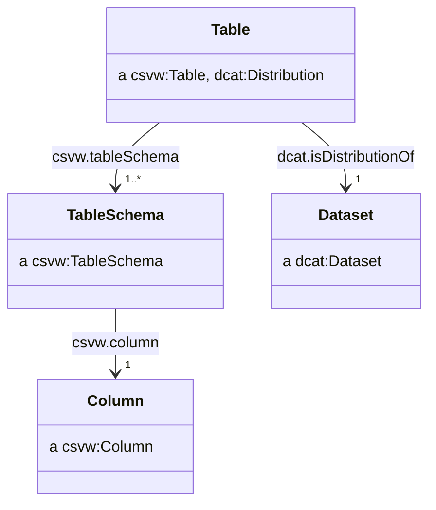
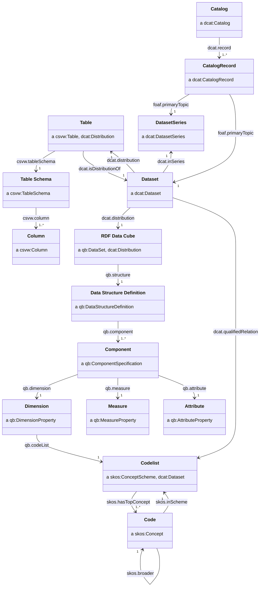

# Application Profile

_Working draft._

The key words must, must not, required, shall, shall not, should, should not, recommended, may, and optional are to be interpreted as described in RFC 2119.

- [Application Profile](#application-profile)
  - [Preamble](#preamble)
    - [Data on the Web Best Practises](#data-on-the-web-best-practises)
    - [Five star data](#five-star-data)
    - [FAIR principles](#fair-principles)
    - [CSV on the Web](#csv-on-the-web)
  - [Specifications used](#specifications-used)
  - [Publish CSV on the web (CSVW)](#publish-csv-on-the-web-csvw)
    - [Structural CSV metadata](#structural-csv-metadata)
    - [CSVs as self-contained datasets](#csvs-as-self-contained-datasets)
    - [Discoverability of CSVW](#discoverability-of-csvw)
    - [Foreign-key constraints](#foreign-key-constraints)
  - [Appendicies](#appendicies)
    - [Class diagram](#class-diagram)
    - [Future work](#future-work)
      - [Provenance](#provenance)

## Preamble

The UK government often [publishes its statistics](https://www.gov.uk/search/research-and-statistics?content_store_document_type=statistics_published&order=updated-newest) in presentational spreadsheets. While this succeeds in getting important information into the public domain, we recognise there are still barriers and challenges in accessing and using the data we produce:

- Analysts need to wrangle data because data are in unstandardised and presentational formats.
- A user must locate and navigate through many large spreadsheets to understand what data are available.
- Metadata are provided in an unstructured or unstandardised ways.
- Data are in silos, making it difficult to link or relate statistics from different sources.
- The accessibility and usability of statistics varies from dataset to dataset.

We have explored how to follow best practices when publishing statistics, in particular through the use of the CSV on the Web (CSVW), Data Catalog (DCAT) and RDF Data Cube (QB) standards and vocabularies. This document is an application profile of these standards, describing a recommendation on how to use these standards together in order to achieve the data on the web best practices, 5-star data, and the FAIR data principles.

### Data on the Web Best Practises

The [Data on the Web Best Practices (DWBP)](https://www.w3.org/TR/dwbp/) describes recommendations for publishing data to the web. If followed, we can enable these benefits:

> - **Comprehension**: humans will have a better understanding about the data structure, the data meaning, the metadata and the nature of the dataset.
> - **Processability**: machines will be able to automatically process and manipulate the data within a dataset.
> - **Discoverability** machines will be able to automatically discover a dataset or data within a dataset.
> - **Reuse**: the chances of dataset reuse by different groups of data consumers will increase.
> - **Trust**: the confidence that consumers have in the dataset will improve.
> - **Linkability**: it will be possible to create links between data resources (datasets and data items).
> - **Access**: humans and machines will be able to access up to date data in a variety of forms.
> - **Interoperability**: it will be easier to reach consensus among data publishers and consumers.

### Five star data

5★ Open Data has a five point scale which describes data on the web which increases the utility of said data for each increase from one to five stars.

|   Stars    | Requirements                                                                                         |
| :--------: | :--------------------------------------------------------------------------------------------------- |
| ★☆☆☆☆      | data needs to be able to be published on the web,                                                    |
| ★★☆☆☆      | data needs to be machine-readable,                                                                   |
| ★★★☆☆      | data needs to be non-proprietary,                                                                    |
| ★★★★☆      | identifiers need to be used to denote things, so that people can talk about resources unambiguously, |
| ★★★★★      | data needs to able to be linkied to other data to provide context.                                   |

### FAIR principles

To aid humans who increasingly rely on computational support to deal with increased volumes of data, complexity, and creation speed of data, the [FAIR principles](https://www.go-fair.org/fair-principles/) were conceived.

The FAIR principles describe data which is:

> - **Findable**: data and metadata encoded for machines and humans
> - **Accessible**: using standard protocols for access and authentication of data
> - **Interoperable**: data and metadata is represented in an appropriate knowledge representation standard
> - **Reusable**: using common vocabularies for knowledge representation allows for reuse and remixing of data

### CSV on the Web

> CSVW extends standard CSV with the ingredients for a reliable, flexible and extensible data exchange format. Most importantly, CSVW accommodates metadata. [^csvw-intro]

The [CSV on the Web (CSVW) standard](https://w3c.github.io/csvw/syntax/) provides a method for describing and clarifying the content of CSV tabular data.

The CSV format is at its best when machine readable. CSVW improves machine-readability by pairing CSV with a JSON document to provide additional metadata to describe the content of the CSV file.

One such improvement to CSVs is providing data type information for cells contents so they can be mapped as decimals, integers, dates, etc. without ambiguity. Furthermore, CSVW is extensible to fully 5-star linked-data, providing a mapping to the contents of a CSV file to RDF.

## Specifications used

The Application Profile uses terms from various existing specifications. Classes and properties specified in the following sections come from the following namespaces.

| Namespace | Namespace IRI                                 | Specification name                                                                   |
| --------- | --------------------------------------------- | ------------------------------------------------------------------------------------ |
| `adms`    | `http://www.w3.org/ns/adms#`                  | Asset Description Metadata Schema                                                    |
| `dcat`    | `http://www.w3.org/ns/dcat#`                  | Data Catalog Vocabulary                                                              |
| `dcterms` | `http://purl.org/dc/terms/`                   | DCMI (Dublin Core Metadata Initiative) Metadata Terms                                |
| `dpv`     | `http://www.w3.org/ns/dpv#`                   | Data Privacy Vocabulary (DPV)                                                        |
| `foaf`    | `http://xmlns.com/foaf/0.1/`                  | FOAF (Friend of a friend) Vocabulary                                                 |
| `owl`     | `http://www.w3.org/2002/07/owl#`              | OWL Web Ontology Language                                                            |
| `prov`    | `http://www.w3.org/ns/prov#`                  | Provenance Vocabulary                                                                |
| `qb`      | `http://purl.org/linked-data/cube#`           | RDF Data Cube Vocabulary                                                             |
| `rdfs`    | `http://www.w3.org/2000/01/rdf-schema#`       | RDF (Resource Description Framework) Vocabulary Description Language 1.0: RDF Schema |
| `skos`    | `http://www.w3.org/2004/02/skos/core#`        | SKOS Simple Knowledge Organization System - Reference                                |
| `spdx`    | `http://spdx.org/rdf/terms#`                  | Software Package Data Exchange                                                       |
| `vcard`   | `http://www.w3.org/2006/vcard/ns#`            | File format standard for electronic business cards                                   |
| `wdrs`    | `http://www.w3.org/2007/05/powder-s#`         | Protocol for Web Description Resources (POWDER-S)                                    |
| `xkos`    | `http://rdf-vocabulary.ddialliance.org/xkos#` | XKOS: an SKOS extension for representing statistical classifications                 |
| `xsd`     | `http://www.w3.org/2001/XMLSchema#`           | XML Schema Part 2: Datatypes Second Edition                                          |

## Publish CSV on the web (CSVW)

Our aim is to publish metadata in a machine readable and structured format alongside the statistical data.

Structured data formats, such as JSON-LD can be understood by search engines and are used for [search engine optimisation](https://developers.google.com/search/docs/advanced/structured-data/intro-structured-data), with some search engines offering specific [dataset search functionality](https://developers.google.com/search/docs/advanced/structured-data/dataset) where structured metadata are provided using common vocabularies such as DCAT or [schema.org](https://schema.org/).

### Structural CSV metadata

The most basic of CSVW metadata will include the `tableSchema` properties with details of the columns in the CSV. Since the CSVW metadata specification includes several defaults for properties, a basic CSVW provides some implicit information, such as the file being comma delimited.

We can consider the following CSV file:

| area      | period                  | sex    | life_expectancy |
| --------- | ----------------------- | ------ | --------------- |
| W06000022 | 2004-01-01T00:00:00/P3Y | Male   | 76.7            |
| W06000022 | 2004-01-01T00:00:00/P3Y | Female | 80.7            |
| W06000015 | 2004-01-01T00:00:00/P3Y | Male   | 78.7            |
| W06000015 | 2004-01-01T00:00:00/P3Y | Female | 83.3            |
| ...       | ...                     | ...    | ...             |

Given the above CSV, a minimal CSVW metadata file would look as follows:

```json
{
    "@context": "http://www.w3.org/ns/csvw",
    "url": "http://data.gov.uk/dataset/life-expectancy-by-region-sex-and-time.csv",
    "tableSchema": {
        "columns": [
            {
                "name": "area",
                "titles": "area",
                "datatype": "string"
            },
            {
                "name": "period",
                "titles": "period",
                "datatype": "string"
            },
            {
                "name": "sex",
                "titles": "sex",
                "datatype": "string"
            },
            {
                "name": "life_expectancy",
                "titles": "life_expectancy",
                "datatype": "decimal"
            }
        ]
    }
}
```

### CSVs as self-contained datasets

A CSVW should provide all the necessary metadata that would be needed for a user of the data to feature it in a `dcat:Catalog`.

The subject resource of a CSVW metadata file is typically a `csvw:Table` which corresponds to a CSV file. This CSV file can be considered as a distribution of some `dcat:Dataset`.

When using a CSVW metadata file to describe some CSV, we recommend asserting the distribution relationship between the `csvw:Table` and the `dcat:Dataset`. The CSVW specification prohibits the use of the `@reverse` JSON-LD property, meaning we are unable to use the `dcat:distribution` property to achieve this, and instead rely upon its inverse `dcat:isDistributionOf`.



An example of a CSVW metadata file containing the relevant relationship with a `dcat:Dataset` could look as follows:

```json
{
    "@context": ["http://www.w3.org/ns/csvw", {"@language": "en"}],
    "@id": "http://data.gov.uk/dataset/life-expectancy-by-region-sex-and-time.csv",
    "url": "http://data.gov.uk/dataset/life-expectancy-by-region-sex-and-time.csv",
    "dcterms:title": "Life expectancy by local authority and sex (CSV)",
    "dcterms:description": "A CSV version of the life expectancy by local authority and sex dataset.",
    "dcat:isDistributionOf": {
        "@id": "http://data.gov.uk/dataset/life-expectancy-by-region-sex-and-time",
        "@type": "dcat:Dataset",
        "dcterms:title": "Life expectancy by local authority and sex",
        "dcterms:description": "The figures in this table are constructed from the estimated population and total deaths by single year / quinary age each year, based on a three year average. The expected years of life is the lifetime of a newborn person if they were subject throughout their lives to the average recorded death rate of the three year period. Such a calculation excludes future improvements to mortality rates."
    },
    "tableSchema": {
        "columns": [
            {
                "name": "area",
                "titles": "area",
                "datatype": "string"
            },
            {
                "name": "period",
                "titles": "period",
                "datatype": "string"
            },
            {
                "name": "sex",
                "titles": "sex",
                "datatype": "string"
            },
            {
                "name": "life_expectancy",
                "titles": "life_expectancy",
                "datatype": "decimal"
            }
        ]
    }
}
```

### Discoverability of CSVW

We recommend naming CSVW metadata files by appending `-metadata.json` to end the CSV's filename, so a CSV file named `countries.csv` would have a metadata file named `countries.csv-metadata.json`.

Where possible, we recommend serving CSV files with a `Link` header within the response with the `rel="describedby"` attribute pointing to the CSVW metadata file.

We recommend CSVW metadata is served with the media type `application/csvm+json`.

### Foreign-key constraints

Publishers may wish to use the `csvw:foreignKey` property to assert relationships between different CSVs.

## Appendicies

### Class diagram



### Future work

This section includes links to other vocabularies or ideas we may develop further for full inclusion in the profile.

- [Data quality vocab](http://www.w3.org/TR/vocab-dqv/)
- [Data usage vocab](http://www.w3.org/TR/vocab-duv/)
- [Data privacy vocab](http://dpvcg.github.io/dpv/)

#### Provenance

> **Warning**
> This section needs further work.
> TODO: <https://www.w3.org/TR/prov-o/>
> TODO: <https://ceur-ws.org/Vol-2549/article-08.pdf>

```ttl
# We have a dcat:Dataset with a CSVW distribution and a qb:DataSet distribution
</dataset/sweden-at-eurovision> a dcat:Dataset ;
    dcat:distribution </dataset/sweden-at-eurovision.csv>, </dataset/sweden-at-eurovision/datacube> ;
    .

# The CSVW distribution is prov:derivedFrom some upstream datasource
</dataset/sweden-at-eurovision.csv> a csvw:Table ;
    prov:wasDerivedFrom <https://en.wikipedia.org/wiki/Sweden_in_the_Eurovision_Song_Contest> ;
    # We can qualify (provide more detail) about the derivation if we want:
    prov:qualifiedDerivation [
        a prov:Derivation;
        # The CSV was derived from the wikipedia page
        prov:entity <https://en.wikipedia.org/wiki/Sweden_in_the_Eurovision_Song_Contest> ;
        # It was derived in the Jenkins pipeline
        prov:hadActivity <http://ci.data.gov.uk/12718530-bff7-4a6f-907d-f0ee564e8cac> ;
    ] ;
    prov:wasGeneratedBy <http://ci.data.gov.uk/12718530-bff7-4a6f-907d-f0ee564e8cac> ;
    .

# The qb:DataSet was derived from the CSV + CSVW metadata
</dataset/sweden-at-eurovision/datacube> a qb:DataSet ; 
    prov:wasDerivedFrom </dataset/sweden-at-eurovision.csv>, </dataset/sweden-at-eurovision.csv-metadata.json> ;
    prov:wasGeneratedBy <http://ci.data.gov.uk/12718530-bff7-4a6f-907d-f0ee564e8cac> ;
    .

<http://ci.data.gov.uk/12718530-bff7-4a6f-907d-f0ee564e8cac> a prov:Activity ;
    prov:wasAssociatedWith <https://github.com/Swirrl/csv2rdf>, <https://github.com/GSS-Cogs/csvcubed> ;
    prov:startedAtTime "2015-02-13T15:12:44"^^xsd:dateTime ;
    prov:endedAtTime   "2015-02-13T15:12:46"^^xsd:dateTime ;
    prov:used <https://en.wikipedia.org/wiki/Sweden_in_the_Eurovision_Song_Contest>,
        </dataset/sweden-at-eurovision.csv>,
        </dataset/sweden-at-eurovision.csv-metadata.json> ;
    prov:qualifiedUsage [ a prov:Usage ;
        prov:entity </dataset/sweden-at-eurovision.csv> ;
        prov:hadRole csvw:csvEncodedTabularData
    ];
    prov:qualifiedUsage [ a prov:Usage ;
        prov:entity </dataset/sweden-at-eurovision.csv-metadata.json> ;
        prov:hadRole csvw:tabularMetadata
    ];
    .
```
