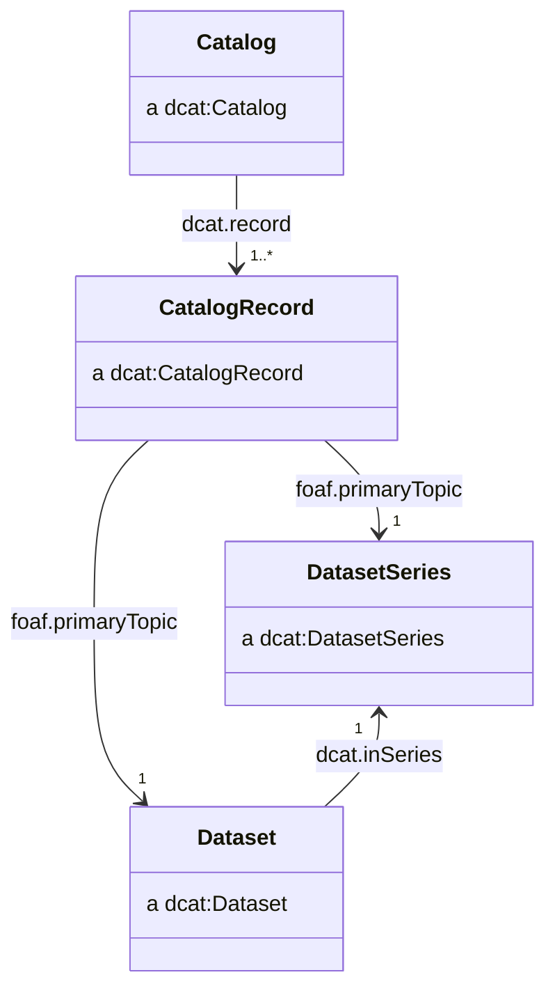
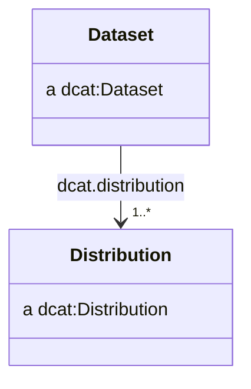
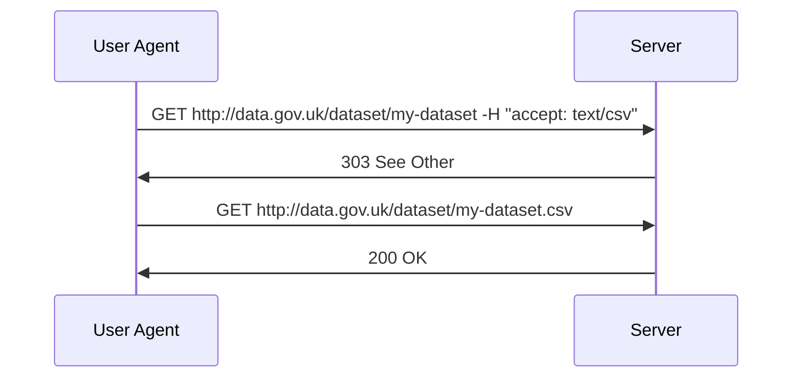
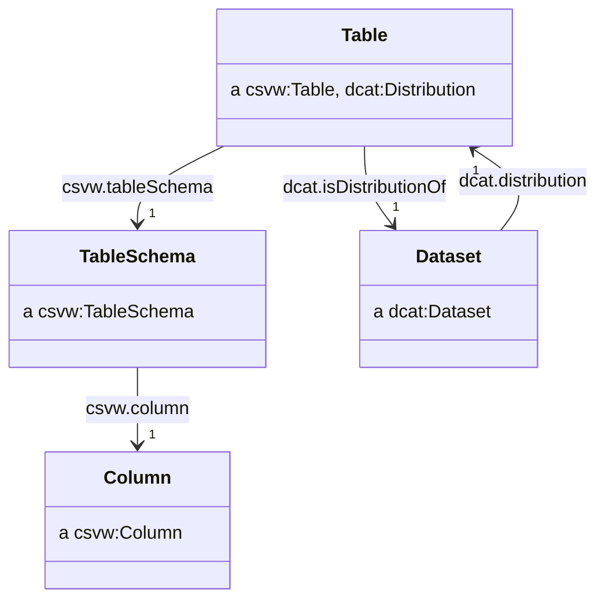
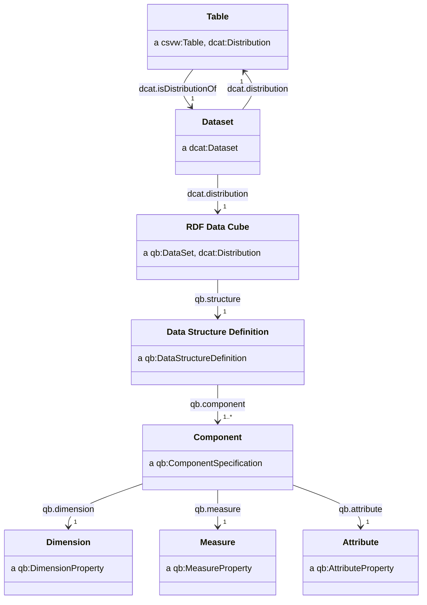

# Application Profile

## Preamble

The UK government often [publishes its statistics](https://www.gov.uk/search/research-and-statistics?content_store_document_type=statistics_published&order=updated-newest) in presentational spreadsheets. While this succeeds in getting important information into the public domain, we recognise there are still barriers and challenges in accessing and using the data we produce:

- Analysts need to wrangle data because data are in unstandardised and presentational formats.
- A user must locate and navigate through many large spreadsheets to understand what data are available.
- Metadata are provided in an unstructured or unstandardised ways.
- Data are in silos, making it difficult to link or relate statistics from different sources.
- The accessibility and usability of statistics varies from dataset to dataset.

The [Data on the Web Best Practices (DWBP)](https://www.w3.org/TR/dwbp/) describes recommendations for publishing data to the web. If followed, we can enable these benefits:

> - **Comprehension**: humans will have a better understanding about the data structure, the data meaning, the metadata and the nature of the dataset.
> - **Processability**: machines will be able to automatically process and manipulate the data within a dataset.
> - **Discoverability** machines will be able to automatically discover a dataset or data within a dataset.
> - **Reuse**: the chances of dataset reuse by different groups of data consumers will increase.
> - **Trust**: the confidence that consumers have in the dataset will improve.
> - **Linkability**: it will be possible to create links between data resources (datasets and data items).
> - **Access**: humans and machines will be able to access up to date data in a variety of forms.
> - **Interoperability**: it will be easier to reach consensus among data publishers and consumers.

We have explored how to follow the best practices when publishing statistics, in particular through the use of the CSV on the Web (CSVW), Data Catalog (DCAT) and RDF Data Cube (QB) standards and vocabularies. This document is an application profile of these standards, describing a recommendation on how to use these standards together in order to achieve the data on the web best practices.

## Specifications used

The Application Profile uses terms from various existing specifications. Classes and properties specified in the following sections come from the following namespaces.

| Namespace | Namespace IRI                           | Specification name                                                                   |
| --------- | --------------------------------------- | ------------------------------------------------------------------------------------ |
| `adms`    | `http://www.w3.org/ns/adms#`            | Asset Description Metadata Schema                                                    |
| `dcat`    | `http://www.w3.org/ns/dcat#`            | Data Catalog Vocabulary                                                              |
| `dcterms` | `http://purl.org/dc/terms/`             | DCMI (Dublin Core Metadata Initiative) Metadata Terms                                |
| `dpv`     | `http://www.w3.org/ns/dpv#`             | Data Privacy Vocabulary (DPV)                                                        |
| `foaf`    | `http://xmlns.com/foaf/0.1/`            | FOAF (Friend of a friend) Vocabulary                                                 |
| `owl`     | `http://www.w3.org/2002/07/owl#`        | OWL Web Ontology Language                                                            |
| `prov`    | `http://www.w3.org/ns/prov#`            | Provenance Vocabulary                                                                |
| `qb`      | `http://purl.org/linked-data/cube#`     | RDF Data Cube Vocabulary                                                             |
| `rdfs`    | `http://www.w3.org/2000/01/rdf-schema#` | RDF (Resource Description Framework) Vocabulary Description Language 1.0: RDF Schema |
| `skos`    | `http://www.w3.org/2004/02/skos/core#`  | SKOS Simple Knowledge Organization System - Reference                                |
| `spdx`    | `http://spdx.org/rdf/terms#`            | Software Package Data Exchange                                                       |
| `xsd`     | `http://www.w3.org/2001/XMLSchema#`     | XML Schema Part 2: Datatypes Second Edition                                          |
| `vcard`   | `http://www.w3.org/2006/vcard/ns#`      | File format standard for electronic business cards                                   |

## Data structure

### Publish machine-readable data

> Machine-readable data is data in a standard format that can be read and processed automatically by a computing system. Traditional word processing documents and portable document format (PDF) files are easily read by humans but typically are difficult for machines to interpret and manipulate. Formats such as XML, JSON, HDF5, RDF and CSV are machine-readable data formats [^machine]

[^machine]: https://w3c.github.io/dwbp/bp.html#machine_readable

Many of the excel workbooks produced by statisticians are designed to be easily read by humans but typically are difficult for machines to interpret and manipulate.

Consider this example taken from the [RDF data cube vocabulary](https://www.w3.org/TR/vocab-data-cube/), extracted from StatsWales report number 003311 which describes life expectancy broken down by region (unitary authority), sex and time:

<table id="example-data" style="text-align: left;">
  <tbody>
    <tr>
      <td style="vertical-align: top;"><br>
      </td>
      <td colspan="2" rowspan="1" style="vertical-align: top; text-align: center; font-weight: bold;">2004-2006<br>
      </td>
      <td colspan="2" rowspan="1" style="vertical-align: top; text-align: center; font-weight: bold;">2005-2007<br>
      </td>
      <td colspan="2" rowspan="1" style="vertical-align: top; text-align: center; font-weight: bold;">2006-2008<br>
      </td>
    </tr>
    <tr>
      <td style="vertical-align: top;"><br>
      </td>
      <td style="vertical-align: top; text-align: center; font-weight: bold;">Male<br>
      </td>
      <td style="vertical-align: top; text-align: center; font-weight: bold;">Female<br>
      </td>
      <td style="vertical-align: top; text-align: center; font-weight: bold;">Male<br>
      </td>
      <td style="vertical-align: top; text-align: center; font-weight: bold;">Female<br>
      </td>
      <td style="vertical-align: top; text-align: center; font-weight: bold;">Male<br>
      </td>
      <td style="vertical-align: top; text-align: center; font-weight: bold;">Female<br>
      </td>
    </tr>
    <tr>
      <td style="vertical-align: top; text-align: right; font-weight: bold;">Newport<br>
      </td>
      <td style="vertical-align: top;">76.7<br>
      </td>
      <td style="vertical-align: top;">80.7<br>
      </td>
      <td style="vertical-align: top;">77.1<br>
      </td>
      <td style="vertical-align: top;">80.9<br>
      </td>
      <td style="vertical-align: top;">77.0<br>
      </td>
      <td style="vertical-align: top;">81.5<br>
      </td>
    </tr>
    <tr>
      <td style="vertical-align: top; text-align: right; font-weight: bold;">Cardiff<br>
      </td>
      <td style="vertical-align: top;">78.7<br>
      </td>
      <td style="vertical-align: top;">83.3<br>
      </td>
      <td style="vertical-align: top;">78.6<br>
      </td>
      <td style="vertical-align: top;">83.7<br>
      </td>
      <td style="vertical-align: top;">78.7<br>
      </td>
      <td style="vertical-align: top;">83.4<br>
      </td>
    </tr>
    <tr>
      <td style="vertical-align: top; text-align: right; font-weight: bold;">Monmouthshire<br>
      </td>
      <td style="vertical-align: top;">76.6<br>
      </td>
      <td style="vertical-align: top;">81.3<br>
      </td>
      <td style="vertical-align: top;">76.5<br>
      </td>
      <td style="vertical-align: top;">81.5<br>
      </td>
      <td style="vertical-align: top;">76.6<br>
      </td>
      <td style="vertical-align: top;">81.7<br>
      </td>
    </tr>
    <tr>
      <td style="vertical-align: top; text-align: right; font-weight: bold;">Merthyr Tydfil<br>
      </td>
      <td style="vertical-align: top;">75.5<br>
      </td>
      <td style="vertical-align: top;">79.1<br>
      </td>
      <td style="vertical-align: top;">75.5<br>
      </td>
      <td style="vertical-align: top;">79.4<br>
      </td>
      <td style="vertical-align: top;">74.9<br>
      </td>
      <td style="vertical-align: top;">79.6<br>
      </td>
    </tr>
  </tbody>
</table>

The table is a cross tabulation of the data, with the columns representing the time period of the observation and the sex of the observed population and the rows representing different locations. Having multiple header rows which span multiple columns makes the data difficult to read with software. Downstream users of the data will have to wrangle the data into a usable format.

For example, importing the above table into some statistical software such as [R](https://www.r-project.org/) produces a result with some problems:

- The header rows are not treated as headers.
- The header row representing time period is not fully populated.
- The first column contains empty strings.
- Numbers in the data are treated as strings, due to columns having mixed data types.

```r
# An example of how the above table looks once imported into R:

# A tibble: 6 x 7
  V1                V2        V3        V4        V5     V6    V7    
  <chr>             <chr>     <chr>     <chr>     <chr>  <chr> <chr> 
1 ""                2004-2006 2005-2007 2006-2008 NA     NA    NA    
2 ""                Male      Female    Male      Female Male  Female
3 "Newport"         76.7      80.7      77.1      80.9   77.0  81.5  
4 "Cardiff"         78.7      83.3      78.6      83.7   78.7  83.4  
5 "Monmouthshire"   76.6      81.3      76.5      81.5   76.6  81.7  
6 "Merthyr Tydfil"  75.5      79.1      75.5      79.4   74.9  79.6  
```

Organising the table as [tidy data](https://r4ds.had.co.nz/tidy-data.html), with each variable having its own column gives an output which can be instantly read into R, without need for further cleaning.

| area    | period    | sex    | life_expectancy |
| ------- | --------- | ------ | --------------- |
| Newport | 2004-2006 | Male   | 76.7            |
| Newport | 2004-2006 | Female | 80.7            |
| Cardiff | 2004-2006 | Male   | 78.7            |
| Cardiff | 2004-2006 | Female | 83.3            |
| ...     | ...       | ...    | ...             |

### Adopt common identifiers

We should adopt common and unambiguous identifiers for data items such as ONS geography codes or ISO-8601 time intervals.

| area      | period                  | sex    | life_expectancy |
| --------- | ----------------------- | ------ | --------------- |
| W06000022 | 2004-01-01T00:00:00/P3Y | Male   | 76.7            |
| W06000022 | 2004-01-01T00:00:00/P3Y | Female | 80.7            |
| W06000015 | 2004-01-01T00:00:00/P3Y | Male   | 78.7            |
| W06000015 | 2004-01-01T00:00:00/P3Y | Female | 83.3            |
| ...       | ...                     | ...    | ...             |

In this example, adopting ISO 8601 time intervals allows machines to provide additional functionality for computing with this type of data. Adopting geography codes allows for linking between data sets.

```r
# A tibble: 4 x 4
  area      period                         sex    life_expectancy
  <chr>     <Interval>                     <chr>            <dbl>
1 W06000022 2004-01-01 UTC--2007-01-01 UTC Male              76.7
2 W06000022 2004-01-01 UTC--2007-01-01 UTC Female            80.7
3 W06000015 2004-01-01 UTC--2007-01-01 UTC Male              78.7
4 W06000015 2004-01-01 UTC--2007-01-01 UTC Female            83.3
```

Producing data which _only_ uses identifiers could reduce usability by humans. It may be reasonable to include some of the redundant, human-friendly data such as labels alongside identifiers (known formally as denormalisation).

| area      | area_label | period                  | period_label | sex    | life_expectancy |
| --------- | ---------- | ----------------------- | ------------ | ------ | --------------- |
| W06000022 | Newport    | 2004-01-01T00:00:00/P3Y | 2004-2006    | Male   | 76.7            |
| W06000022 | Newport    | 2004-01-01T00:00:00/P3Y | 2004-2006    | Female | 80.7            |
| W06000015 | Cardiff    | 2004-01-01T00:00:00/P3Y | 2004-2006    | Male   | 78.7            |
| W06000015 | Cardiff    | 2004-01-01T00:00:00/P3Y | 2004-2006    | Female | 83.3            |
| ...       | ...        | ...                     | ...          | ...    | ...             |

To adopt common identifiers, there needs to exist a list of identifiers which can be shared and reused. We cover the creation of classifications in [codelists](#codelists).

### Using symbols and shorthand in tables

Statisticians often need to add metadata and additional context to their tables, such as describing that data are not available, an estimate is provisional or an estimate is statistically significant. The Government Statistical Service (GSS) [has a guide](https://analysisfunction.civilservice.gov.uk/policy-store/symbols-in-tables-definitions-and-help/) which provides a number of symbols and shorthand for common annotations (see [here](#symbols-and-shorthand-in-tables)).

For example, this table indicates that the life expectancy is not available (`[x]`) or provisional (`[p]`) for some entries.

| area      | period                  | sex    | life_expectancy |
| --------- | ----------------------- | ------ | --------------- |
| W06000022 | 2004-01-01T00:00:00/P3Y | Male   | 76.7            |
| W06000022 | 2004-01-01T00:00:00/P3Y | Female | 80.7            |
| W06000015 | 2004-01-01T00:00:00/P3Y | Male   | 78.7 [p]        |
| W06000015 | 2004-01-01T00:00:00/P3Y | Female | [x]             |
| ...       | ...                     | ...    | ...             |

These annotations are usually included inside the table alongside numeric data. When this happens the columns no longer contain a single type. By placing symbols such as `[x]` in the same column as numeric values, statistical software will interpret the column as containing strings and not numbers.

To avoid the mixing of types, we recommend that these annotations be placed in their own column. We refer to these annotations as _statistical markers_.

| area      | period                  | sex    | life_expectancy | marker |
| --------- | ----------------------- | ------ | --------------- | ------ |
| W06000022 | 2004-01-01T00:00:00/P3Y | Male   | 76.7            |        |
| W06000022 | 2004-01-01T00:00:00/P3Y | Female | 80.7            |        |
| W06000015 | 2004-01-01T00:00:00/P3Y | Male   | 78.7            |        |
| W06000015 | 2004-01-01T00:00:00/P3Y | Female |                 | [x]    |
| ...       | ...                     | ...    | ...             |        |

This adds some complexity when a table has multiple statistical measures as it is unclear which of the columns the marker applies to. In the following example, it is unclear whether the entry for `life_expectancy` or `disability_free_life_expectancy` (or both) is provisional.

| area      | period                  | sex    | life_expectancy | disability_free_life_expectancy | marker |
| --------- | ----------------------- | ------ | --------------- | ------------------------------- | ------ |
| W06000022 | 2004-01-01T00:00:00/P3Y | Male   | 76.7            | 70.1                            |        |
| W06000022 | 2004-01-01T00:00:00/P3Y | Female | 80.7            | 80.2                            |        |
| W06000015 | 2004-01-01T00:00:00/P3Y | Male   | 78.7            | 70.3                            | [p]    |
| W06000015 | 2004-01-01T00:00:00/P3Y | Female |                 | 80.4                            | [x]    |
| ...       | ...                     | ...    | ...             |                                 |        |

We solve this by pivoting the measures into a `measure_type` column, so each row represents a single statistical measure, with a single marker relating specifically to that measure.

| area      | period                  | sex    | measure_type                    | value | marker |
| --------- | ----------------------- | ------ | ------------------------------- | ----- | ------ |
| W06000022 | 2004-01-01T00:00:00/P3Y | Male   | life-expectancy                 | 76.7  |        |
| W06000022 | 2004-01-01T00:00:00/P3Y | Female | life-expectancy                 | 80.7  |        |
| W06000022 | 2004-01-01T00:00:00/P3Y | Male   | disability-free-life-expectancy | 70.1  |        |
| W06000022 | 2004-01-01T00:00:00/P3Y | Female | disability-free-life-expectancy | 80.2  | [p]    |
| W06000015 | 2004-01-01T00:00:00/P3Y | Male   | life-expectancy                 | 78.7  |        |
| W06000015 | 2004-01-01T00:00:00/P3Y | Female | life-expectancy                 |       | [x]    |
| ...       | ...                     | ...    | ...                             | ...   |        |

Data in this format allows users to filter and sort based upon annotations. For example, users can filter out results which are provisional or not applicable.

If necessary, the data can be pivoted back into a format which would feel more familiar by discarding the marker column.

```python
# R ----------------------------------------------

df |>
  dplyr::select(-marker) |>
  tidyr::pivot_wider(names_from = measure_type) |>
  janitor::clean_names()

# python -----------------------------------------

import pandas as pd

df = (
    df
    .set_index(["area", "period" ,"sex", "measure_type"])["value"]
    .unstack()
    .reset_index()
)
```

After pivoting with the above code, each of the measures has its own column.

| area      | period                  | sex    | life_expectancy | disability_free_life_expectancy |
| --------- | ----------------------- | ------ | --------------- | ------------------------------- |
| W06000022 | 2004-01-01T00:00:00/P3Y | Male   | 76.7            | 70.1                            |
| W06000022 | 2004-01-01T00:00:00/P3Y | Female | 80.7            | 80.2                            |
| W06000015 | 2004-01-01T00:00:00/P3Y | Male   | 78.7            | 70.3                            |
| W06000015 | 2004-01-01T00:00:00/P3Y | Female |                 | 80.4                            |
| ...       | ...                     | ...    | ...             |                                 |

> TODO: Is there a need to support a multiple-measure structure instead of a measure-type dimension, e.g.
> 
> | area      | period                  | sex    | life_expectancy | life_expectancy_marker | disability_free_life_expectancy | disability_free_life_expectancy_marker |
> | --------- | ----------------------- | ------ | --------------- | ---------------------- | ------------------------------- | -------------------------------------- |
> | W06000022 | 2004-01-01T00:00:00/P3Y | Male   | 76.7            |                        | 70.1                            |                                        |
> | W06000022 | 2004-01-01T00:00:00/P3Y | Female | 80.7            |                        | 80.2                            | [p]                                    |
> | W06000015 | 2004-01-01T00:00:00/P3Y | Male   | 78.7            |                        | 70.3                            |                                        |
> | W06000015 | 2004-01-01T00:00:00/P3Y | Female |                 | [x]                    | 80.4                            |                                        |
> | ...       | ...                     | ...    | ...             |                        |                                 |                                        |

### Expressing concept hierarchies

Statistics publishers may wish to indicate that their data includes a hierarchy. A typical approach may be to include multiple columns, one for each level of the hierarchy, though this can sometimes be ambiguous and difficult to interpret.

Consider a mock dataset which uses the Standard Industrial Trade Classification (SITC). SITC is a classification system for the trade of goods and services. It has several top level categories then broken down into subcategories.

```
0 Food and live animals
├─ 00 Live animals other than animals of division 03
│  ├─ 001 Live animals other than animals of division 03
├─ 01 Meat and meat preparations
│  ├─ 011 Meat of bovine animals, fresh, chilled or frozen
│  ├─ 012 Other meat and edible meat offal
│  ├─ 016 Meat, edible meat offal, salted, dried; flours, meals
│  ├─ 017 Meat, edible meat offal, prepared, preserved, n.e.s
│  ├─ ...
├─ 02 Dairy products and birds' eggs
│  ├─   022 Milk, cream and milk products (excluding butter, cheese)
│  ├─ ...
```

This would typically be presented in a dataset with `industry`, `sub_industry` and `sub_industry_2` columns. Some entries may be blank depending on the level of the hierarchy being described.

| period | industry | sub_industry | sub_industry_2 | industry_label                                   | trade_value |
| ------ | -------- | ------------ | -------------- | ------------------------------------------------ | ----------- |
| 2004   | 0        |              |                | Food and live animals                            | ...         |
| 2004   | 0        | 00           |                | Live animals other than animals of division 03   | ...         |
| 2004   | 0        | 00           | 001            | Live animals other than animals of division 03   | ...         |
| 2004   | 0        | 01           |                | Meat and meat preparations                       | ...         |
| 2004   | 0        | 01           | 011            | Meat of bovine animals, fresh, chilled or frozen | ...         |
| ...    | ...      |              |                | ...                                              | ...         |

There may be some difficulties in working with data structured in this way:
- Different publishers may indicate hierarchy in different ways, using different combinations of multiple columns and blank entries. Understanding how each dataset's structure relates to its interpretation requires investigation. 
- The number of columns is determined by the number of levels in the hierarchy, potentially making datasets very wide. Naming becomes more difficult as the number of columns increases.
- Using blank entries to indicate hierarchy means blank entries cannot then also be used where data is unknown or does not exist.
- The hierarchical relationship between columns is not explicit. It can be difficult to infer the structure, especially when a dataset has multiple hierarchies.

By creating codelists such as SITC we can make the hierarchy of categories explicit. By creating codelists and publishing these alongside the statistical data, we remove the need to include hierarchical structure inside the dataset.

We suggest collapsing the hierarchy into a single column, and using a defined classification which indicates the hierarchy of classes. We cover the creation of classifications in [codelists](#codelists).

| period | industry | industry_label                                   | trade_value |
| ------ | -------- | ------------------------------------------------ | ----------- |
| 2004   | 0        | Food and live animals                            | ...         |
| 2004   | 00       | Live animals other than animals of division 03   | ...         |
| 2004   | 001      | Live animals other than animals of division 03   | ...         |
| 2004   | 01       | Meat and meat preparations                       | ...         |
| 2004   | 011      | Meat of bovine animals, fresh, chilled or frozen | ...         |
| ...    | ...      | ...                                              | ...         |

It can be helpful to humans to include some information about the hierarchy inside the dataset, for example to make some aggregations simpler to perform. We recommend including a single `parent_x` column where there is a need to do so (a form of denormalisation). A blank entry in the parent column indicates no parent exists.

| period | parent_industry | industry | industry_label                                   | trade_value |
| ------ | --------------- | -------- | ------------------------------------------------ | ----------- |
| 2004   |                 | 0        | Food and live animals                            | ...         |
| 2004   | 0               | 00       | Live animals other than animals of division 03   | ...         |
| 2004   | 00              | 001      | Live animals other than animals of division 03   | ...         |
| 2004   | 0               | 01       | Meat and meat preparations                       | ...         |
| 2004   | 01              | 011      | Meat of bovine animals, fresh, chilled or frozen | ...         |
| ...    |                 | ...      | ...                                              | ...         |

## Cataloguing

> TODO: Should we support dcat:DatasetSeries?

> TODO: Do we support cataloguing catalogues?

A catalogue is a collection of metadata about datasets which has been gathered and curated.

### Classes



We recommend the use of `dcat:Catalog`, `dcat:CatalogRecord`, `dcat:DatasetSeries` and `dcat:Dataset` classes.

### Catalogue

We recommend catalogues have IRIs of the form:

- ```http://{domain}/catalogue```
- ```http://{domain}/catalogue/{catalogue_name}```

For example:

- ```http://data.gov.uk/catalogue```
- ```http://data.gov.uk/catalogue/climate-change```

We recommend the use of the following properties:

| Property                | Requirement level | Notes                                                                      |
| ----------------------- | ----------------- | -------------------------------------------------------------------------- |
| `dcterms:title`         | mandatory         | See [titles](#titles)                                                      |
| `dcterms:description`   | mandatory         | See [descriptions](#descriptions)                                          |
| `dcterms:publisher`     | mandatory         | See [publishers, creators and contacts](#publishers-creators-and-contacts) |
| `dcterms:creator`       | recommended       | See [publishers, creators and contacts](#publishers-creators-and-contacts) |
| `dcat:contactPoint`     | recommended       | See [publishers, creators and contacts](#publishers-creators-and-contacts) |
| `dcterms:issued`        | recommended       | See [dates and times](#dates-and-times)                                    |
| `dcterms:modified`      | recommended       | See [dates and times](#dates-and-times)                                    |
| `dcterms:themeTaxonomy` | recommended       | See [themes](#themes)                                                      |

For example:

```
@prefix dcat: <http://www.w3.org/ns/dcat#> .
@prefix dcterms: <http://purl.org/dc/terms/> .

<http://data.gov.uk/catalogue/climate-change> a dcat:Catalog ;
    dcterms:title "Climate change datasets"@en ;
    dcterms:description "A catalogue of datasets about climate change"@en ;
    dcterms:publisher <http://www.gov.uk/government/organisations/department-for-business-energy-and-industrial-strategy> ;
    dcterms:creator <http://www.gov.uk/government/organisations/department-for-business-energy-and-industrial-strategy> ;
    dcat:contactPoint <http://data.gov.uk/catalogue/climate-change/contact> ;
    dcterms:issued "2015-01-01"^^xsd:date ;
    dcterms:modified "2015-01-01"^^xsd:date ;
    dcterms:themeTaxonomy <http://data.gov.uk/themes> ;
    .
```

### Catalog Record

We recommend creaing a IRI for catalogue records by appending `/record` or `#record` to the IRI of the resource being described by the catalogue record:

- `{dataset_iri}/record`
- `{dataset_iri}#record`

For example:

- `http://data.gov.uk/dataset/my-dataset/record`
- `http://data.gov.uk/dataset/my-dataset#record`

We recommend the use of the following properties:

| Property               | Requirement level | Notes |
| ---------------------- | ----------------- | ----- |
| `dcterms:issued`       | mandatory         |       |
| `foaf:primaryTopic`    | mandatory         |       |
| `prov:wasAttributedTo` | recommended       |       |
| `dcterms:modified`     | optional          |       |

We may use `prov:wasAttributedTo` to attribute the creation of the catalogue record to a specific entity, such as the person who added the dataset to the catalogue.

For example:

```ttl
@prefix dcat: <http://www.w3.org/ns/dcat#> .
@prefix dcterms: <http://purl.org/dc/terms/> .
@prefix foaf: <http://xmlns.com/foaf/0.1/> .
@prefix prov: <http://www.w3.org/ns/prov#> .

<http://data.gov.uk/dataset/my-dataset/record> a dcat:CatalogRecord ;
    dcterms:issued "2015-01-01"^^xsd:date ;
    foaf:primaryTopic <http://data.gov.uk/dataset/my-dataset> ;
    prov:wasAttributedTo <mailto:joe.bloggs@ons.gov.uk> ;
    .
```

### Dataset

We recommend standalone datasets have IRIs of the form:

- `http://{domain}/dataset/{dataset_slug}`

For datasets belonging to a dataset series, we recommend extending the series IRI to form the dataset IRI:

- `http://{domain}/series/{series_slug}/dataset/{edition_year}`

For example:

- `http://data.gov.uk/dataset/my-dataset`
- `http://data.gov.uk/series/some-dataset-series/dataset/2018`

We recommend the use of the following properties:

| Property                     | Requirement level | Notes                                                                      |
| ---------------------------- | ----------------- | -------------------------------------------------------------------------- |
| `dcterms:title`              | mandatory         | See [titles](#titles)                                                      |
| `dcterms:description`        | mandatory         | See [descriptions](#descriptions)                                          |
| `dcterms:publisher`          | mandatory         | See [publishers, creators and contacts](#publishers-creators-and-contacts) |
| `dcterms:license`            | mandatory         | See [licenses](#licenses)                                                  |
| `dcat:distribution`          | mandatory         | See [distributions](#distributions)                                        |
| `dcterms:creator`            | recommended       | See [publishers, creators and contacts](#publishers-creators-and-contacts) |
| `dcat:contactPoint`          | recommended       | See [publishers, creators and contacts](#publishers-creators-and-contacts) |
| `dcterms:issued`             | recommended       | See [dates and times](#dates-and-times)                                    |
| `dcterms:modified`           | recommended       | See [dates and times](#dates-and-times)                                    |
| `dcat:keyword`               | recommended       | See [keywords](#keywords)                                                  |
| `dcat:theme`                 | recommended       | See [themes](#themes)                                                      |
| `dcterms:accrualPeriodicity` | recommended       | See [frequency](#frequency)                                                |
| `dcterms:spatial`            | recommended       | See [geography](#geography)                                                |
| `dcterms:temporal`           | recommended       | See [dates and times](#dates-and-times)                                    |
| `dcat:inSeries`              | recommended       | See [editions](#editions)                                                  |
| `dcat:hasCurrentVersion`     | recommended       | See [versions](#versions)                                                  |
| `dcat:hasVersion`            | recommended       | See [versions](#versions)                                                  |
| `dcat:version`               | recommended       | See [versions](#versions)                                                  |
| `adms:versionNotes`          | recommended       | See [versions](#versions)                                                  |
| `dcat:prev`                  | recommended       | See [versions](#versions)                                                  |
| `dcat:landingPage`           | optional          |                                                                            |
| `dcterms:identifier`         | optional          |                                                                            |
| `dcterms:isReferencedBy`     | optional          |                                                                            |

For example:

```ttl
<http://data.gov.uk/series/uk-territorial-greenhouse-gas-emissions-national-statistics/dataset/2018> a dcat:Dataset ;
    dcterms:title "Final UK greenhouse gas emissions national statistics: 1990 to 2018"@en ;
    dcterms:description "Final estimates of UK territorial greenhouse gas emissions.."@en ;
    dcterms:license <https://www.nationalarchives.gov.uk/doc/open-government-licence/version/3/> ;
    dcterms:publisher <http://www.gov.uk/government/organisations/department-for-business-energy-and-industrial-strategy> ;
    dcterms:issued "2020-02-04T09:30:00"^^xsd:dateTime ;
    dcterms:modified "2020-07-30T08:30:06"^^xsd:dateTime ;
    dcat:keyword "greenhouse gases"@en, "carbon emissions"@en, "greenhouse gas emissions"@en ;
    dcat:theme <http://osr.statisticsauthority.gov.uk/themes/transport-environment-climate-change/> ;
    dcat:contactPoint <http://data.gov.uk/series/uk-territorial-greenhouse-gas-emissions-national-statistics/dataset/2018/contact> ;
    dcat:distribution <http://data.gov.uk/series/uk-territorial-greenhouse-gas-emissions-national-statistics/dataset/2018/datacube>, 
        <http://data.gov.uk/series/uk-territorial-greenhouse-gas-emissions-national-statistics/dataset/2018.csv>, 
        <http://data.gov.uk/series/uk-territorial-greenhouse-gas-emissions-national-statistics/dataset/2018.json> ;
    dcterms:isReferencedBy <https://www.gov.uk/government/statistics/final-uk-greenhouse-gas-emissions-national-statistics-1990-to-2018> ;
    dcat:landingPage "http://data.gov.uk/series/uk-territorial-greenhouse-gas-emissions-national-statistics/dataset/2018"^^xsd:anyURI ;
    dcterms:accrualPeriodicity <http://purl.org/cld/freq/annual> ;
    dcterms:spatial <http://statistics.data.gov.uk/id/statistical-geography/K02000001> ;
    dcterms:temporal <http://reference.data.gov.uk/id/gregorian-interval/1990-01-01T00:00:00/P28Y> ;
    dcat:inSeries <http://data.gov.uk/series/uk-territorial-greenhouse-gas-emissions-national-statistics> ;
    dcat:hasCurrentVersion <http://data.gov.uk/series/uk-territorial-greenhouse-gas-emissions-national-statistics/dataset/2018/version/2> ;
    dcat:hasVersion <http://data.gov.uk/series/uk-territorial-greenhouse-gas-emissions-national-statistics/dataset/2018/version/1>, 
        <http://data.gov.uk/series/uk-territorial-greenhouse-gas-emissions-national-statistics/dataset/2018/version/2> ;
    dcat:version 2 ;
    adms:versionNotes "Dataset was corrected following an error being recognised."@en ;
    dcat:prev <http://data.gov.uk/series/uk-territorial-greenhouse-gas-emissions-national-statistics/dataset/2017> ;
    dcterms:identifier "ghg-2018" ;
    .
```

### Dataset series

Our use of dataset series is described in [editions](#editions).

We recommend dataset series have IRIs of the form:

- `http://{domain}/series/{series_slug}`

For example:

- `http://data.gov.uk/series/some-dataset-series`

We recommend the use of the following properties:

| Property                     | Requirement level | Notes                                                                      |
| ---------------------------- | ----------------- | -------------------------------------------------------------------------- |
| `dcterms:title`              | mandatory         | See [titles](#titles)                                                      |
| `dcterms:description`        | mandatory         | See [descriptions](#descriptions)                                          |
| `dcterms:publisher`          | mandatory         | See [publishers, creators and contacts](#publishers-creators-and-contacts) |
| `dcterms:license`            | mandatory         | See [licenses](#licenses)                                                  |
| `dcat:distribution`          | mandatory         | See [distributions](#distributions)                                        |
| `dcterms:creator`            | recommended       | See [publishers, creators and contacts](#publishers-creators-and-contacts) |
| `dcat:contactPoint`          | recommended       | See [publishers, creators and contacts](#publishers-creators-and-contacts) |
| `dcterms:issued`             | recommended       | See [dates and times](#dates-and-times)                                    |
| `dcterms:modified`           | recommended       | See [dates and times](#dates-and-times)                                    |
| `dcat:keyword`               | recommended       | See [keywords](#keywords)                                                  |
| `dcat:theme`                 | recommended       | See [themes](#themes)                                                      |
| `dcterms:accrualPeriodicity` | recommended       | See [frequency](#frequency)                                                |
| `dcterms:spatial`            | recommended       | See [geography](#geography)                                                |
| `dcterms:temporal`           | recommended       | See [dates and times](#dates-and-times)                                    |

For example:

```ttl
<http://data.gov.uk/series/uk-territorial-greenhouse-gas-emissions-national-statistics> a dcat:DatasetSeries ;
    dcterms:title "UK territorial greenhouse gas emissions national statistics"@en ;
    dcterms:description "Final and provisional estimates of UK territorial greenhouse gas emissions from 1990."@en ;
    dcterms:issued "2015-02-11T09:30:00"^^xsd:dateTime ;
    dcterms:modified "2022-03-31T08:30:14"^^xsd:dateTime ;
    .
```

Many of the properties which apply to dataset series are also applicable to datasets within that series. We recommend specifying properties for both resources.

###  Named graphs for catalogue metadata

Where metadata is stored as RDF, such as being made available via a SPARQL endpoint, DCAT makes a recommendation about the names of graphs to use for catalogue records.

> If a catalog is represented as an RDF Dataset with named graphs (as defined in [[SPARQL11-QUERY]](https://www.w3.org/TR/sparql11-query/)), then it is appropriate to place the description of each dataset (consisting of all RDF triples that mention the dcat:Dataset, dcat:CatalogRecord, and any of its dcat:Distributions) into a separate named graph. The name of that graph SHOULD be the IRI of the catalog record.[^named-graphs]

[^named-graphs]: https://www.w3.org/TR/vocab-dcat-3/#Class:Catalog_Record

```trig
<http://data.gov.uk/dataset/my-dataset/record> {
    ...
}
```

Doing this results in a neat ability to query for dataset metadata by limiting a SPARQL query to the IRI of the catalogue record.

```sparql
SELECT * 
FROM <http://data.gov.uk/dataset/my-dataset/record> 
WHERE {
    ?s ?p ?o .
}
```

We also recommend placing catalogue records into a named graph that is the same as the IRI of the catalog.

```trig

<http://data.gov.uk/catalogue/my-datasets> {

    <http://data.gov.uk/catalogue/my-datasets> a dcat:Catalog ;
        dcterms:title "My datasets"@en ;
        dcterms:description "A description of my catalogue."@en ;
        dcterms:publisher <http://www.gov.uk/government/organisations/office-for-national-statistics> ;
        dcterms:issued "2015-01-01"^^xsd:date ;
        dcterms:modified "2018-01-01"^^xsd:date ;
        dcat:record <http://data.gov.uk/dataset/my-dataset/record> ;
        .

    <http://data.gov.uk/dataset/my-dataset/record> a dcat:CatalogRecord ;
        dcterms:title "My Dataset" ;
        dcterms:description "A description of my dataset."@en ;
        dcterms:publisher <http://www.gov.uk/government/organisations/office-for-national-statistics> ;
        dcterms:issued "2018-01-01"^^xsd:date ;
        .

}
```

## Distributions

> a `dcat:Distribution` represents an accessible form of a dataset such as a downloadable file.


### Classes

#### Distribution

We recommend distributions have IRIs which are identical to the dataset IRI, with 

- `http://{dataset_iri}.{extension}`

The exception is when representing an RDF data cube as a distribution, for which there is no physical file and therefore no extension. In that instance, we recommend appending `/datacube` or `#datacube` to the dataset IRI.

- `http://{dataset_iri}/datacube`
- `http://{dataset_iri}#datacube`

For example:

- `http://data.gov.uk/dataset/my-dataset.csv`
- `http://data.gov.uk/dataset/my-dataset.ttl`
- `http://data.gov.uk/dataset/my-dataset.json`

### Classes



### Content negotiation of distributions

We recommend that data providers implement content negotiation as a method for clients to access the data in the format they require.

The IRI of the `dcat:Dataset` 


```sh
curl http://data.gov.uk/dataset/my-dataset -H "Accept: text/csv"
```

> What is the flow, do we 303 redirect to the CSV version of the dataset?



## Editions

> TODO

```turtle
<http://data.gov.uk/series/name-of-my-statistical-series> a dcat:DatasetSeries .

<http://data.gov.uk/series/name-of-my-statistical-series/dataset/2018> a dcat:Dataset ;
    dcat:inSeries <http://data.gov.uk/series/name-of-my-statistical-series> ;
    dcat:prev <http://data.gov.uk/series/name-of-my-statistical-series/dataset/2017> ;
    .

<http://data.gov.uk/series/name-of-my-statistical-series/dataset/2017> a dcat:Dataset ;
    dcat:inSeries <http://data.gov.uk/series/name-of-my-statistical-series> ;
    dcat:prev <http://data.gov.uk/series/name-of-my-statistical-series/dataset/2016> ;
    .
```

## Versions

> TODO

```turtle
<http://data.gov.uk/series/name-of-my-statistical-series/dataset/2018> a dcat:Dataset ;
    dcat:hasCurrentVersion <http://data.gov.uk/series/name-of-my-statistical-series/dataset/2018/version/2> ;
    dcat:hasVersion <http://data.gov.uk/series/name-of-my-statistical-series/dataset/2018/version/1>, 
        <http://data.gov.uk/series/name-of-my-statistical-series/dataset/2018/version/2> ;
    dcat:version 2 ;
    adms:versionNotes "Dataset was corrected following an error being recognised."@en ;
    dcat:prev <http://data.gov.uk/series/name-of-my-statistical-series/dataset/2017> ;
    .

<http://data.gov.uk/series/name-of-my-statistical-series/dataset/2018/version/2> a dcat:Dataset ;
    dcterms:issued "2018-03-01T00:00:00Z"^^xsd:dateTime ;
    dcat:isVersionOf <http://data.gov.uk/series/name-of-my-statistical-series/dataset/2018> ;
    dcat:previousVersion <http://data.gov.uk/series/name-of-my-statistical-series/dataset/2018/version/1>;
    prov:wasRevisionOf <http://data.gov.uk/series/name-of-my-statistical-series/dataset/2018/version/1>;
    prov:specializationOf <http://data.gov.uk/series/name-of-my-statistical-series/dataset/2018>;
    .

<http://data.gov.uk/series/name-of-my-statistical-series/dataset/2018/version/1> a dcat:Dataset ;
    dcterms:issued "2018-01-01T00:00:00Z"^^xsd:dateTime ;
    dcat:isVersionOf <http://data.gov.uk/series/name-of-my-statistical-series/dataset/2018> ;
    prov:specializationOf <http://data.gov.uk/series/name-of-my-statistical-series/dataset/2018>;
    prov:invalidatedAtTime "2018-03-01T00:00:00Z"^^xsd:dateTime ;
    .
```

## Publish CSV on the web (CSVW)

> TODO

### Classes



### Example

| area      | period                  | sex    | life_expectancy |
| --------- | ----------------------- | ------ | --------------- |
| W06000022 | 2004-01-01T00:00:00/P3Y | Male   | 76.7            |
| W06000022 | 2004-01-01T00:00:00/P3Y | Female | 80.7            |
| W06000015 | 2004-01-01T00:00:00/P3Y | Male   | 78.7            |
| W06000015 | 2004-01-01T00:00:00/P3Y | Female | 83.3            |
| ...       | ...                     | ...    | ...             |

```json
{
    "@context": "http://www.w3.org/ns/csvw",
    "@id": "http://data.gov.uk/dataset/life-expectancy-by-region-sex-and-time.csv",
    "tableSchema": {
        "columns": [
            {
                "name": "area",
                "titles": "area",
                "type": "string"
            },
            {
                "name": "period",
                "titles": "period",
                "type": "dayTimeDuration"
            },
            {
                "name": "sex",
                "titles": "sex",
                "type": "string"
            },
            {
                "name": "life_expectancy",
                "titles": "life_expectancy",
                "type": "decimal"
            }
        ]
    }
}
```

### CSVs as self-contained datasets

> TODO

A CSV file can be considered as a distribution of a dataset.

CSVW prohibits the use of the `@reverse` JSON-LD property, so there's no neat way of linking a CSV distribution to its dataset from within a CSVW metadata file.

Suggesting the use of a DCAT inverse property `dcat:isDistributionOf`, open issue [here](https://github.com/w3c/dxwg/issues/1322).

```json
{
    "@context": ["http://www.w3.org/ns/csvw", {"@language": "en"}],
    "@id": "http://data.gov.uk/dataset/life-expectancy-by-region-sex-and-time.csv",
    "dcterms:title": "Life expectancy by local authority and sex (CSV)",
    "dcterms:description": "A CSV version of the life expectancy by local authority and sex dataset."
    "url": "http://data.gov.uk/dataset/life-expectancy-by-region-sex-and-time.csv",
    "dcat:isDistributionOf": {
        "@id": "http://data.gov.uk/dataset/life-expectancy-by-region-sex-and-time",
        "@type": "dcat:Dataset",
        "dcterms:title": "Life expectancy by local authority and sex",
        "dcterms:description": "The figures in this table are constructed from the estimated population and total deaths by single year / quinary age each year, based on a three year average. The expected years of life is the lifetime of a newborn person if they were subject throughout their lives to the average recorded death rate of the three year period. Such a calculation excludes future improvements to mortality rates."
    },
    "tableSchema": {
        "columns": [
            {
                "name": "area",
                "titles": "area",
                "type": "string"
            },
            {
                "name": "period",
                "titles": "period",
                "type": "dayTimeDuration"
            },
            {
                "name": "sex",
                "titles": "sex",
                "type": "string"
            },
            {
                "name": "life_expectancy",
                "titles": "life_expectancy",
                "type": "decimal"
            }
        ]
    }
}
```

## RDF data cubes

> TODO

> Always publish geography and time.

### Using CSVW to create an RDF data cube

> TODO

A CSVW provides a way for the rows, cells and column headers of a CSV files to be mapped to RDF resources.

The CSVW specification also describes a method for [transforming CSV files into RDF](https://www.w3.org/TR/csv2rdf/). By doing so, we can generate an RDF data cube.

Within a single CSVW metadata file we are able to describe a dataset and define two distributions, a CSV distribution and an RDF data cube, for example, a singular CSVW
- a dataset, with a IRI of `<http://data.gov.uk/dataset/my-dataset>`
- a CSV distribution of that dataset, with a IRI of `<http://data.gov.uk/dataset/my-dataset.csv>`
- an RDF data cube distribution of a dataset, with a IRI of `<http://data.gov.uk/dataset/my-dataset/datacube>`.

```jsonc
{
    "@context": "http://www.w3.org/ns/csvw",
    "@id": "http://data.gov.uk/dataset/my-dataset.csv",
    "@type": "Table",
    "url": "http://data.gov.uk/dataset/my-dataset.csv",
    "tableSchema": {
        "columns": [
            // CSVW column definitions
        ]
    },
    "dcat:mediaType": {
        "@id": "http://www.iana.org/assignments/media-types/text/csv"
    },
    "dcat:isDistributionOf": {
        "@id": "http://data.gov.uk/dataset/my-dataset",
        "@type": "dcat:Dataset",
        "dcat:distribution": [
            {
                "@id": "http://data.gov.uk/dataset/my-dataset.csv",
                "@type": "dcat:Distribution",
            },
            {
                "@id": "http://data.gov.uk/dataset/my-dataset/datacube",
                "@type": [
                    "qb:DataSet",
                    "dcat:Distribution"
                ],
                "qb:structure": {
                    "@id": "http://data.gov.uk/dataset/my-dataset/datacube/structure",
                    "@type": "qb:DataStructureDefinition",
                    "qb:component": [
                        // dimension, measures, attributes...
                    ]
                }
            }
        ]
    }
}
```

Diagramatically, the CSV distribution, the dataset and the RDF data cube distribution (and its components) are related in the following way:



We may then generate an RDF representation of the data which describes an RDF data cube, using a CSVW and following the approach as set out in [Generating RDF from Tabular Data on the Web](https://www.w3.org/TR/csv2rdf/).

## Codelists

> What is the relationship between a `skos:ConceptScheme` and a `dcat:Dataset`?

### Using CSVW to create a codelist

> TODO

## Provenance

> TODO: http://www.w3.org/TR/prov-o/

## Data quality

> TODO: http://www.w3.org/TR/vocab-dqv/

## Data usage

> TODO: http://www.w3.org/TR/vocab-duv/

## Data privacy
> TODO: http://dpvcg.github.io/dpv/

## Appendicies

### Recommended codelists

#### Geography

Prefer using IRIs from the `http://statistics.data.gov.uk` vocabulary, based on ONS geography codes.

| Label             | IRI                                                                |
| ----------------- | ------------------------------------------------------------------ |
| United Kingdom    | `http://statistics.data.gov.uk/id/statistical-geography/K02000001` |
| Great Britain     | `http://statistics.data.gov.uk/id/statistical-geography/K03000001` |
| England and Wales | `http://statistics.data.gov.uk/id/statistical-geography/K04000001` |
| England           | `http://statistics.data.gov.uk/id/statistical-geography/E92000001` |
| Northern Ireland  | `http://statistics.data.gov.uk/id/statistical-geography/N92000002` |
| Scotland          | `http://statistics.data.gov.uk/id/statistical-geography/S92000002` |
| Wales             | `http://statistics.data.gov.uk/id/statistical-geography/W92000002` |

#### Dates and times

> TODO

Prefer using `xsd:date` and `xsd:dateTime` to describe `dcterms:issued` and `dcterms:modified`, for example:

```
<http://data.gov.uk/dataset/my-dataset> dcterms:issued "2018-01-01"^^xsd:date .
```

Prefer using IRIs from the `http://reference.data.gov.uk` vocabulary to describe dates and times within datasets (for example a time dimension). The IRI scheme is described [here](https://github.com/epimorphics/IntervalServer/blob/master/interval-IRIs.md).

#### Frequency

Prefer using IRIs from the [Dublin core collection description frequency vocabulary](https://www.dublincore.org/specifications/dublin-core/collection-description/frequency/), `http://purl.org/cld/freq/`.

Common options include:

| Label     | IRI                                  |
| --------- | ------------------------------------ |
| Annual    | `http://purl.org/cld/freq/annual`    |
| Quarterly | `http://purl.org/cld/freq/quarterly` |
| Monthly   | `http://purl.org/cld/freq/monthly`   |
| Weekly    | `http://purl.org/cld/freq/weekly`    |
| Daily     | `http://purl.org/cld/freq/daily`     |

#### Licenses

| Label                        | IRI                                                                         |
| ---------------------------- | --------------------------------------------------------------------------- |
| Open Government Licence v3.0 | `http://www.nationalarchives.gov.uk/doc/open-government-licence/version/3/` |

#### Organisations

GOV.UK provides a [list of government organisations](https://www.gov.uk/government/organisations), which can be used to populate the `dcterms:publisher` and `dcterms:creator` properties.

For example: `http://www.gov.uk/government/organisations/office-for-national-statistics`.

#### Statistics designations

> TODO: IRIs for official/national/experimental stats classifications.

| Label                   | IRI                                          |
| ----------------------- | -------------------------------------------- |
| National Statistics     | `http://data.gov.uk/national-statistics`     |
| Official Statistics     | `http://data.gov.uk/official-statistics`     |
| Experimental Statistics | `http://data.gov.uk/experimental-statistics` |

#### Symbols and shorthand in tables

> TODO: [Recently updated guidance exists](https://analysisfunction.civilservice.gov.uk/policy-store/symbols-in-tables-definitions-and-help/). We may need to update our markers codelist.

| Label                       | Notation | IRI                                                        |
| --------------------------- | -------- | ---------------------------------------------------------- |
| Break in time series        | `[b]`    | `http://data.gov.uk/codelist/statistical-markers/code/[b]`   |
| Confidential                | `[c]`    | `http://data.gov.uk/codelist/statistical-markers/code/[c]`   |
| Estimated                   | `[e]`    | `http://data.gov.uk/codelist/statistical-markers/code/[e]`   |
| Earliest revision           | `[er]`   | `http://data.gov.uk/codelist/statistical-markers/code/[er]`  |
| Forecast                    | `[f]`    | `http://data.gov.uk/codelist/statistical-markers/code/[f]`   |
| Low                         | `[low]`  | `http://data.gov.uk/codelist/statistical-markers/code/[low]` |
| Not significant             | `[ns]`   | `http://data.gov.uk/codelist/statistical-markers/code/[ns]`  |
| Provisional                 | `[p]`    | `http://data.gov.uk/codelist/statistical-markers/code/[p]`   |
| Revised                     | `[r]`    | `http://data.gov.uk/codelist/statistical-markers/code/[r]`   |
| Significance level of 0.05  | `[s]`    | `http://data.gov.uk/codelist/statistical-markers/code/[s]`   |
| Significance level of 0.01  | `[ss]`   | `http://data.gov.uk/codelist/statistical-markers/code/[ss]`  |
| Significance level of 0.001 | `[sss]`  | `http://data.gov.uk/codelist/statistical-markers/code/[sss]` |
| Low reliability             | `[u]`    | `http://data.gov.uk/codelist/statistical-markers/code/[u]`   |
| None recorded in survey     | `[w]`    | `http://data.gov.uk/codelist/statistical-markers/code/[w]`   |
| Not available               | `[x]`    | `http://data.gov.uk/codelist/statistical-markers/code/[x]`   |
| Not applicable              | `[z]`    | `http://data.gov.uk/codelist/statistical-markers/code/[z]`   |

#### Themes

> TODO: OSR have [domains](https://osr.statisticsauthority.gov.uk/what-we-do/our-domains/). Might be similar to the statistics authority themes.

| Label                                         | IRI                                                                                       |
| --------------------------------------------- | ----------------------------------------------------------------------------------------- |
| Business, Trade and International Development | `http://osr.statisticsauthority.gov.uk/themes/business-trade-international-development/` |
| Children, Education and Skills                | `http://osr.statisticsauthority.gov.uk/themes/children-education-skills/`                |
| Crime and Security                            | `http://osr.statisticsauthority.gov.uk/themes/crime-security/`                           |
| Economy                                       | `http://osr.statisticsauthority.gov.uk/themes/economy/`                                  |
| Health and Social Care                        | `http://osr.statisticsauthority.gov.uk/themes/health-social-care/`                       |
| Housing, Planning and Local Services          | `http://osr.statisticsauthority.gov.uk/themes/housing-planning-local-services/`          |
| Labour Market and Welfare                     | `http://osr.statisticsauthority.gov.uk/themes/labour-market-welfare/`                    |
| Population and Society                        | `http://osr.statisticsauthority.gov.uk/themes/population-society/`                       |
| Transport, Environment and Climate Change     | `http://osr.statisticsauthority.gov.uk/themes/transport-environment-climate-change/`     |

### Style

#### Titles

> TODO: Do we want to recommend a house style for titles? 
>
> ONS style guide suggests:
>
> Titles appear in search results and should:
> - accurately describe the statistics, using plain English
> - include the geographical area and period covered by the content
> - be unique
> - use sentence case as this is easier to read, for example: “The quick brown fox"
>
> GOV.UK: https://www.gov.uk/guidance/content-design/writing-for-gov-uk#titles

#### Descriptions

> TODO: Do we want to recommend a house style for descriptions? 
>
> ONS style guide suggests:
>
> The metadata description is the summary of the release content. It is mainly used for search purposes and should be searchable. This can make up the text that appears in search results. Users should be able to immediately understand what the link contains.
>
> The description should:
>
> - be an accurate, concise and clear description of the content
> - be “frontloaded”, with a summary of the content at the start of the description
> - not start with phrases such as “This page provides…”
> - have a unique description that is specific to the content, which does not repeat the title
> - be no more than 160 characters including spaces (search engines ignore any text over this)
>
> GOV.UK: https://www.gov.uk/guidance/content-design/writing-for-gov-uk#summaries

#### Keywords

> TODO: Advice for keywords

### `rdfs` vs `dcterms`

> TODO: When do we use `rdfs:label`, `rdfs:comment` vs. `dcterms:title`, `dcterms:description`?
>
> - Do we always specify both?
> - Should `rdfs:label == dcterms:title`?
>
> Some discussion [here](https://jazz.net/wiki/bin/view/LinkedData/UseOfRdfsLabelVersusDctermsTitle).
>
> `rdfs` offers `rdfs:label` and `rdfs:comment`.
>
> `DCTERMS` offers `dcterms:title` and `dcterms:description`.
>
> Above link suggests vocabularies to use `rdfs`, so `skos:Concept`, `qb:ComponentProperty` resources should use `rdfs`.
>
> Document-like resources to use `dcterms`. So `dcat:Dataset`, `dcat:Catalog`, `dcat:Distribution` etc. should use `dcterms`.
>

### Publishers, creators and contacts

> TODO: Should publisher/creator be an organisation or a person? Maybe the object of `dcat:publisher` and `dcat:creator` is an organisation, but `dcat:contactPoint` is a person.
>
> TODO: Should we use `vcard`?
>
> ```ttl
> <http://data.gov.uk/series/name-of-my-statistical-series/dataset/2018> dcat:contactPoint <http://data.gov.uk/series/name-of-my-statistical-series/dataset/2018/contact> .
> 
> <http://data.gov.uk/series/name-of-my-statistical-series/dataset/2018/contact> a vcard:Individual ;
>     vcard:hasEmail <mailto:joe.bloggs@ons.gov.uk> ;
>     vcard:hasTelephone <tel:+441234123456> ;
>     vcard:fn "Joe Bloggs" ;
>     .
> ```
