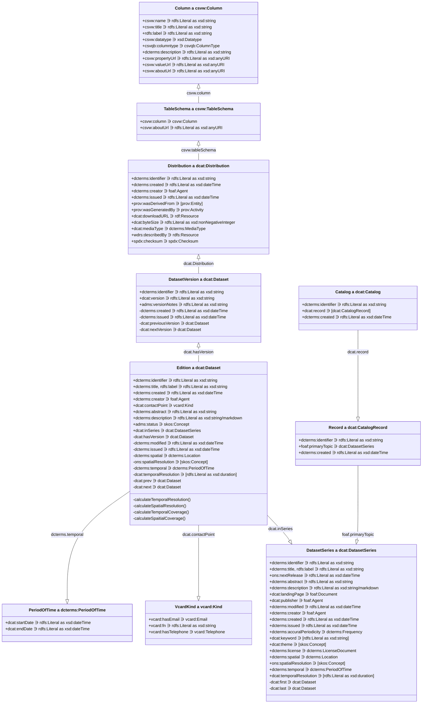

# Application Profile

_Working draft._

The key words must, must not, required, shall, shall not, should, should not, recommended, may, and optional are to be interpreted as described in RFC 2119.

- [Application Profile](#application-profile)
  - [Preamble](#preamble)
    - [Data on the Web Best Practises](#data-on-the-web-best-practises)
    - [Five star data](#five-star-data)
    - [FAIR principles](#fair-principles)
  - [Specifications used](#specifications-used)
  - [Data structure](#data-structure)
    - [Tidy Data dependencies](#tidy-data-dependencies)
    - [Using JSON-LD to describe statistical data](#using-json-ld-to-describe-statistical-data)
      - [Standards divergence from CSV-W](#standards-divergence-from-csv-w)
    - [Overview Object Model Diagram](#overview-object-model-diagram)
  - [Our API endpoints](#our-api-endpoints)
    - [Design decision on object model](#design-decision-on-object-model)
    - [Draft JSON-LD Context](#draft-json-ld-context)
    - [HTTP verbs and their applicability to our objects](#http-verbs-and-their-applicability-to-our-objects)
      - [Datasets (aka dcat:DatasetSeries)](#datasets-aka-dcatdatasetseries)
        - [GET and POST of a CPIH Dataset](#get-and-post-of-a-cpih-dataset)
      - [Editions (aka dcat:Dataset)](#editions-aka-dcatdataset)
      - [Distributions (dcat:Distribution, qb:Dataset) and Versions (dcat:Dataset)](#distributions-dcatdistribution-qbdataset-and-versions-dcatdataset)
  - [Versioning](#versioning)
    - [Example of versioning in RDF for CPIH](#example-of-versioning-in-rdf-for-cpih)

## Preamble

The UK government often [publishes its statistics](https://www.gov.uk/search/research-and-statistics?content_store_document_type=statistics_published&order=updated-newest) in presentational spreadsheets. While this succeeds in getting important information into the public domain, we recognise there are still barriers and challenges in accessing and using the data we produce:

- Analysts need to wrangle data because data are in unstandardised and presentational formats.
- A user must locate and navigate through many large spreadsheets to understand what data are available.
- Metadata are provided in an unstructured or unstandardised ways.
- Data are in silos, making it difficult to link or relate statistics from different sources.
- The accessibility and usability of statistics varies from dataset to dataset.

We have explored how to follow best practices when publishing statistics, in particular through the use of the JSON-LD (JSON Linked Data), CSV on the Web (CSVW), Data Catalog (DCAT) and RDF Data Cube (QB) standards and vocabularies. This document is an application profile of these standards, describing a recommendation on how to use these standards together in order to achieve the data on the web best practices, 5-star data, and the FAIR data principles.

### Data on the Web Best Practises

The [Data on the Web Best Practices (DWBP)](https://www.w3.org/TR/dwbp/) describes recommendations for publishing data to the web. If followed, we can enable these benefits:

> - **Comprehension**: humans will have a better understanding about the data structure, the data meaning, the metadata and the nature of the dataset.
> - **Processability**: machines will be able to automatically process and manipulate the data within a dataset.
> - **Discoverability** machines will be able to automatically discover a dataset or data within a dataset.
> - **Reuse**: the chances of dataset reuse by different groups of data consumers will increase.
> - **Trust**: the confidence that consumers have in the dataset will improve.
> - **Linkability**: it will be possible to create links between data resources (datasets and data items).
> - **Access**: humans and machines will be able to access up to date data in a variety of forms.
> - **Interoperability**: it will be easier to reach consensus among data publishers and consumers.

### Five star data

5★ Open Data has a five point scale which describes data on the web which increases the utility of said data for each increase from one to five stars.

|   Stars    | Requirements                                                                                         |
| :--------: | :--------------------------------------------------------------------------------------------------- |
| ★☆☆☆☆      | data needs to be able to be published on the web,                                                    |
| ★★☆☆☆      | data needs to be machine-readable,                                                                   |
| ★★★☆☆      | data needs to be non-proprietary,                                                                    |
| ★★★★☆      | identifiers need to be used to denote things, so that people can talk about resources unambiguously, |
| ★★★★★      | data needs to able to be linkied to other data to provide context.                                   |

### FAIR principles

To aid humans who increasingly rely on computational support to deal with increased volumes of data, complexity, and creation speed of data, the [FAIR principles](https://www.go-fair.org/fair-principles/) were conceived.

The FAIR principles describe data which is:

> - **Findable**: data and metadata encoded for machines and humans
> - **Accessible**: using standard protocols for access and authentication of data
> - **Interoperable**: data and metadata is represented in an appropriate knowledge representation standard
> - **Reusable**: using common vocabularies for knowledge representation allows for reuse and remixing of data

## Specifications used

The Application Profile uses terms from various existing specifications. Classes and properties specified in the following sections come from the following namespaces.

| Namespace | Namespace IRI                                 | Specification name                                                                   |
| --------- | --------------------------------------------- | ------------------------------------------------------------------------------------ |
| `adms`    | `http://www.w3.org/ns/adms#`                  | Asset Description Metadata Schema                                                    |
| `dcat`    | `http://www.w3.org/ns/dcat#`                  | Data Catalog Vocabulary                                                              |
| `dcterms` | `http://purl.org/dc/terms/`                   | DCMI (Dublin Core Metadata Initiative) Metadata Terms                                |
| `dpv`     | `http://www.w3.org/ns/dpv#`                   | Data Privacy Vocabulary (DPV)                                                        |
| `foaf`    | `http://xmlns.com/foaf/0.1/`                  | FOAF (Friend of a friend) Vocabulary                                                 |
| `owl`     | `http://www.w3.org/2002/07/owl#`              | OWL Web Ontology Language                                                            |
| `prov`    | `http://www.w3.org/ns/prov#`                  | Provenance Vocabulary                                                                |
| `qb`      | `http://purl.org/linked-data/cube#`           | RDF Data Cube Vocabulary                                                             |
| `rdfs`    | `http://www.w3.org/2000/01/rdf-schema#`       | RDF (Resource Description Framework) Vocabulary Description Language 1.0: RDF Schema |
| `skos`    | `http://www.w3.org/2004/02/skos/core#`        | SKOS Simple Knowledge Organization System - Reference                                |
| `spdx`    | `http://spdx.org/rdf/terms#`                  | Software Package Data Exchange                                                       |
| `vcard`   | `http://www.w3.org/2006/vcard/ns#`            | File format standard for electronic business cards                                   |
| `wdrs`    | `http://www.w3.org/2007/05/powder-s#`         | Protocol for Web Description Resources (POWDER-S)                                    |
| `xkos`    | `http://rdf-vocabulary.ddialliance.org/xkos#` | XKOS: an SKOS extension for representing statistical classifications                 |
| `xsd`     | `http://www.w3.org/2001/XMLSchema#`           | XML Schema Part 2: Datatypes Second Edition                                          |

## Data structure

### Tidy Data dependencies

Our standards and vocabularies are based on the [Tidy Data](https://vita.had.co.nz/papers/tidy-data.pdf) principles. Tidy Data is a framework for structuring data to make analysis easier. The principles are:

> - Each variable (i.e. dimension) has its own column.
> - Each observation forms a row.
> - Each type of observation has a unit and a measure.
> - Each unit is based off QUDT units.
> - Each measure is based off QUDT measures.
> - Missing observations must be marked as missing using attributes.
> - Attributes provide additional metadata about the observation.
> - For every combination of dimensions and measure there is a single observation.

### Using JSON-LD to describe statistical data

We use JSON-LD to encode the metadata about statistical publications; metadata includes data which helps discovery, and provides guarantees on strucutre. JSON-LD is a standard for encoding linked data in JSON. JSON-LD is a subset of JSON, so any valid JSON is also valid JSON-LD. This makes using our JSON-LD representation of statistical data easy to use in any JSON application but better in ours.

#### Standards divergence from CSV-W

In order to gain the benefits of JSON-LD being directly consumable as RDF, we add the CSV-W context which is a violation of the CSV-W specification. CSV-W specfically states that the only acceptable context of a CSV-W document is the CSV-W context, whereas we use the CSV-W namespace in conjunction with other namespaces within our own contexts. This allows us to link our metadata about statistical publications with tabular data and its structure using familiar terms from the CSV on the Web standard.

(Note: We know the drama between JSON-LD and CSV-W was a bit of a mess when both were being developed, but we think the benefits of using JSON-LD outweigh the drawbacks of violating the CSV-W specification.)

### Overview Object Model Diagram



We are heavily reliant on dcat and dcterms to relate our statistical datasets, editions and versions together. In brief:

- We call our statistical publication series _Datasets_, although they are actually `dcat:DatasetSeries`.
- We call releases within these Datasets _Editions_, and they are dcat:inSeries of the `dcat:DatasetSeries` and are of type dcat:Dataset.
- We call all versions within these Editions _Versions_, and they are the object of the Editions' `dcat:hasVersion` property and are of type `dcat:Dataset`.
- Versions of data are provided as a _Distribution_, which is a `dcat:Distribution`, and can be of varying types, such as CSV, JSON, RDF, etc; however we are targetting JSON-LD with a CSV-W context representing a qb:DataSet.

## Our API endpoints

Our primary objective is to establish a URL framework that caters to both user-friendly web browsing and efficient data retrieval, for example in Python using `pandas.read_csv(url)`. The link should provide users with a comprehensive webpage if visited in a browser, but when consumed using pandas it would provide a csv file - this approach is known as [content negotiation](https://www.w3.org/TR/dwbp/#Conneg).

### Design decision on object model

Our API will use pluralised nouns to represent collections of objects and the individual objects as well. For example, the following URLs may be used to access the CPIH dataset:

> `https://data.ons.gov.uk/datasets/cpih`

- In a browser, this URL will return a webpage with the latest information about the CPIH dataset, a summary of its stucture, a preview of the data, and links to download the data in open formats.
- When used programatically along with an accept header, this URL will return the latest data in the requested format but defaulting to machine readable CSV.

> `https://data.ons.gov.uk/datasets/cpih/editions/2019-03`

- In a browser, this URL will redirect to the primary CPIH webpage.
- When used programatically along with an accept header, this URL will return the data for the most recent version of the March 2019 dataset in the requested format but defaulting to machine readable CSV.

> `https://data.ons.gov.uk/datasets/cpih/editions/2019-03/versions/2`

- In a browser, this URL will redirect to the primary CPIH webpage.
- When used programatically along with an accept header, this URL will return the data for the second version of the March 2019 dataset in the requested format but defaulting to machine readable CSV.

### Draft JSON-LD Context

We are building a series of JSON-LD contexts to support the publication of our statistical data. The draft context is currently [here](./worked-examples/cpih/draft_onsns_context.json), and we will be improving the context and ensuring conformation to the object model as described earlier.

### HTTP verbs and their applicability to our objects

We use the standard HTTP verbs to interact with our objects. Not all verbs are applicable to all objects, nor are all accessible publicly. We are still working out the business logic of mandatory and optional fields, and how to curate the namespace available to the ID of objects.

#### Datasets (aka dcat:DatasetSeries)

| Type            | Predicate                  | Range                               | POST Datasets | PUT Datasets | GET Datasets | GET Datasets/{ID} | DELETE Datasets |
|-----------------|----------------------------|-------------------------------------|---------------|--------------|--------------|-------------------|-----------------|
| 0 Management    | dcterms:identifier         | rdfs:Literal as xsd:string          | ✓             | ✓            | ✓            | ✓                 | ✓               |
| 1 Descriptive   | dcat:publisher             | foaf:Agent                          | ✓             | ✓            | ✓            | ✓                 |                 |
| 1 Descriptive   | dcterms:created            | rdfs:Literal as xsd:dateTime        | ✓             | ✓            | ✓            | ✓                 |                 |
| 1 Descriptive   | dcterms:creator            | foaf:Agent                          | ✓             | ✓            |              | ✓                 |                 |
| 1 Descriptive   | dcterms:issued             | rdfs:Literal as xsd:dateTime        | ✓             | ✓            | ✓            | ✓                 |                 |
| 1 Descriptive   | dcterms:modified           | rdfs:Literal as xsd:dateTime        | ✓             | ✓            | ✓            | ✓                 |                 |
| 1 Descriptive   | dcterms:title              | rdfs:Literal as xsd:string          | ✓             | ✓            | ✓            | ✓                 |                 |
| 1 Descriptive   | rdfs:label                 | rdfs:Literal as xsd:string          | ✓             | ✓            |              | ✓                 |                 |
| 2 Summary       | dcat:keyword               | [rdfs:Literal as xsd:string]        | ✓             | ✓            |              | ✓                 |                 |
| 2 Summary       | dcat:theme                 | [skos:Concept]                      | ✓             | ✓            |              | ✓                 |                 |
| 2 Summary       | dcterms:abstract           | rdfs:Literal as xsd:string          | ✓             | ✓            | ✓            | ✓                 |                 |
| 2 Summary       | dcterms:accuralPeriodicity | dcterms:Frequency                   | ✓             | ✓            | ✓            | ✓                 |                 |
| 2 Summary       | dcterms:description        | rdfs:Literal as xsd:string/markdown | ✓             | ✓            |              | ✓                 |                 |
| 2 Summary       | dcterms:license            | dcterms:LicenseDocument             | ✓             | ✓            | ✓            | ✓                 |                 |
| 5 Scope         | dcat:temporalResolution    | [rdfs:Literal as xsd:duration]      | ✓             | ✓            | ✓            | ✓                 |                 |
| 5 Scope         | dcterms:spatial            | dcterms:Location                    | ✓             | ✓            | ✓            | ✓                 |                 |
| 5 Scope         | dcterms:temporal           | dcterms:PeriodOfTime                | ✓             | ✓            | ✓            | ✓                 |                 |
| 5 Scope         | ons:spatialResolution      | [skos:Concept]                      | ✓             | ✓            | ✓            | ✓                 |                 |
| 6 Management    | dcat:first                 | dcat:Dataset                        |               |              |              | ✓                 |                 |
| 6 Management    | dcat:last                  | dcat:Dataset                        |               |              |              | ✓                 |                 |
| 6 Management    | ons:nextRelease            | rdfs:Literal as xsd:dateTime        | ✓             | ✓            | ✓            | ✓                 |                 |
| 8 Distributions | dcat:landingPage           | foaf:Document                       | ✓             | ✓            |              | ✓                 |                 |

##### GET and POST of a CPIH Dataset

**GET**
```JSON
{
  "@context": "https://data.ons.gov.uk/ns#",
  "@id": "https://data.ons.gov.uk/datasets/cpih",
  "@type": "dcat:DatasetSeries",
  "identifier": "cpih",
  "title": "Consumer Price Inflation including owner occupiers' housing costs (CPIH)",
  "summary": "The Consumer Prices Index including owner occupiers' housing costs (CPIH) is a measure of inflation which includes the costs associated with owning, maintaining and living in one's own home.",
  "description": "The Consumer Prices Index including owner occupiers' housing costs (CPIH) is a measure of inflation which includes the costs associated with owning, maintaining and living in one's own home. The CPIH is the most comprehensive measure of inflation.",
  "issued": "2023-06-21T00:07:00+00:00",
  "next_release": "2023-09-20T00:07:00+00:00",
  "publisher": "office-for-national-statistics",
  "creator": "office-for-national-statistics",
  "contact_point": {
    "name": "Consumer Price Inflation Enquiries",
    "email": "cpi@ons.gov.uk"
  },
  "theme": [
    "prices",
    "economy"
  ],
  "frequency": "monthly",
  "keywords": [
    "cpih",
    "inflation",
    "consumer price index",
    "consumer price inflation",
    "cpi",
    "consumer price index including owner occupiers' housing costs"
  ],
  "licence": "http://www.nationalarchives.gov.uk/doc/open-government-licence/version/3/",
  "spatial_coverage": "K02000001",
  "temporal_coverage": {
    "start": "1989-01-01T00:00:00+00:00",
    "end": "2023-08-01T00:00:00+00:00"
  },
  "temporal_resolution": "P1M",
  "editions": [
    {
      "@id": "https://data.ons.gov.uk/dataset/cpih/2023-09",
      "issued": "2023-09-21T00:07:00+00:00",
      "modified": "2023-09-21T00:07:00+00:00"
    },
    {
      "@id": "https://data.ons.gov.uk/dataset/cpih/2023-08",
      "issued": "2023-08-21T00:07:00+00:00",
      "modified": "2023-08-21T00:07:00+00:00"
    },
    {
      "@id": "https://data.ons.gov.uk/dataset/cpih/2023-07",
      "issued": "2023-07-21T00:07:00+00:00",
      "modified": "2023-07-21T00:07:00+00:00"
    }
  ]
}
```

**POST**

```JSON
{
  "@context": "./draft_onsns_context.json",
  "@id": "https://data.ons.gov.uk/datasets/cpih",
  "@type": "dcat:DatasetSeries",
  "identifier": "cpih",
  "title": "Consumer Price Inflation including owner occupiers' housing costs (CPIH)",
  "summary": "The Consumer Prices Index including owner occupiers' housing costs (CPIH) is a measure of inflation which includes the costs associated with owning, maintaining and living in one's own home.",
  "description": "The Consumer Prices Index including owner occupiers' housing costs (CPIH) is a measure of inflation which includes the costs associated with owning, maintaining and living in one's own home. The CPIH is the most comprehensive measure of inflation.",
  "landing_page": "https://www.ons.gov.uk/economy/inflationandpriceindices/bulletins/consumerpriceinflation/latest",
  "created": "2023-06-19T00:09:38+00:00",
  "issued": "2023-06-21T00:07:00+00:00",
  "nextRelease": "2023-09-20T00:07:00+00:00",
  "publisher": "office-for-national-statistics",
  "creator": "office-for-national-statistics",
  "contact_point": {
    "name": "Consumer Price Inflation Enquiries",
    "email": "cpi@ons.gov.uk",
    "telephone": "+441633456900"
  },
  "theme": [
    "prices",
    "economy"
  ],
  "frequency": "Month",
  "keywords": [
    "cpih",
    "inflation",
    "consumer price index",
    "consumer price inflation",
    "cpi",
    "consumer price index including owner occupiers' housing costs"
  ],
  "licence": "http://www.nationalarchives.gov.uk/doc/open-government-licence/version/3/",
  "temporal_coverage": {
    "start": "1989-01-01T00:00:00+00:00",
    "end": "2023-08-01T00:00:00+00:00"
  },
  "temporal_resolution": "P1M",
  "spatial_coverage": "K02000001",
  "spatial_resolution": ["K02"]
}
```

#### Editions (aka dcat:Dataset)

| Type            | Predicate                  | Range                               | POST Editions | PUT Editions | GET Editions | GET Editions/{ID} | DELETE Editions |
|-----------------|----------------------------|-------------------------------------|---------------|--------------|--------------|-------------------|-----------------|
| 0 Management    | dcterms:identifier         | rdfs:Literal as xsd:string          | ✓             | ✓            | ✓            | ✓                 | ✓               |
| 1 Descriptive   | dcat:publisher             | foaf:Agent                          | ✓             | ✓            | ✓            | ✓                 |                 |
| 1 Descriptive   | dcterms:created            | rdfs:Literal as xsd:dateTime        | ✓             | ✓            | ✓            | ✓                 |                 |
| 1 Descriptive   | dcterms:creator            | foaf:Agent                          | ✓             | ✓            |              | ✓                 |                 |
| 1 Descriptive   | dcterms:issued             | rdfs:Literal as xsd:dateTime        | ✓             | ✓            | ✓            | ✓                 |                 |
| 1 Descriptive   | dcterms:modified           | rdfs:Literal as xsd:dateTime        | ✓             | ✓            | ✓            | ✓                 |                 |
| 1 Descriptive   | dcterms:title              | rdfs:Literal as xsd:string          | ✓             | ✓            | ✓            | ✓                 |                 |
| 1 Descriptive   | rdfs:label                 | rdfs:Literal as xsd:string          | ✓             | ✓            |              | ✓                 |                 |
| 2 Summary       | dcat:keyword               | [rdfs:Literal as xsd:string]        | ✓             | ✓            |              | ✓                 |                 |
| 2 Summary       | dcat:theme                 | [skos:Concept]                      | ✓             | ✓            |              | ✓                 |                 |
| 2 Summary       | dcterms:abstract           | rdfs:Literal as xsd:string          | ✓             | ✓            | ✓            | ✓                 |                 |
| 2 Summary       | dcterms:accuralPeriodicity | dcterms:Frequency                   | ✓             | ✓            | ✓            | ✓                 |                 |
| 2 Summary       | dcterms:description        | rdfs:Literal as xsd:string/markdown | ✓             | ✓            |              | ✓                 |                 |
| 2 Summary       | dcterms:license            | dcterms:LicenseDocument             | ✓             | ✓            | ✓            | ✓                 |                 |
| 5 Scope         | dcat:temporalResolution    | [rdfs:Literal as xsd:duration]      | ✓             | ✓            | ✓            | ✓                 |                 |
| 5 Scope         | dcterms:spatial            | dcterms:Location                    | ✓             | ✓            | ✓            | ✓                 |                 |
| 5 Scope         | dcterms:temporal           | dcterms:PeriodOfTime                | ✓             | ✓            | ✓            | ✓                 |                 |
| 5 Scope         | ons:spatialResolution      | [skos:Concept]                      | ✓             | ✓            | ✓            | ✓                 |                 |
| 6 Management    | dcat:first                 | dcat:Dataset                        |               |              |              | ✓                 |                 |
| 6 Management    | dcat:last                  | dcat:Dataset                        |               |              |              | ✓                 |                 |
| 6 Management    | ons:nextRelease            | rdfs:Literal as xsd:dateTime        | ✓             | ✓            | ✓            | ✓                 |                 |
| 8 Distributions | dcat:landingPage           | foaf:Document                       | ✓             | ✓            |              | ✓                 |                 |

#### Distributions (dcat:Distribution, qb:Dataset) and Versions (dcat:Dataset)

| Type            | Predicate            | Range                                  | dcat:Dataset (Version) | dcat:Distribution | csvw:TableSchema | csvw:Column | POST Versions | GET Versions | GET Versions/{ID} | DELETE Version |
|-----------------|----------------------|----------------------------------------|------------------------|-------------------|------------------|-------------|---------------|--------------|-------------------|----------------|
| 0 Management    | dcterms:identifier   | rdfs:Literal as xsd:string             | ✓                      | ✓                 |                  |             | ✓             | ✓            | ✓                 | ✓              |
| 1 Descriptive   | dcterms:created      | rdfs:Literal as xsd:dateTime           | ✓                      | ✓                 |                  |             | ✓             | ✓            | ✓                 |                |
| 1 Descriptive   | dcterms:creator      | foaf:Agent                             |                        | ✓                 |                  |             | ✓             | ✓            | ✓                 |                |
| 1 Descriptive   | dcterms:issued       | rdfs:Literal as xsd:dateTime           | ✓                      | ✓                 |                  |             | ✓             | ✓            | ✓                 |                |
| 1 Descriptive   | rdfs:label           | rdfs:Literal as xsd:string             |                        |                   |                  | ✓           | ✓             | ✓            | ✓                 |                |
| 2 Summary       | dcterms:description  | rdfs:Literal as xsd:string/markdown    |                        |                   |                  | ✓           | ✓             |              | ✓                 |                |
| 4 Quality       | adms:versionNotes    | rdfs:Literal as xsd:string             | ✓                      |                   |                  |             | ✓             | ✓            | ✓                 |                |
| 6 Management    | dcat:nextVersion     | dcat:Dataset                           | ✓                      |                   |                  |             |               |              | ✓                 |                |
| 6 Management    | dcat:version         | rdfs:Literal as xsd:string             | ✓                      |                   |                  |             | ✓             | ✓            | ✓                 |                |
| 7 Relationships | dcat:previousVersion | dcat:Dataset                           | ✓                      |                   |                  |             |               |              | ✓                 |                |
| 7 Relationships | prov:wasDerivedFrom  | prov:Entity                            |                        | ✓                 |                  |             | ✓             |              | ✓                 |                |
| 7 Relationships | prov:wasGeneratedBy  | prov:Activity                          |                        | ✓                 |                  |             | ✓             |              | ✓                 |                |
| 7 Relationships | wdrs:describedBy     | rdfs:Resource                          |                        | ✓                 |                  |             | ✓             |              | ✓                 |                |
| 8 Distributions | dcat:byteSize        | rdfs:Literal as xsd:nonNegativeInteger |                        | ✓                 |                  |             |               |              | ✓                 |                |
| 8 Distributions | dcat:downloadURL     | rdf:Resource                           |                        | ✓                 |                  |             |               | ✓            | ✓                 |                |
| 8 Distributions | dcat:mediaType       | dcterms:MediaType                      |                        | ✓                 |                  |             | ✓             | ✓            | ✓                 |                |
| 8 Distributions | spdx:checksum        | spdx:Checksum                          |                        | ✓                 |                  |             |               | ✓            | ✓                 |                |
| 9 Schema        | csvqb:columntype     | csvqb:ColumnType                       |                        |                   |                  | ✓           | ✓             | ✓            | ✓                 |                |
| 9 Schema        | csvw:aboutUrl        | rdfs:Literal as xsd:anyURI             |                        |                   | ✓                |             | ✓             |              | ✓                 |                |
| 9 Schema        | csvw:column          | csvw:Column                            |                        |                   | ✓                |             | ✓             |              | ✓                 |                |
| 9 Schema        | csvw:datatype        | xsd:Datatype                           |                        |                   |                  | ✓           | ✓             |              | ✓                 |                |
| 9 Schema        | csvw:name            | rdfs:Literal as xsd:string             |                        |                   |                  | ✓           | ✓             | ✓            | ✓                 |                |
| 9 Schema        | csvw:propertyUrl     | rdfs:Literal as xsd:anyURI             |                        |                   |                  | ✓           | ✓             |              | ✓                 |                |
| 9 Schema        | csvw:title           | rdfs:Literal as xsd:string             |                        |                   |                  | ✓           | ✓             | ✓            | ✓                 |                |
| 9 Schema        | csvw:valueUrl        | rdfs:Literal as xsd:anyURI             |                        |                   |                  | ✓           | ✓             |              | ✓                 |                |

## Versioning

We believe publishing data in a versioned manner is important. Every publication of a dataset at a version level cannot be amended, it can only be deleted or superseded by a new version. This is to ensure that the data is immutable. We provide fields in our service to allow producers to provide version notes, specificing the changes between versions of an edition. 

### Example of versioning in RDF for CPIH

```turtle

@base <https://data.ons.gov.uk/datasets/> .
@prefix dcat: <http://www.w3.org/ns/dcat#> .
@prefix data: <https://iana.org/assignments/media-types/> .
@prefix dataapp: <https://iana.org/assignments/media-types/application/> .
@prefix datatext: <https://iana.org/assignments/media-types/text/> .
@prefix wdrs: <http://www.w3.org/2007/05/powder-s#> .
@prefix qb: <http://purl.org/linked-data/cube#> .

<cpih> a dcat:DatasetSeries .
<cpih/2019-01> a dcat:Dataset ;
	dcat:inSeries <cpih> ;
	dcat:hasVersion <cpih/2019-01/version/1>,
		<cpih/2019-01/version/2>,
		<cpih/2019-01/version/3> .

<cpih/2019-01/version/1> a dcat:Dataset ;
	dcat:distribution <cpih-2019-01-version-1.csv> .

<cpih-2019-01-version-1.csv> a dcat:Distribution ;
  dcat:mediaType datatext:csv ;
  wdrs:describedby <cpih-2019-01-version-1-metadata.json>.

<cpih-2019-01-version-1-metadata.json> dcat:mediaType <https://iana.org/assignments/media-types/application/csvm+json> .

<cpih/2019-01/version/2> a dcat:Dataset ;
	dcat:distribution <cpih-2019-01-version-2.json> .

<cpih-2019-01-version-2.json> a dcat:Distribution ;
  dcat:mediaType <https://iana.org/assignments/media-types/application/ld+json> .

<cpih/2019-01/version/3> a dcat:Dataset .

<cpih/2019-02> a dcat:Dataset ;
	dcat:inSeries <cpih> ;
	dcat:hasVersion <cpih/2019-02/version/1> .

<cpih/2019-02/version/1> a dcat:Dataset .

<cpih/2019-03> a dcat:Dataset ;
	dcat:inSeries <cpih> ;
	dcat:hasVersion <cpih/2019-01/version/1>,
		<cpih/2019-01/version/2> .

<cpih/2019-03/version/1> a dcat:Dataset .

<cpih/2019-03/version/2> a dcat:Dataset .

<cpihQB> a dcat:Distribution , qb:Dataset .

```
