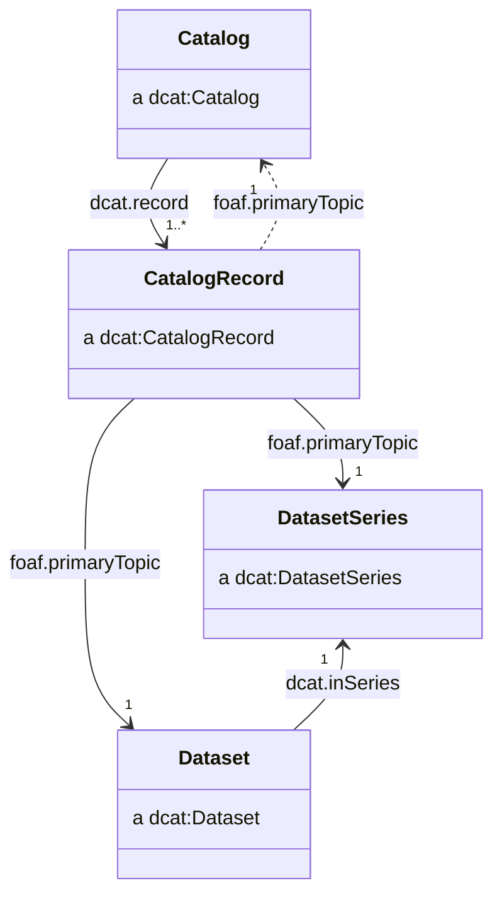
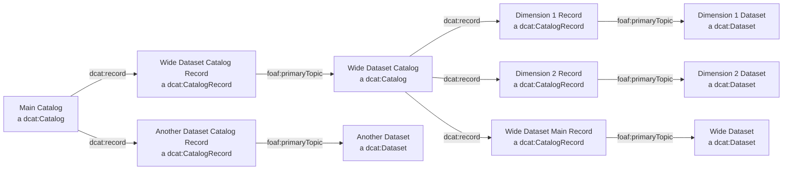
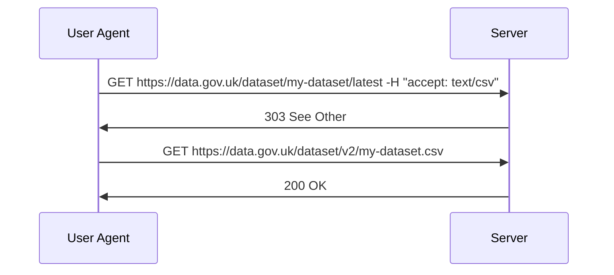
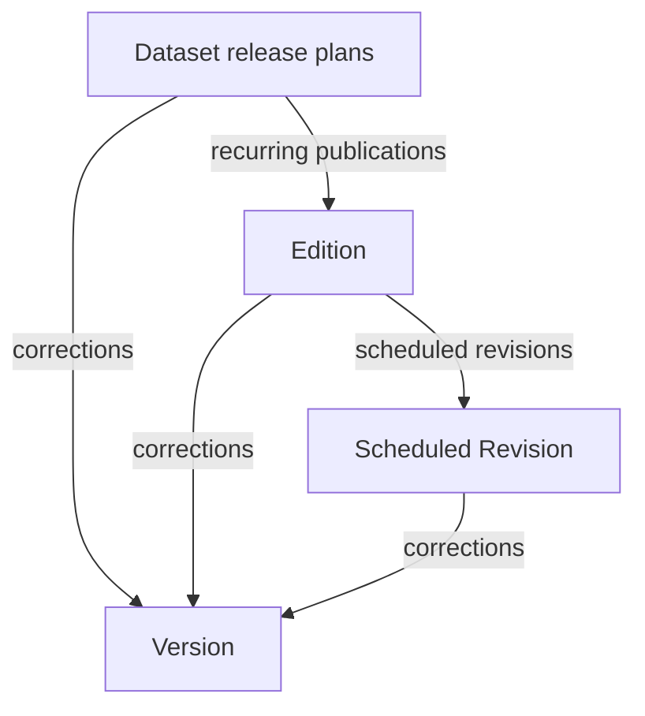
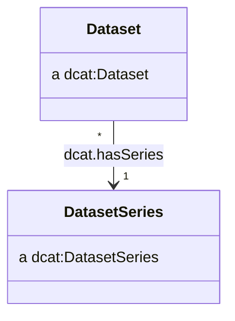
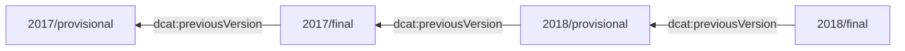
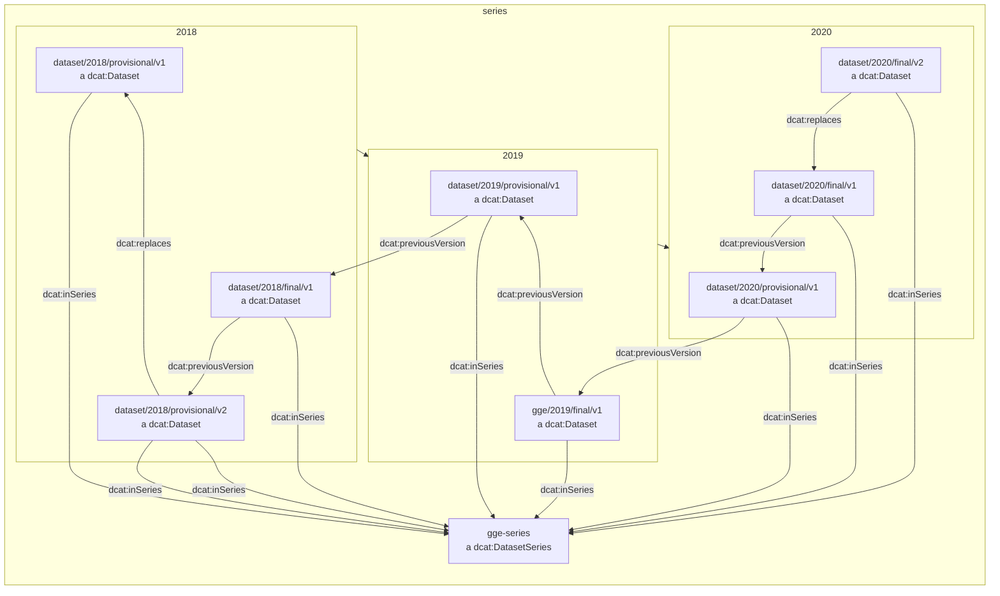

# Application Profile

_Working draft._

The key words must, must not, required, shall, shall not, should, should not, recommended, may, and optional are to be interpreted as described in RFC 2119.

## Preamble

The UK government often [publishes its statistics](https://www.gov.uk/search/research-and-statistics?content_store_document_type=statistics_published&order=updated-newest) in presentational spreadsheets. While this succeeds in getting important information into the public domain, there are still barriers and challenges in accessing and using the data:

- Analysts need to wrangle data because data are in unstandardised and presentational formats.
- A user must locate and navigate through many large spreadsheets to understand what data are available.
- Metadata are provided in an unstructured or unstandardised ways.
- Data are in silos, making it difficult to link or relate statistics from different sources.
- The accessibility and usability of statistics varies from dataset to dataset.

The [Data on the Web Best Practices (DWBP)](https://www.w3.org/TR/dwbp/) describes recommendations for publishing data to the web. If followed, we can enable these benefits:

> - **Comprehension**: humans will have a better understanding about the data structure, the data meaning, the metadata and the nature of the dataset.
> - **Processability**: machines will be able to automatically process and manipulate the data within a dataset.
> - **Discoverability** machines will be able to automatically discover a dataset or data within a dataset.
> - **Reuse**: the chances of dataset reuse by different groups of data consumers will increase.
> - **Trust**: the confidence that consumers have in the dataset will improve.
> - **Linkability**: it will be possible to create links between data resources (datasets and data items).
> - **Access**: humans and machines will be able to access up to date data in a variety of forms.
> - **Interoperability**: it will be easier to reach consensus among data publishers and consumers.

We have explored how to follow the best practices when publishing statistics, in particular through the use of the CSV on the Web (CSVW), Data Catalog (DCAT) and RDF Data Cube (QB) standards and vocabularies. This document is an application profile of these standards, describing a recommendation on how to use these standards together in order to achieve the data on the web best practices.

## Specifications used

The Application Profile uses terms from various existing specifications. Classes and properties specified in the following sections come from the following namespaces.

| Namespace | Namespace IRI                                  | Specification name                                                                   |
| --------- | ---------------------------------------------- | ------------------------------------------------------------------------------------ |
| `adms`    | `https://www.w3.org/ns/adms#`                  | Asset Description Metadata Schema                                                    |
| `dcat`    | `https://www.w3.org/ns/dcat#`                  | Data Catalog Vocabulary                                                              |
| `dcterms` | `https://purl.org/dc/terms/`                   | DCMI (Dublin Core Metadata Initiative) Metadata Terms                                |
| `dpv`     | `https://www.w3.org/ns/dpv#`                   | Data Privacy Vocabulary (DPV)                                                        |
| `foaf`    | `https://xmlns.com/foaf/0.1/`                  | FOAF (Friend of a friend) Vocabulary                                                 |
| `owl`     | `https://www.w3.org/2002/07/owl#`              | OWL Web Ontology Language                                                            |
| `prov`    | `https://www.w3.org/ns/prov#`                  | Provenance Vocabulary                                                                |
| `qb`      | `https://purl.org/linked-data/cube#`           | RDF Data Cube Vocabulary                                                             |
| `qudt`    | `https://qudt.org/2.1/schema/qudt`             | Main QUDT Ontology                                                                   |
| `rdfs`    | `https://www.w3.org/2000/01/rdf-schema#`       | RDF (Resource Description Framework) Vocabulary Description Language 1.0: RDF Schema |
| `skos`    | `https://www.w3.org/2004/02/skos/core#`        | SKOS Simple Knowledge Organization System - Reference                                |
| `spdx`    | `https://spdx.org/rdf/terms#`                  | Software Package Data Exchange                                                       |
| `xkos`    | `https://rdf-vocabulary.ddialliance.org/xkos#` | XKOS: an SKOS extension for representing statistical classifications                 |
| `xsd`     | `https://www.w3.org/2001/XMLSchema#`           | XML Schema Part 2: Datatypes Second Edition                                          |
| `vcard`   | `https://www.w3.org/2006/vcard/ns#`            | File format standard for electronic business cards                                   |

## Data structure

### Publish machine-readable data

> Machine-readable data is data in a standard format that can be read and processed automatically by a computing system. Traditional word processing documents and portable document format (PDF) files are easily read by humans but typically are difficult for machines to interpret and manipulate. Formats such as XML, JSON, HDF5, RDF and CSV are machine-readable data formats [^machine]

Many of the excel workbooks produced by statisticians are designed to be easily read by humans but typically are difficult for machines to interpret and manipulate.

Consider this example taken from the [RDF data cube vocabulary](https://www.w3.org/TR/vocab-data-cube/), extracted from StatsWales report number 003311 which describes life expectancy broken down by region (unitary authority), sex and time:

<table id="example-data" style="text-align: left;">
  <tbody>
    <tr>
      <td style="vertical-align: top;"><br>
      </td>
      <td colspan="2" rowspan="1" style="vertical-align: top; text-align: center; font-weight: bold;">2004-2006<br>
      </td>
      <td colspan="2" rowspan="1" style="vertical-align: top; text-align: center; font-weight: bold;">2005-2007<br>
      </td>
      <td colspan="2" rowspan="1" style="vertical-align: top; text-align: center; font-weight: bold;">2006-2008<br>
      </td>
    </tr>
    <tr>
      <td style="vertical-align: top;"><br>
      </td>
      <td style="vertical-align: top; text-align: center; font-weight: bold;">Male<br>
      </td>
      <td style="vertical-align: top; text-align: center; font-weight: bold;">Female<br>
      </td>
      <td style="vertical-align: top; text-align: center; font-weight: bold;">Male<br>
      </td>
      <td style="vertical-align: top; text-align: center; font-weight: bold;">Female<br>
      </td>
      <td style="vertical-align: top; text-align: center; font-weight: bold;">Male<br>
      </td>
      <td style="vertical-align: top; text-align: center; font-weight: bold;">Female<br>
      </td>
    </tr>
    <tr>
      <td style="vertical-align: top; text-align: right; font-weight: bold;">Newport<br>
      </td>
      <td style="vertical-align: top;">76.7<br>
      </td>
      <td style="vertical-align: top;">80.7<br>
      </td>
      <td style="vertical-align: top;">77.1<br>
      </td>
      <td style="vertical-align: top;">80.9<br>
      </td>
      <td style="vertical-align: top;">77.0<br>
      </td>
      <td style="vertical-align: top;">81.5<br>
      </td>
    </tr>
    <tr>
      <td style="vertical-align: top; text-align: right; font-weight: bold;">Cardiff<br>
      </td>
      <td style="vertical-align: top;">78.7<br>
      </td>
      <td style="vertical-align: top;">83.3<br>
      </td>
      <td style="vertical-align: top;">78.6<br>
      </td>
      <td style="vertical-align: top;">83.7<br>
      </td>
      <td style="vertical-align: top;">78.7<br>
      </td>
      <td style="vertical-align: top;">83.4<br>
      </td>
    </tr>
    <tr>
      <td style="vertical-align: top; text-align: right; font-weight: bold;">Monmouthshire<br>
      </td>
      <td style="vertical-align: top;">76.6<br>
      </td>
      <td style="vertical-align: top;">81.3<br>
      </td>
      <td style="vertical-align: top;">76.5<br>
      </td>
      <td style="vertical-align: top;">81.5<br>
      </td>
      <td style="vertical-align: top;">76.6<br>
      </td>
      <td style="vertical-align: top;">81.7<br>
      </td>
    </tr>
    <tr>
      <td style="vertical-align: top; text-align: right; font-weight: bold;">Merthyr Tydfil<br>
      </td>
      <td style="vertical-align: top;">75.5<br>
      </td>
      <td style="vertical-align: top;">79.1<br>
      </td>
      <td style="vertical-align: top;">75.5<br>
      </td>
      <td style="vertical-align: top;">79.4<br>
      </td>
      <td style="vertical-align: top;">74.9<br>
      </td>
      <td style="vertical-align: top;">79.6<br>
      </td>
    </tr>
  </tbody>
</table>

The table is a cross tabulation of the data, with the columns representing the time period of the observation and the sex of the observed population and the rows representing different locations. Having multiple header rows which span multiple columns makes the data difficult to read with software. Downstream users of the data will have to wrangle the data into a usable format.

Importing the above table into a statistical software such as [R](https://www.r-project.org/) produces a result with some problems:

- The header rows are not treated as headers.
- The header row representing time period is not fully populated.
- The first column contains empty strings.
- Numbers in the data are treated as strings, due to columns having mixed data types.

```r
# An example of how the above table looks once imported into R:

# A tibble: 6 x 7
  V1                V2        V3        V4        V5     V6    V7  
  <chr>             <chr>     <chr>     <chr>     <chr>  <chr> <chr> 
1 ""                2004-2006 2005-2007 2006-2008 NA     NA    NA  
2 ""                Male      Female    Male      Female Male  Female
3 "Newport"         76.7      80.7      77.1      80.9   77.0  81.5  
4 "Cardiff"         78.7      83.3      78.6      83.7   78.7  83.4  
5 "Monmouthshire"   76.6      81.3      76.5      81.5   76.6  81.7  
6 "Merthyr Tydfil"  75.5      79.1      75.5      79.4   74.9  79.6  
```

Organising the table as [tidy data](https://r4ds.had.co.nz/tidy-data.html), with each variable having its own column gives an output which can be instantly read into R, without need for further cleaning.

| area    | period    | sex    | life_expectancy |
| ------- | --------- | ------ | --------------- |
| Newport | 2004-2006 | Male   | 76.7            |
| Newport | 2004-2006 | Female | 80.7            |
| Cardiff | 2004-2006 | Male   | 78.7            |
| Cardiff | 2004-2006 | Female | 83.3            |
| ...     | ...       | ...    | ...             |

### Adopt common identifiers

We should adopt common and unambiguous identifiers for data items such as ONS geography codes and ISO-8601 time intervals.

| area      | period                  | sex    | life_expectancy |
| --------- | ----------------------- | ------ | --------------- |
| W06000022 | 2004-01-01T00:00:00/P3Y | Male   | 76.7            |
| W06000022 | 2004-01-01T00:00:00/P3Y | Female | 80.7            |
| W06000015 | 2004-01-01T00:00:00/P3Y | Male   | 78.7            |
| W06000015 | 2004-01-01T00:00:00/P3Y | Female | 83.3            |
| ...       | ...                     | ...    | ...             |

In this example, adopting ISO 8601 time intervals allows machines to provide additional functionality for computing with this type of data. Adopting geography codes allows for linking between datasets.

```r
# A tibble: 4 x 4
  area      period                         sex    life_expectancy
  <chr>     <Interval>                     <chr>            <dbl>
1 W06000022 2004-01-01 UTC--2007-01-01 UTC Male              76.7
2 W06000022 2004-01-01 UTC--2007-01-01 UTC Female            80.7
3 W06000015 2004-01-01 UTC--2007-01-01 UTC Male              78.7
4 W06000015 2004-01-01 UTC--2007-01-01 UTC Female            83.3
```

Producing data which _only_ uses identifiers could reduce usability by humans. It may be reasonable to include some of the redundant, human-friendly data such as labels alongside identifiers (known formally as denormalisation).

When [using a CSVW to create an RDF data cube](#using-csvw-to-create-an-rdf-data-cube), any redundant columns must be suppressed by setting `"suppressOutput": "true"`.

| area      | area_label | period                  | period_label | sex    | life_expectancy |
| --------- | ---------- | ----------------------- | ------------ | ------ | --------------- |
| W06000022 | Newport    | 2004-01-01T00:00:00/P3Y | 2004-2006    | Male   | 76.7            |
| W06000022 | Newport    | 2004-01-01T00:00:00/P3Y | 2004-2006    | Female | 80.7            |
| W06000015 | Cardiff    | 2004-01-01T00:00:00/P3Y | 2004-2006    | Male   | 78.7            |
| W06000015 | Cardiff    | 2004-01-01T00:00:00/P3Y | 2004-2006    | Female | 83.3            |
| ...       | ...        | ...                     | ...          | ...    | ...             |

To adopt common identifiers, there needs to exist a list of identifiers which can be shared and reused. We cover the creation of classifications in [codelists](#codelists).

### Using symbols and shorthand in tables

Statisticians often need to add metadata and additional context to their tables, such as describing that data are not available, an estimate is provisional or an estimate is statistically significant. The Government Statistical Service (GSS) [has a guide](https://analysisfunction.civilservice.gov.uk/policy-store/symbols-in-tables-definitions-and-help/) which provides a number of symbols and shorthand for common annotations (see [here](#symbols-and-shorthand-in-tables)).

For example, this table indicates that the life expectancy is not available (`[x]`) or provisional (`[p]`) for some entries.

| area      | period                  | sex    | life_expectancy |
| --------- | ----------------------- | ------ | --------------- |
| W06000022 | 2004-01-01T00:00:00/P3Y | Male   | 76.7            |
| W06000022 | 2004-01-01T00:00:00/P3Y | Female | 80.7            |
| W06000015 | 2004-01-01T00:00:00/P3Y | Male   | 78.7 [p]        |
| W06000015 | 2004-01-01T00:00:00/P3Y | Female | [x]             |
| ...       | ...                     | ...    | ...             |

These annotations are usually included inside the table alongside numeric data. When this happens the columns no longer contain a single type. By placing symbols such as `[x]` in the same column as numeric values, statistical software will interpret the column as containing strings and not numbers.

To avoid the mixing of types, we recommend that these annotations be placed in their own column. We refer to these annotations as _statistical markers_.

| area      | period                  | sex    | life_expectancy | marker |
| --------- | ----------------------- | ------ | --------------- | ------ |
| W06000022 | 2004-01-01T00:00:00/P3Y | Male   | 76.7            |        |
| W06000022 | 2004-01-01T00:00:00/P3Y | Female | 80.7            |        |
| W06000015 | 2004-01-01T00:00:00/P3Y | Male   | 78.7            |        |
| W06000015 | 2004-01-01T00:00:00/P3Y | Female |                 | [x]    |
| ...       | ...                     | ...    | ...             |        |

This adds some complexity when a table has multiple statistical measures as it is unclear which of the columns the marker applies to. In the following example, it is unclear whether the entry for `life_expectancy` or `disability_free_life_expectancy` (or both) is provisional.

| area      | period                  | sex    | life_expectancy | disability_free_life_expectancy | marker |
| --------- | ----------------------- | ------ | --------------- | ------------------------------- | ------ |
| W06000022 | 2004-01-01T00:00:00/P3Y | Male   | 76.7            | 70.1                            |        |
| W06000022 | 2004-01-01T00:00:00/P3Y | Female | 80.7            | 80.2                            |        |
| W06000015 | 2004-01-01T00:00:00/P3Y | Male   | 78.7            | 70.3                            | [p]    |
| W06000015 | 2004-01-01T00:00:00/P3Y | Female |                 | 80.4                            | [x]    |
| ...       | ...                     | ...    | ...             |                                 |        |

We solve this by pivoting the measures into a `measure_type` column, so each row represents a single statistical measure, with a single marker relating specifically to that measure.

| area      | period                  | sex    | measure_type                    | value | marker |
| --------- | ----------------------- | ------ | ------------------------------- | ----- | ------ |
| W06000022 | 2004-01-01T00:00:00/P3Y | Male   | life-expectancy                 | 76.7  |        |
| W06000022 | 2004-01-01T00:00:00/P3Y | Female | life-expectancy                 | 80.7  |        |
| W06000022 | 2004-01-01T00:00:00/P3Y | Male   | disability-free-life-expectancy | 70.1  |        |
| W06000022 | 2004-01-01T00:00:00/P3Y | Female | disability-free-life-expectancy | 80.2  | [p]    |
| W06000015 | 2004-01-01T00:00:00/P3Y | Male   | life-expectancy                 | 78.7  |        |
| W06000015 | 2004-01-01T00:00:00/P3Y | Female | life-expectancy                 |       | [x]    |
| ...       | ...                     | ...    | ...                             | ...   |        |

Data in this format allows users to filter and sort based upon annotations. For example, users can filter out results which are provisional or not applicable.

If necessary, the data can be pivoted back into a format which would feel more familiar by discarding the marker column.

```python
# R ----------------------------------------------

df |>
  dplyr::select(-marker) |>
  tidyr::pivot_wider(names_from = measure_type) |>
  janitor::clean_names()

# python -----------------------------------------

import pandas as pd

df = (
    df
    .set_index(["area", "period" ,"sex", "measure_type"])["value"]
    .unstack()
    .reset_index()
)
```

After pivoting with the above code, each of the measures has its own column.

| area      | period                  | sex    | life_expectancy | disability_free_life_expectancy |
| --------- | ----------------------- | ------ | --------------- | ------------------------------- |
| W06000022 | 2004-01-01T00:00:00/P3Y | Male   | 76.7            | 70.1                            |
| W06000022 | 2004-01-01T00:00:00/P3Y | Female | 80.7            | 80.2                            |
| W06000015 | 2004-01-01T00:00:00/P3Y | Male   | 78.7            | 70.3                            |
| W06000015 | 2004-01-01T00:00:00/P3Y | Female |                 | 80.4                            |
| ...       | ...                     | ...    | ...             |                                 |

### Expressing concept hierarchies

Statistics publishers may wish to indicate that their data includes a hierarchy. A typical approach may be to include multiple columns, one for each level of the hierarchy, though this can sometimes be ambiguous and difficult to interpret.

Consider a mock dataset which uses the Standard Industrial Trade Classification (SITC). SITC is a classification system for the trade of goods and services. It has several top level categories then broken down into subcategories.

```
0 Food and live animals
├─ 00 Live animals other than animals of division 03
│  ├─ 001 Live animals other than animals of division 03
├─ 01 Meat and meat preparations
│  ├─ 011 Meat of bovine animals, fresh, chilled or frozen
│  ├─ 012 Other meat and edible meat offal
│  ├─ 016 Meat, edible meat offal, salted, dried; flours, meals
│  ├─ 017 Meat, edible meat offal, prepared, preserved, n.e.s
│  ├─ ...
├─ 02 Dairy products and birds' eggs
│  ├─   022 Milk, cream and milk products (excluding butter, cheese)
│  ├─ ...
```

This would typically be presented in a dataset with `industry`, `sub_industry` and `sub_industry_2` columns. Some entries may be blank depending on the level of the hierarchy being described.

| period | industry | sub_industry | sub_industry_2 | industry_label                                   | trade_value |
| ------ | -------- | ------------ | -------------- | ------------------------------------------------ | ----------- |
| 2004   | 0        |              |                | Food and live animals                            | ...         |
| 2004   | 0        | 00           |                | Live animals other than animals of division 03   | ...         |
| 2004   | 0        | 00           | 001            | Live animals other than animals of division 03   | ...         |
| 2004   | 0        | 01           |                | Meat and meat preparations                       | ...         |
| 2004   | 0        | 01           | 011            | Meat of bovine animals, fresh, chilled or frozen | ...         |
| ...    | ...      |              |                | ...                                              | ...         |

There may be some difficulties in working with data structured in this way:

- Different publishers may indicate hierarchy in different ways, using different combinations of multiple columns and blank entries. Understanding how each dataset's structure relates to its interpretation requires investigation.
- The number of columns is determined by the number of levels in the hierarchy, potentially making datasets very wide. Naming becomes more difficult as the number of columns increases.
- Using blank entries to indicate hierarchy means blank entries cannot then also be used where data is unknown or does not exist.
- The hierarchical relationship between columns is not explicit. It can be difficult to infer the structure, especially when a dataset has multiple hierarchies.

By creating codelists such as SITC we can make the hierarchy of categories explicit. By creating codelists and publishing these alongside the statistical data, we remove the need to include hierarchical structure inside the dataset.

We suggest collapsing the hierarchy into a single column, and using a defined classification which indicates the hierarchy of classes. We cover the creation of classifications in [codelists](#codelists).

| period | industry | industry_label                                   | trade_value |
| ------ | -------- | ------------------------------------------------ | ----------- |
| 2004   | 0        | Food and live animals                            | ...         |
| 2004   | 00       | Live animals other than animals of division 03   | ...         |
| 2004   | 001      | Live animals other than animals of division 03   | ...         |
| 2004   | 01       | Meat and meat preparations                       | ...         |
| 2004   | 011      | Meat of bovine animals, fresh, chilled or frozen | ...         |
| ...    | ...      | ...                                              | ...         |

It can be helpful to humans to include some information about the hierarchy inside the dataset, for example to make some aggregations simpler to perform. We recommend including a single `parent_x` column where there is a need to do so (a form of denormalisation). A blank entry in the parent column indicates no parent exists. 

When [using a CSVW to create an RDF data cube](#using-csvw-to-create-an-rdf-data-cube), the `parent_x` column must be suppressed by setting `"suppressOutput": "true"`.

| period | parent_industry | industry | industry_label                                   | trade_value |
| ------ | --------------- | -------- | ------------------------------------------------ | ----------- |
| 2004   |                 | 0        | Food and live animals                            | ...         |
| 2004   | 0               | 00       | Live animals other than animals of division 03   | ...         |
| 2004   | 00              | 001      | Live animals other than animals of division 03   | ...         |
| 2004   | 0               | 01       | Meat and meat preparations                       | ...         |
| 2004   | 01              | 011      | Meat of bovine animals, fresh, chilled or frozen | ...         |
| ...    |                 | ...      | ...                                              | ...         |

### Units of measurement

Units of an observation may be specified by including a units column.

| area      | period                  | sex    | life_expectancy | units |
| --------- | ----------------------- | ------ | --------------- | ----- |
| W06000022 | 2004-01-01T00:00:00/P3Y | Male   | 76.7            | years |
| W06000022 | 2004-01-01T00:00:00/P3Y | Female | 80.7            | years |
| W06000015 | 2004-01-01T00:00:00/P3Y | Male   | 78.7            | years |
| W06000015 | 2004-01-01T00:00:00/P3Y | Female | 83.3            | years |
| ...       | ...                     | ...    | ...             |       |

In the case of a single-measure dataset (or multiple-measures where those measures share the same units of measurement), the units of an observation may be specified via a CSVW virtual column.

### Secondary observations with different units

It is possible to capture secondary observations of the same measure. In order to do so, the secondary observation is treated as an attribute of the primary observation. We recommend that the primary observation unit be selected by the units used in the initial observation; however in composite datasets (i.e. an aggregation of study results) such as the one below the most precise unit should be selected.

| Country     | Sex    | Study Period | Height in cm | Height in inches |
| ----------- | ------ | :----------: | :----------: | :--------------: |
| Nepal       | Male   |  2012-2013   |    161.7     |       63.5       |
| Nepal       | Female |  2012-2013   |    150.4     |        59        |
| Netherlands | Male   |     2009     |    183.8     |       72.5       |
| Netherlands | Female |     2009     |    170.7     |        67        |

> Source: https://en.wikipedia.org/wiki/Average_human_height_by_country

In this case, `country`, `sex`, `study period` are dimensions, `height` is the measure dimension, `height in cm` is the observation column with cm as units, and `height in inches` is a decimal literal attribute of the `height in cm` observation with unit inches.

TODO: For representation using CSVW or RDF of this construction see a section in the RDF Cube Vocabulary bit at the end

### Representing model components and uncertanty

Similarly to [secondary observations with different units](#secondary-observations-with-different-units), model components and uncertainty should be expressed using literal attributes. An extension of the average human height by country dataset containing additional information about the observations provide information including the age range and count of study participants, and the standard deviation of the observation.

| Country     | Sex    | Study Period | Height in cm | Height in inches | age range | participants |  std  |
| ----------- | ------ | :----------: | :----------: | :--------------: | :-------: | :----------: | :---: |
| Nepal       | Male   |  2012-2013   |    161.7     |       63.5       |   15-69   |     1326     |       |
| Nepal       | Female |  2012-2013   |    150.4     |        59        |   15-69   |     2798     |       |
| Netherlands | Male   |     2009     |    183.8     |       72.5       |    21     |      74      |  7.1  |
| Netherlands | Female |     2009     |    170.7     |        67        |    21     |      50      |  6.3  |

> Source: https://en.wikipedia.org/wiki/Average_human_height_by_country

For datasets with confidence internals, we recommend attaching the upper and lower bounds to the primary observation as individiual literal attributes and not as a range.

#### Seasonal adjustments and unadjusted values

Seasonally adjusted and non-seasonally adjusted figures are frequently contained within the same dataset. In this case, although Seasonally Adjusted figures are a model component/output, we recommend that the measure used be extended so that SA and NSA both are captured as primary observations. In the example below the units are a number in thousands, and the column `All aged 16 & over` are a model component treated as a literal attribute.

| Period  | Measure                                   | Value | All aged 16 & over |
| ------- | ----------------------------------------- | :---: | :----------------: |
| 2022-Q2 | economically active (unadjusted)          | 33945 |       53900        |
| 2022-Q3 | economically active (unadjusted)          | 33999 |       53935        |
| 2022-Q2 | economically active (seasonally adjusted) | 33970 |       53900        |
| 2022-Q3 | economically active (seasonally adjusted) | 33942 |       53935        |

> Combined datasets from ONS [A02 SA: Employment, ... (seasonally adjusted)](https://www.ons.gov.uk/employmentandlabourmarket/peopleinwork/employmentandemployeetypes/datasets/employmentunemploymentandeconomicinactivityforpeopleaged16andoverandagedfrom16to64seasonallyadjusteda02sa) and [A02 NSA: Employment, ... (not seasonally adjusted)](https://www.ons.gov.uk/employmentandlabourmarket/peopleinwork/employmentandemployeetypes/datasets/nsaemploymentunemploymentandeconomicinactivityforpeopleaged16andoverandagedfrom16to64a02).

### Mixing time periods

Statisticians may wish to report statistics at different time granularities. For example, a single dataset may report statistics by month, quarter, year and financial year.

| period    | industry | trade_value |
| --------- | -------- | ----------- |
| 2004      | 0        | ...         |
| 2004-2005 | 0        | ...         |
| 2004-01   | 0        | ...         |
| 2004-02   | 0        | ...         |
| ...       | ...      | ...         |
| 2005      | 00       | ...         |
| 2005-01   | 001      | ...         |
| 2005-02   | 01       | ...         |
| ...       | ...      | ...         |

We adopt IRIs from the [reference.data.gov.uk service](https://github.com/epimorphics/IntervalServer/blob/master/interval-uris.md).

`https://reference.data.gov.uk/id/{period_type}/{period}`

| period_type     | period    | industry | trade_value |
| --------------- | --------- | -------- | ----------- |
| year            | 2004      | 0        | ...         |
| government-year | 2004-2005 | 0        | ...         |
| month           | 2004-01   | 0        | ...         |
| month           | 2004-02   | 0        | ...         |
| ...             | ...       | ...      | ...         |
| year            | 2005      | 00       | ...         |
| government-year | 2005-2006 | 00       | ...         |
| month           | 2005-01   | 001      | ...         |
| month           | 2005-02   | 01       | ...         |
| ...             | ...       | ...      | ...         |

## Datasets

We recommend standalone datasets have IRIs in the form of

- `https://{domain}/dataset/{dataset_slug}`

However, in order to support [unscheduled revisions](#versions) (i.e. versions), we recommended that all datasets be a member of a dataset series.

For datasets belonging to a dataset series, we recommend extending the series IRI to form the dataset IRI:

- `https://{domain}/series/{series_slug}/dataset/{edition_period}`

For example:

- `https://data.gov.uk/dataset/my-dataset`
- `https://data.gov.uk/series/some-dataset-series/dataset/2018-Q3`

We recommend the use of the following properties:

| Property                     | Requirement level | Notes                                                                      |
| ---------------------------- | ----------------- | -------------------------------------------------------------------------- |
| `dcterms:title`              | mandatory         | See [titles](#titles)                                                      |
| `dcterms:description`        | mandatory         | See [descriptions](#descriptions)                                          |
| `dcterms:publisher`          | mandatory         | See [publishers, creators and contacts](#publishers-creators-and-contacts) |
| `dcterms:license`            | mandatory         | See [licenses](#licenses)                                                  |
| `dcat:distribution`          | mandatory         | See [distributions](#distributions)                                        |
| `dcterms:creator`            | recommended       | See [publishers, creators and contacts](#publishers-creators-and-contacts) |
| `dcat:contactPoint`          | recommended       | See [publishers, creators and contacts](#publishers-creators-and-contacts) |
| `dcterms:issued`             | recommended       | See [dates and times](#dates-and-times)                                    |
| `dcterms:modified`           | recommended       | See [dates and times](#dates-and-times)                                    |
| `dcat:keyword`               | recommended       | See [keywords](#keywords)                                                  |
| `dcat:theme`                 | recommended       | See [themes](#themes)                                                      |
| `dcterms:accrualPeriodicity` | recommended       | See [frequency](#frequency)                                                |
| `dcterms:spatial`            | recommended       | See [geography](#geography)                                                |
| `dcterms:temporal`           | recommended       | See [dates and times](#dates-and-times)                                    |
| `dcat:inSeries`              | recommended       | See [editions](#editions)                                                  |
| `dcat:hasCurrentVersion`     | recommended       | See [versions](#versions)                                                  |
| `dcat:hasVersion`            | recommended       | See [versions](#versions)                                                  |
| `dcat:version`               | recommended       | See [versions](#versions)                                                  |
| `adms:versionNotes`          | recommended       | See [versions](#versions)                                                  |
| `dcat:prev`                  | recommended       | See [versions](#versions)                                                  |
| `dcat:landingPage`           | optional          |                                                                            |
| `dcterms:identifier`         | optional          |                                                                            |
| `dcterms:isReferencedBy`     | optional          |                                                                            |

For example:

```ttl
<https://data.gov.uk/series/uk-territorial-greenhouse-gas-emissions-national-statistics/dataset/2018> a dcat:Dataset ;
    dcterms:title "Final UK greenhouse gas emissions national statistics: 1990 to 2018"@en ;
    dcterms:description "Final estimates of UK territorial greenhouse gas emissions..."@en ;
    dcterms:license <https://www.nationalarchives.gov.uk/doc/open-government-licence/version/3/> ;
    dcterms:publisher <https://www.gov.uk/government/organisations/department-for-business-energy-and-industrial-strategy> ;
    dcterms:issued "2020-02-04T09:30:00"^^xsd:dateTime ;
    dcterms:modified "2020-07-30T08:30:06"^^xsd:dateTime ;
    dcat:keyword "greenhouse gases"@en, "carbon emissions"@en, "greenhouse gas emissions"@en ;
    dcat:theme <https://osr.statisticsauthority.gov.uk/themes/transport-environment-climate-change/> ;
    dcat:contactPoint <https://data.gov.uk/series/uk-territorial-greenhouse-gas-emissions-national-statistics/dataset/2018/contact> ;
    dcat:distribution <https://data.gov.uk/series/uk-territorial-greenhouse-gas-emissions-national-statistics/dataset/2018/datacube>, 
        <https://data.gov.uk/series/uk-territorial-greenhouse-gas-emissions-national-statistics/dataset/2018.csv>, 
        <https://data.gov.uk/series/uk-territorial-greenhouse-gas-emissions-national-statistics/dataset/2018.json> ;
    dcterms:isReferencedBy <https://www.gov.uk/government/statistics/final-uk-greenhouse-gas-emissions-national-statistics-1990-to-2018> ;
    dcat:landingPage "https://data.gov.uk/series/uk-territorial-greenhouse-gas-emissions-national-statistics/dataset/2018"^^xsd:anyURI ;
    dcterms:accrualPeriodicity <https://purl.org/cld/freq/annual> ;
    dcterms:spatial <https://statistics.data.gov.uk/id/statistical-geography/K02000001> ;
    dcterms:temporal <https://reference.data.gov.uk/id/gregorian-interval/1990-01-01T00:00:00/P28Y> ;
    dcat:inSeries <https://data.gov.uk/series/uk-territorial-greenhouse-gas-emissions-national-statistics> ;
    dcat:hasCurrentVersion <https://data.gov.uk/series/uk-territorial-greenhouse-gas-emissions-national-statistics/dataset/2018/version/2> ;
    dcat:hasVersion <https://data.gov.uk/series/uk-territorial-greenhouse-gas-emissions-national-statistics/dataset/2018/version/1>, 
        <https://data.gov.uk/series/uk-territorial-greenhouse-gas-emissions-national-statistics/dataset/2018/version/2> ;
    dcat:version 2 ;
    adms:versionNotes "Dataset was corrected following an error being recognised."@en ;
    dcat:prev <https://data.gov.uk/series/uk-territorial-greenhouse-gas-emissions-national-statistics/dataset/2017> ;
    dcterms:identifier "ghg-2018" ;
    .
```

## Dataset series

Our use of dataset series is described in [editions](#editions).

We recommend dataset series have IRIs of the form:

- `https://{domain}/series/{series_slug}`

For example:

- `https://data.gov.uk/series/some-dataset-series`

We recommend the use of the following properties:

| Property                     | Requirement level | Notes                                                                      |
| ---------------------------- | ----------------- | -------------------------------------------------------------------------- |
| `dcterms:title`              | mandatory         | See [titles](#titles)                                                      |
| `dcterms:description`        | mandatory         | See [descriptions](#descriptions)                                          |
| `dcterms:publisher`          | mandatory         | See [publishers, creators and contacts](#publishers-creators-and-contacts) |
| `dcterms:license`            | mandatory         | See [licenses](#licenses)                                                  |
| `dcterms:creator`            | recommended       | See [publishers, creators and contacts](#publishers-creators-and-contacts) |
| `dcat:contactPoint`          | recommended       | See [publishers, creators and contacts](#publishers-creators-and-contacts) |
| `dcterms:issued`             | recommended       | See [dates and times](#dates-and-times)                                    |
| `dcterms:modified`           | recommended       | See [dates and times](#dates-and-times)                                    |
| `dcat:keyword`               | recommended       | See [keywords](#keywords)                                                  |
| `dcat:theme`                 | recommended       | See [themes](#themes)                                                      |
| `dcterms:accrualPeriodicity` | recommended       | See [frequency](#frequency)                                                |
| `dcterms:spatial`            | recommended       | See [geography](#geography)                                                |
| `dcterms:temporal`           | recommended       | See [dates and times](#dates-and-times)                                    |

For example:

```ttl
@prefix dcterms: <https://purl.org/dc/terms/> .
<https://data.gov.uk/series/uk-territorial-greenhouse-gas-emissions-national-statistics> a dcat:DatasetSeries ;
    dcterms:title "UK territorial greenhouse gas emissions national statistics"@en ;
    dcterms:description "Final and provisional estimates of UK territorial greenhouse gas emissions from 1990."@en ;
    dcterms:issued "2015-02-11T09:30:00"^^xsd:dateTime ;
    dcterms:modified "2022-03-31T08:30:14"^^xsd:dateTime ;
    .
```

Many of the properties which apply to dataset series are also applicable to datasets within that series. We recommend specifying properties for both resources.

## Cataloguing

A catalogue is a collection of metadata about datasets which has been gathered and curated. For smaller or more simple dataset collections, it makes sense to attach `DatasetSeries` and `Datasets` directly to a `CatalogRecord`.

### Classes



We recommend the use of `dcat:Catalog`, `dcat:CatalogRecord`, `dcat:DatasetSeries` and `dcat:Dataset` classes. 

> Yo dawg, I heard you liked catalogs...

In some serialisations, more complicated datasets with many local dimensions a dataset is created for each dimension as a representation of its `ConceptScheme`. If each of these dimenion datasets end up on the primary `Catalog` it may complicate the primary `Dataset`'s discovery, by creating a child `Catalog` to encapsulate `CatalogRecord`s for the each dimension and the primary dataset creates a more streamlined primary `Catalog`.



**NOTE** A `dcat:Catalog` should not have a `dcat:CatalogRecord` which points to its parent `dcat:Catalog`. 

### Catalogue

We recommend catalogues have IRIs of the form:

- ```https://{domain}/catalogue```
- ```https://{domain}/catalogue/{catalogue_slug}```

For example:

- ```https://data.gov.uk/catalogue```
- ```https://data.gov.uk/catalogue/climate-change```

We recommend the use of the following properties:

| Property                | Requirement level | Notes                                                                      |
| ----------------------- | ----------------- | -------------------------------------------------------------------------- |
| `dcterms:title`         | mandatory         | See [titles](#titles)                                                      |
| `dcterms:description`   | mandatory         | See [descriptions](#descriptions)                                          |
| `dcterms:publisher`     | mandatory         | See [publishers, creators and contacts](#publishers-creators-and-contacts) |
| `dcterms:creator`       | recommended       | See [publishers, creators and contacts](#publishers-creators-and-contacts) |
| `dcat:contactPoint`     | recommended       | See [publishers, creators and contacts](#publishers-creators-and-contacts) |
| `dcterms:issued`        | recommended       | See [dates and times](#dates-and-times)                                    |
| `dcterms:modified`      | recommended       | See [dates and times](#dates-and-times)                                    |
| `dcterms:themeTaxonomy` | optional          | See [themes](#themes)                                                      |

For example:

```ttl
@prefix dcat: <https://www.w3.org/ns/dcat#> .
@prefix dcterms: <https://purl.org/dc/terms/> .

<https://data.gov.uk/catalogue/climate-change> a dcat:Catalog ;
    dcterms:title "Climate change datasets"@en ;
    dcterms:description "A catalogue of datasets about climate change"@en ;
    dcterms:publisher <https://www.gov.uk/government/organisations/department-for-business-energy-and-industrial-strategy> ;
    dcterms:creator <https://www.gov.uk/government/organisations/department-for-business-energy-and-industrial-strategy> ;
    dcat:contactPoint <https://data.gov.uk/catalogue/climate-change/contact> ;
    dcterms:issued "2015-01-01"^^xsd:date ;
    dcterms:modified "2015-01-01"^^xsd:date ;
    dcterms:themeTaxonomy <https://data.gov.uk/themes> ;
    .
```

### Catalog Record

We recommend creaing a IRI for catalogue records by appending `/record` or `#record` to the IRI of the resource being described by the catalogue record:

- `{dataset_iri}/record`
- `{dataset_iri}#record`

For example:

- `https://data.gov.uk/dataset/my-dataset/record`
- `https://data.gov.uk/dataset/my-dataset#record`

We recommend the use of the following properties:

| Property               | Requirement level | Notes                                                                                |
| ---------------------- | ----------------- | ------------------------------------------------------------------------------------ |
| `dcterms:issued`       | mandatory         | See [dates and times](#dates-and-times)                                              |
| `foaf:primaryTopic`    | mandatory         | This points to the IRI of the `dcat:DatasetSeries` described by the catalogue record |
| `prov:wasAttributedTo` | recommended       |                                                                                      |
| `dcterms:modified`     | recommended       | See [dates and times](#dates-and-times)                                              |

We may use `prov:wasAttributedTo` to attribute the creation of the catalogue record to a specific entity, such as the person who added the dataset to the catalogue.

For example:

```ttl
@prefix dcat: <https://www.w3.org/ns/dcat#> .
@prefix dcterms: <https://purl.org/dc/terms/> .
@prefix foaf: <https://xmlns.com/foaf/0.1/> .
@prefix prov: <https://www.w3.org/ns/prov#> .

<https://data.gov.uk/dataset/my-dataset/record> a dcat:CatalogRecord ;
    dcterms:issued "2015-01-01"^^xsd:date ;
    foaf:primaryTopic <https://data.gov.uk/series/my-dataset-series> ;
    prov:wasAttributedTo <mailto:joe.bloggs@ons.gov.uk> ;
    .
```


### Named graphs for catalogue metadata

Where metadata is stored as RDF, such as being made available via a SPARQL endpoint, DCAT makes a recommendation about the names of graphs to use for catalogue records.

> If a catalog is represented as an RDF Dataset with named graphs (as defined in [[SPARQL11-QUERY]](https://www.w3.org/TR/sparql11-query/)), then it is appropriate to place the description of each dataset (consisting of all RDF triples that mention the dcat:Dataset, dcat:CatalogRecord, and any of its dcat:Distributions) into a separate named graph. The name of that graph SHOULD be the IRI of the catalog record.[^named-graphs]

```ttl
<https://data.gov.uk/dataset/my-dataset/record> {
    ...
}
```

Doing this results in a neat ability to query for dataset metadata by limiting a SPARQL query to the IRI of the catalogue record.

```sparql
SELECT * 
FROM <https://data.gov.uk/dataset/my-dataset/record> 
WHERE {
    ?s ?p ?o .
}
```

We also recommend placing catalogue records into a named graph that is the same as the IRI of the catalog.

```ttl
@prefix dcterms: <https://purl.org/dc/terms/> .
<https://data.gov.uk/catalogue/my-datasets> {

    <https://data.gov.uk/catalogue/my-datasets> a dcat:Catalog ;
        dcterms:title "My datasets"@en ;
        dcterms:description "A description of my catalogue."@en ;
        dcterms:publisher <https://www.gov.uk/government/organisations/office-for-national-statistics> ;
        dcterms:issued "2015-01-01"^^xsd:date ;
        dcterms:modified "2018-01-01"^^xsd:date ;
        dcat:record <https://data.gov.uk/dataset/my-dataset/record> ;
        .

    <https://data.gov.uk/dataset/my-dataset/record> a dcat:CatalogRecord ;
        dcterms:title "My Dataset" ;
        dcterms:description "A description of my dataset."@en ;
        dcterms:publisher <https://www.gov.uk/government/organisations/office-for-national-statistics> ;
        dcterms:issued "2018-01-01"^^xsd:date ;
        .

}
```

## Distributions


> a `dcat:Distribution` represents an accessible form of a dataset such as a downloadable file.

We recommend distributions have IRIs which are identical to the dataset IRI, with file extension appended.

- `https://{dataset_iri}.{extension}`

The exception is when representing an RDF data cube as a distribution, for which there is no physical file and therefore no extension. In that instance, we recommend appending `/datacube` or `#datacube` to the dataset IRI.

- `https://{dataset_iri}/datacube`
- `https://{dataset_iri}#datacube`

For example:

- `https://data.gov.uk/dataset/my-dataset.csv`
- `https://data.gov.uk/dataset/my-dataset.ttl`
- `https://data.gov.uk/dataset/my-dataset.json`
- `https://data.gov.uk/dataset/my-dataset/datacube`

| Property                | Requirement level | Notes                                                                          |
| ----------------------- | ----------------- | ------------------------------------------------------------------------------ |
| `dcterms:title`         | mandatory         | See [titles](#titles)                                                          |
| `dcterms:description`   | mandatory         | See [descriptions](#descriptions)                                              |
| `dcterms:license`       | mandatory         | See [licenses](#licenses)                                                      |
| `dcterms:creator`       | recommended       | See [publishers, creators and contacts](#publishers-creators-and-contacts)     |
| `dcterms:issued`        | recommended       | See [dates and times](#dates-and-times)                                        |
| `dcterms:modified`      | recommended       | See [dates and times](#dates-and-times)                                        |
| `dcat:isDistributionOf` | recommended       | See [CSVs as self contained datasets](#csvs-as-self-contained-datasets)        |
| `dcat:mediaType`        | recommended       | See [media types](#media-types)                                                |
| `dcat:downloadURL`      | recommended       |                                                                                |
| `dcat:byteSize`         | recommended       |                                                                                |
| `spdx:checksum`         | recommended       |                                                                                |
| `wdrs:describedby`      | optional          | For CSV distributions, we can relate the CSVW metadata using`wdrs:describedby` |

For example:

```ttl
@prefix dcterms: <https://purl.org/dc/terms/> .

<https://data.gov.uk/series/uk-territorial-greenhouse-gas-emissions-national-statistics/dataset/2018.csv> a dcat:Distribution ;
    dcterms:title "Final UK greenhouse gas emissions national statistics: 1990 to 2018 (CSV)"@en ;
    dcterms:description "Final estimates of UK territorial greenhouse gas emissions..."@en ;
    dcterms:license <https://www.nationalarchives.gov.uk/doc/open-government-licence/version/3/> ;
    dcterms:issued "2020-02-04T09:30:00"^^xsd:dateTime ;
    dcterms:modified "2020-07-30T08:30:06"^^xsd:dateTime ;
    dcterms:title "2018.csv" ;
    wdrs:describedby <https://data.gov.uk/series/uk-territorial-greenhouse-gas-emissions-national-statistics/dataset/2018.csv-metadata.json> ;
    dcat:mediaType <https://www.w3.org/ns/iana/media-types/text/csv#Resource> ;
    dcat:downloadURL <https://data.gov.uk/series/uk-territorial-greenhouse-gas-emissions-national-statistics/dataset/2018.csv> ;
    dcat:byteSize "12345"^^xsd:nonNegativeInteger ;
    spdx:checksum "CE114E4501D2F4E2DCEA3E17B546F339"^^spdx:Checksum ;
    .
```

### Content negotiation of distributions

We recommend that data providers implement content negotiation as a method for clients to access the data in the format they require.

The IRI of the `dcat:Dataset` should be used as the generic IRI which a user can request different formats of the data from.

For example, a `dcat:Dataset` with an IRI of `https://data.gov.uk/dataset/my-dataset/latest` may have a CSV distribution with its own IRI of `https://data.gov.uk/dataset/v2/my-dataset.csv`. A user agent wishing to access the data in CSV format could navigate to `https://data.gov.uk/dataset/latest/my-dataset.csv` directly, or content negotiate against the IRI of the `dcat:Dataset` to find the CSV distribution.

```sh
curl https://data.gov.uk/dataset/my-dataset/latest -H "Accept: text/csv"
```

> What is the flow, do we 303 redirect to the CSV distribution of the dataset?



## Thinking on Editions, Scheduled Revisions, and Version

1. ASSUMPTION: All datasets are subject to revisions

    All newly published `dcat:datasets` should be included in a `dcat:DatasetSeries` as this provides structure for revision without introducing new resources when a revision becomes necessary; this allows for `dcat:CatalogRecords` to point to a `dcat:DatasetSeries` without needing to be updated should a revision happen..

```ttl
@PREFIX ex: <https://example.org/> .
@prefix dcat: <https://www.w3.org/ns/dcat#> .

ex:series/dataset-series-slug a dcat:DatasetSeries ;
    dcat:hasCurrentVersion ex:series/series-slug/dataset-slug/dataset/latest .

ex:series/series-slug/dataset-slug/dataset/v1 a dcat:Dataset ;
    dcat:inSeries ex:dataset-series-slug .

ex:series/series-slug/dataset-slug/dataset/v2 a dcat:Dataset ;
    dcat:inSeries ex:dataset-series-slug ;
    dcat:replaces ex:series/series-slug/dataset-slug/dataset/v1 ;
    owl:sameAs ex:series/series-slug/dataset-slug/dataset/latest .
```
2. ASSUMPTION: We must support editions (i.e. a sequence of releases) of datasets (e.g. 2018, 2019, 2020)

    Adding new editions of datasets should not require the modification of existing datasets within the series; in a simple series of editions defining which dataset it is replacing (via `dcat:previousVersion`) provides all necessary information to ammend the dataset series' membership to include this new dataset, and have the new edition be the current version.

```ttl
@PREFIX ex: <https://example.org/> .
@prefix dcat: <https://www.w3.org/ns/dcat#> .

ex:series/dataset-series-slug a dcat:DatasetSeries ;
    dcat:hasCurrentVersion ex:series/dataset-series-slug/dataset/latest ; 
    dcat:first ex:series/dataset-series-slug/dataset/2018 .

ex:series/dataset-series-slug/dataset/2018 a dcat:Dataset ;
    dcat:inSeries ex:series/dataset-series-slug .

ex:series/dataset-series-slug/dataset/2019 a dcat:Dataset ;
    dcat:inSeries ex:series/dataset-series-slug ;
    dcat:previousVersion ex:series/dataset-series-slug/dataset/2018 .

ex:series/dataset-series-slug/dataset/2020 a dcat:Dataset ;
    dcat:inSeries ex:series/dataset-series-slug ;
    dcat:previousVersion ex:series/dataset-series-slug/dataset/2019 ;
    owl:sameAs ex:series/dataset-series-slug/dataset/latest .
```

3.  We must support both scheduled (e.g. provisional/final) and unscheduled (e.g. v2-corrected) revisions

    One of the problems we face in this scenario is "what is the next version of a provisional release which has been re-issued due to an error?" If we have a unscheduled revision of a provisional edition (i.e. 2020/provisional/v2), when the final version (i.e. 2020/final) is published what is the "dcat:next" dataset from the original provisional edition (i.e. 2020/provisional/v1)? Is it 2020/provisional/v2 or 2020/final or even 2021/provisional? By using a combination of `dcat:previousVersion` and `dcat:replaces` the lineage allows the user to separate updated datasets.

## Editions, Scheduled Revisions, and Versions
> `dcat:DatasetSeries`, `dcat:inSeries`, `dcat:first`, `dcat:currentVersion`, `dcat:previousVersion`, and `dcat:replaces` is recommended as part of [DCAT v3](https://w3c.github.io/dxwg/dcat/), which is still in draft.

Many statistics producers publish sets of statistics at a regular frequency such as monthly, quarterly, or annual releases; we consider these _editions_. An edition typically covers a new time period compared to the previously released edition.

Some statistical releases couple regular editions with multiple scheduled releases of the same period. This statistical publication approach where a draft, provisional, or estimated publication is released earlier than a final edition where the full processes or observations would be possible; we consider these _scheduled revisions_. A _scheduled revision_ for the same edition would typically cover the same time period.

Statistics which are released can corrected outside the regular update process; we consider these unscheduled revisions _versions_. The updated version covers the same scope as the replaced version, and should contain a detailed explaination of the changes necessitating the unscheduled revision.



Statistical publications, and other datasets typically have a release plan including its update cadence which falls into the structure described above. Additionally, all datasets can be subject to correction. As such we recommend that all editions, revisions, and versions of a dataset attach to a `dcat:DatasetSeries` which is in turn attached a `dcat:CatalogEntry`.



```ttl
@prefix dcat: <https://www.w3.org/ns/dcat#> .
@PREFIX ex: <https://example.org/> .

ex:DatasetSeries a dcat:DatasetSeries .

ex:Dataset1 a dcat:Dataset ;
    dcat:inSeries ex:DatasetSeries .

ex:Dataset2 a dcat:Dataset ;
    dcat:inSeries ex:DatasetSeries .
```

### Editions

> `dcat:DatasetSeries`, `dcat:inSeries`, and `dcat:previousVersion` are recommended as part of [DCAT v3](https://w3c.github.io/dxwg/dcat/), which is still in draft.

We group regular releases of new data within the same series of statistical publications as _editions_. A new edition of a dataset should cover the new observations from the time period since the previous edition.

In editions, previous years of data may be repeated without any changes, though in some instances some previous edition's data may be revised or updated to include new data or better estimates. Regardless of the updates to previously released data, an editions intent is to release new data for the dataset series.

Each edition is given its own IRI which typically contains the latest time period for which data is available.

For example, `https://data.gov.uk/series/name-of-my-statistical-series/dataset/2018` is the IRI of the 2018 edition of the series `name-of-my-statistical-series`.

Editions should be related to a `dcat:DatasetSeries` using `dcat:inSeries`. The dataset series should have an IRI which does not reference particular time period and can represent the collection of editions.

For example, the following dataset series has two editions from 2017 and 2018.

```ttl
<https://data.gov.uk/series/name-of-my-statistical-series> a dcat:DatasetSeries .

<https://data.gov.uk/series/name-of-my-statistical-series/dataset/2018> a dcat:Dataset ;
    dcat:inSeries <https://data.gov.uk/series/name-of-my-statistical-series> ;
    dcat:previousVersion <https://data.gov.uk/series/name-of-my-statistical-series/dataset/2017> .

<https://data.gov.uk/series/name-of-my-statistical-series/dataset/2017> a dcat:Dataset ;
    dcat:inSeries <https://data.gov.uk/series/name-of-my-statistical-series> ;
    dcat:previousVersion <https://data.gov.uk/series/name-of-my-statistical-series/dataset/2016> .
```


### Scheduled revisions

> `dcat:DatasetSeries`, `dcat:inSeries`, and `dcat:previousVersion` are recommended as part of [DCAT v3](https://w3c.github.io/dxwg/dcat/), which is still in draft.

Statisticians may wish to release early or provisional estimates of statistics which are later revised as "final" statistics when additional data is available. The Government Statistical Service refers to these as [scheduled revisions](https://analysisfunction.civilservice.gov.uk/policy-store/communicating-quality-uncertainty-and-change/).

The IRIs of provisional and final datasets should contain their effective status indicator such as `provisional`, `esimated`, or `final`. Provisional and final statistics can both be attached to the same dataset series and related to one another by the `dcat:previousVersion` property.



For example, the following dataset series has two editions from both 2017 and 2018, one provisional and one final.

```ttl
<https://data.gov.uk/series/name-of-my-statistical-series> a dcat:DatasetSeries .

<https://data.gov.uk/series/name-of-my-statistical-series/dataset/2017/provisional> a dcat:Dataset ;
    dcat:inSeries <https://data.gov.uk/series/name-of-my-statistical-series> ;
    dcat:previousVersion <https://data.gov.uk/series/name-of-my-statistical-series/dataset/2016/final> .

<https://data.gov.uk/series/name-of-my-statistical-series/dataset/2017/final> a dcat:Dataset ;
    dcat:inSeries <https://data.gov.uk/series/name-of-my-statistical-series> ;
    dcat:previousVersion <https://data.gov.uk/series/name-of-my-statistical-series/dataset/2017/provisional> .

<https://data.gov.uk/series/name-of-my-statistical-series/dataset/2018/provisional> a dcat:Dataset ;
    dcat:inSeries <https://data.gov.uk/series/name-of-my-statistical-series> ;
    dcat:previousVersion <https://data.gov.uk/series/name-of-my-statistical-series/dataset/2017/final> .

<https://data.gov.uk/series/name-of-my-statistical-series/dataset/2018/final> a dcat:Dataset ;
    dcat:inSeries <https://data.gov.uk/series/name-of-my-statistical-series> ;
    dcat:previousVersion <https://data.gov.uk/series/name-of-my-statistical-series/dataset/2018/provisional> .
```

### Versions

> `dcat:DatasetSeries`, `dcat:inSeries`, and `dcat:replaces` are recommended as part of [DCAT v3](https://w3c.github.io/dxwg/dcat/), which is still in draft.

Different versions of a dataset are the result of an unscheduled revision or correction.

We recommend using a generic `dcat:DatasetSeries` name with an unversioned IRI with a versioned `dcat:Dataset` attached to it so that unscheduled revisions can be accomodated with minimal effort. A user should expect that the generic IRI of a dataset series contains the link to the latest version.

As unscheduled revisions intend to replace data, it is important to use the `dcat:replaces` predicate to distinguish this intent to supercede previously thought correct data from new editions and scheduled revisions which uses `dcat:previousVersion` which describes a generic data lineage.

IRIs should be created to represent each specific version of a dataset. We should assert an equivalence between IRI of the generic dataset and the latest version of the dataset with an `owl:sameAs` relationship, for example:

```ttl
<https://data.gov.uk/series/name-of-my-statistical-series> a dcat:DatasetSeries;
    dcat:latest <https://data.gov.uk/series/name-of-my-statistical-series/latest> .

<https://data.gov.uk/series/name-of-my-statistical-series/dataset/v1> a dcat:Dataset;
    dcat:inSeries <https://data.gov.uk/series/name-of-my-statistical-series> .

<https://data.gov.uk/series/name-of-my-statistical-series/dataset/v2> a dcat:Dataset;
    dcat:inSeries <https://data.gov.uk/series/name-of-my-statistical-series> ;
    dcat:replaces <https://data.gov.uk/series/name-of-my-statistical-series/dataset/v1> ;
    owl:sameAs <https://data.gov.uk/series/name-of-my-statistical-series/latest/> .
```

### Combining Editions, Scheduled Revisions, and Versions (an example)
The Greenhouse Gas Emissions dataset series is a recurring annual publication (i.e. there are annual editions). There are two scheduled revisions each edition. The first scheduled revision of an edition is released at the end of the first calendar quarter; these data are considered provisional due to limited time for review, model validation, and completed data provision. The second scheduled revision of the same edition is released at the end of the second calendar quarter is considered final; these data are subjected to a higher level of scrutiny and the additional time allows for more refined data and additional data streams to be included in the calculations. In rare occurances, there may be unscheduled revisions (i.e. corrections) where a provisional or final release needs to be reissued.

An example set of IRIs of this Greenhouse Gas Emissions dataset series could be as follows:

* `2018/provisional/v1`
* `2018/provisional/v2`
* `2018/final/v1`
* `2019/provisional/v1`
* `2019/final/v1`
* `2020/provisional/v1`
* `2020/final/v1`
* `2020/final/v2`

The year 2019 had no unscheduled revisions (i.e. versions) of the scheduled revisions (i.e. a provisional and a final release). In 2018 the provisional release required correction and in 2020 the final release required correction.

#### Greenhouse Gas Emimssions dataset series (RDF)

```ttl
@prefix owl: <https://www.w3.org/2002/07/owl#> .
@prefix dcat: <https://www.w3.org/ns/dcat#> .

<https://example.org/greenhouse-gas-emissions-series> a dcat:DatasetSeries ;
    dcat:hasCurrentVersion <https://example.org/greenhouse-gas-emissions/dataset/latest> ;
    dcat:first <https://example.org/greenhouse-gas-emissions/dataset/2018/provisional/v1> .

<https://example.org/greenhouse-gas-emissions/dataset/2018/provisional/v1> a dcat:Dataset ;
    dcat:inSeries <https://example.org/greenhouse-gas-emissions-series> .

<https://example.org/greenhouse-gas-emissions/dataset/2018/provisional/v2> a dcat:Dataset ;
    dcat:inSeries <https://example.org/greenhouse-gas-emissions-series> ;
    dcat:replaces <https://example.org/greenhouse-gas-emissions/dataset/2018/provisional/v1> ;
    owl:sameAs <https://example.org/greenhouse-gas-emissions/dataset/2018/provisional/latest> .

<https://example.org/greenhouse-gas-emissions/dataset/2018/final/v1> a dcat:Dataset ;
    dcat:inSeries <https://example.org/greenhouse-gas-emissions-series> ;
    dcat:previousVersion <https://example.org/greenhouse-gas-emissions/dataset/2018/provisional/latest> ;
    owl:sameAs <https://example.org/greenhouse-gas-emissions/dataset/2018/final/latest> ,
        <https://example.org/greenhouse-gas-emissions/dataset/2018/latest> . 

<https://example.org/greenhouse-gas-emissions/dataset/2019/provisional/v1> a dcat:Dataset ;
    dcat:inSeries <https://example.org/greenhouse-gas-emissions-series> ;
    dcat:previousVersion <https://example.org/greenhouse-gas-emissions/dataset/2018/final/latest> ;
    owl:sameAs <https://example.org/greenhouse-gas-emissions/dataset/2019/provisional> .

<https://example.org/greenhouse-gas-emissions/dataset/2019/final/v1> a dcat:Dataset ;
    dcat:inSeries <https://example.org/greenhouse-gas-emissions-series> ;
    dcat:previousVersion <https://example.org/greenhouse-gas-emissions/dataset/2019/provisional> ;
    owl:sameAs <https://example.org/greenhouse-gas-emissions/dataset/2019/final/latest> ,
        <https://example.org/greenhouse-gas-emissions/dataset/2019/latest> .

<https://example.org/greenhouse-gas-emissions/dataset/2020/provisional/v1> a dcat:Dataset ;
    dcat:inSeries <https://example.org/greenhouse-gas-emissions-series> ;
    dcat:previousVersion <https://example.org/greenhouse-gas-emissions/dataset/2019/final/latest> ;
    owl:sameAs <https://example.org/greenhouse-gas-emissions/dataset/2020/provisional/latest> .

<https://example.org/greenhouse-gas-emissions/dataset/2020/final/v1> a dcat:Dataset ;
    dcat:inSeries <https://example.org/greenhouse-gas-emissions> ;
    dcat:previousVersion <https://example.org/greenhouse-gas-emissions/dataset/2020/provisional/latest> .

<https://example.org/greenhouse-gas-emissions/dataset/2020/final/v2> a dcat:Dataset ;
    dcat:inSeries <https://example.org/greenhouse-gas-emissions> ;
    dcat:replaces <https://example.org/greenhouse-gas-emissions/dataset/2020/final/v1> ;
    owl:sameAs <https://example.org/greenhouse-gas-emissions/dataset/2020/final/latest>, 
        <https://example.org/greenhouse-gas-emissions/dataset/2020/latest>,
        <https://example.org/greenhouse-gas-emissions/dataset/latest> .
```

#### Greenhouse Gas Emimssions dataset series (Flowchart)



### Edition, Scheduled Revision, and Version Metadata

Up to now we have focused on the relationships between editions, scheduled revisions, and versions. In addition to the relational structure of datasets within a dataset series, we also need to describe the dataset series and its datasets members so that users can select the appropriate data and navigate the series accurately.

#### Dataset series

| Property          | Requirement level | Notes                                                                      |
| ----------------- | ----------------- | -------------------------------------------------------------------------- |
| `dcat:first`      | recommended       | must be linked to the first resources' absolute IRI (i.e. dataset/2017/v1) |
| `dcat:last`       | recommended       | can be linked to the dataset series' generic IRI (i.e. dataset/latest)     |
| `dcat:hasVersion` | recommended       | can be set from the incoming `dcat:inSeries` links from a `dcat:Dataset`   |

#### Datasets

| Property               | Requirement level | Notes                                                                                                           |
| ---------------------- | ----------------- | --------------------------------------------------------------------------------------------------------------- |
| `dcterms:issued`       | recommended       |                                                                                                                 |
| `dcat:inSeries`        | recommended       |                                                                                                                 |
| `dcat:previousVersion` | recommended       | necessary to establish a lineage of datasets within a dataset series                                            |
| `dcat:replaces`        | optional          | in addition to helping establish a dataset series lineage, distingushes between planned updates and corrections |
| `prov:wasRevisionOf`   | recommended       |                                                                                                                 |
| `dcat:versisonNotes`   | optional          | Description of the changes between editions, a `Literal`                                                        |

```ttl
<https://data.gov.uk/series/name-of-my-statistical-series/dataset/2018> a dcat:Dataset ;
    dcat:hasCurrentVersion <https://data.gov.uk/series/name-of-my-statistical-series/dataset/2018/version/2> ;
    dcat:hasVersion <https://data.gov.uk/series/name-of-my-statistical-series/dataset/2018/version/1>, 
        <https://data.gov.uk/series/name-of-my-statistical-series/dataset/2018/version/2> ;
    adms:versionNotes "Dataset was corrected following an error being recognised."@en ;
    dcat:prev <https://data.gov.uk/series/name-of-my-statistical-series/dataset/2017> ;
    .

<https://data.gov.uk/series/name-of-my-statistical-series/dataset/2018/version/2> a dcat:Dataset ;
    dcterms:issued "2018-03-01T00:00:00Z"^^xsd:dateTime ;
    dcat:isVersionOf <https://data.gov.uk/series/name-of-my-statistical-series/dataset/2018> ;
    dcat:previousVersion <https://data.gov.uk/series/name-of-my-statistical-series/dataset/2018/version/1> ;
    prov:wasRevisionOf <https://data.gov.uk/series/name-of-my-statistical-series/dataset/2018/version/1> ;
    prov:specializationOf <https://data.gov.uk/series/name-of-my-statistical-series/dataset/2018> .

<https://data.gov.uk/series/name-of-my-statistical-series/dataset/2018/version/1> a dcat:Dataset ;
    dcterms:issued "2018-01-01T00:00:00Z"^^xsd:dateTime ;
    dcat:isVersionOf <https://data.gov.uk/series/name-of-my-statistical-series/dataset/2018> ;
    prov:specializationOf <https://data.gov.uk/series/name-of-my-statistical-series/dataset/2018> ;
    prov:invalidatedAtTime "2018-03-01T00:00:00Z"^^xsd:dateTime .
```

## Thinking and worked examples for deletion which lead to the following section


## Publish CSV on the web (CSVW)

Our aim is to publish metadata in a machine readable and structured format alongside the statistical data.

Structured data formats, such as JSON-LD can be understood by search engines and are used for [search engine optimisation](https://developers.google.com/search/docs/advanced/structured-data/intro-structured-data), with some search engines offering specific [dataset search functionality](https://developers.google.com/search/docs/advanced/structured-data/dataset) where structured metadata are provided using common vocabularies such as DCAT or [schema.org](https://schema.org/).

### Structural CSV metadata

The most basic of CSVW metadata will include the `tableSchema` properties with details of the columns in the CSV. Since the CSVW metadata specification includes several defaults for properties, a basic CSVW provides some implicit information, such as the file being comma delimited.

We can consider the following CSV file:

| area      | period                  | sex    | life_expectancy |
| --------- | ----------------------- | ------ | --------------- |
| W06000022 | 2004-01-01T00:00:00/P3Y | Male   | 76.7            |
| W06000022 | 2004-01-01T00:00:00/P3Y | Female | 80.7            |
| W06000015 | 2004-01-01T00:00:00/P3Y | Male   | 78.7            |
| W06000015 | 2004-01-01T00:00:00/P3Y | Female | 83.3            |
| ...       | ...                     | ...    | ...             |

Given the above CSV, a fairly basic CSVW metadata file would look as follows:

```json
{
    "@context": "https://www.w3.org/ns/csvw",
    "url": "https://data.gov.uk/dataset/life-expectancy-by-region-sex-and-time.csv",
    "tableSchema": {
        "columns": [
            {
                "name": "area",
                "titles": "area",
                "datatype": "string"
            },
            {
                "name": "period",
                "titles": "period",
                "datatype": "dayTimeDuration"
            },
            {
                "name": "sex",
                "titles": "sex",
                "datatype": "string"
            },
            {
                "name": "life_expectancy",
                "titles": "life_expectancy",
                "datatype": "decimal"
            }
        ]
    }
}
```

### CSVs as self-contained datasets

> **Note**
> This method of relating CSVW and DCAT together suggests the use of a DCAT inverse property `dcat:isDistributionOf`. This would need to introduce a new inverse property to the DCAT v3 vocabulary. We have contributed to an open issue [here](https://github.com/w3c/dxwg/issues/1322) which is being considered.

A CSVW should provide all the necessary metadata that would be needed for a user of the data to feature it in a `dcat:Catalog`. 

The subject resource of a CSVW metadata file is typically a `csvw:Table` which corresponds to a CSV file. This CSV file can be considered as a distribution of some `dcat:Dataset`.

When using a CSVW metadata file to describe some CSV, we recommend asserting the distribution relationship between the `csvw:Table` and the `dcat:Dataset`. The CSVW specification prohibits the use of the `@reverse` JSON-LD property, meaning we are unable to use the `dcat:distribution` property to achieve this, and instead rely upon its inverse `dcat:isDistributionOf`.


A example of a CSVW metadata file containing the relevant relationship with a `dcat:Dataset` could look as follows:

```json
{
    "@context": ["https://www.w3.org/ns/csvw", {"@language": "en"}],
    "@id": "https://data.gov.uk/dataset/life-expectancy-by-region-sex-and-time.csv",
    "url": "https://data.gov.uk/dataset/life-expectancy-by-region-sex-and-time.csv",
    "dcterms:title": "Life expectancy by local authority and sex (CSV)",
    "dcterms:description": "A CSV version of the life expectancy by local authority and sex dataset.",
    "dcat:isDistributionOf": {
        "@id": "https://data.gov.uk/dataset/life-expectancy-by-region-sex-and-time",
        "@type": "dcat:Dataset",
        "dcterms:title": "Life expectancy by local authority and sex",
        "dcterms:description": "The figures in this table are constructed from the estimated population and total deaths by single year / quinary age each year, based on a three year average. The expected years of life is the lifetime of a newborn person if they were subject throughout their lives to the average recorded death rate of the three year period. Such a calculation excludes future improvements to mortality rates."
    },
    "tableSchema": {
        "columns": [
            {
                "name": "area",
                "titles": "area",
                "datatype": "string"
            },
            {
                "name": "period",
                "titles": "period",
                "datatype": "dayTimeDuration"
            },
            {
                "name": "sex",
                "titles": "sex",
                "datatype": "string"
            },
            {
                "name": "life_expectancy",
                "titles": "life_expectancy",
                "datatype": "decimal"
            }
        ]
    }
}
```

### Discoverability of CSVW

We recommend naming CSVW metadata files by appending `-metadata.json` to end the CSV's filename, so a CSV file named `countries.csv` would have a metadata file named `countries.csv-metadata.json`.

Where possible, we recommend serving CSV files with a `Link` header within the response with the `rel="describedby"` attribute pointing to the CSVW metadata file.

We recommend CSVW metadata is served with the media type `application/csvm+json`.

### Foreign-key constraints

Publishers may wish to use the `csvw:foreignKey` property to assert relationships between different CSVs.

## RDF data cubes

The [RDF data cube vocabulary](https://www.w3.org/TR/vocab-data-cube/) provides a way to provide an explicit linked-data representation of a tabular dataset. 

### Classes


### Components

The components of a data cube (dimensions/measures/attributes).

- If components are used across many different data cubes (common dimensions such as time or geography) then we should assign an IRI which is sufficiently general and not tied to a particular dataset.
- If components are unlikely to be used across many different data cubes (for example if they are domain specific) but will be reused by cubes in the same series, then we can assign an IRI which is "local" to the dataset series.
- If components are likely to only be used within one dataset, then we can assign an IRI which is "local" to that dataset.

IRI schemes which follow this idea are:

- `https://{domain}/dimension/{dimension_name}` (example of a general IRI)
- `https://{domain}/series/name-of-my-statistical-series/dimension/{dimension_name}` (example of an IRI which is local to a dataset series)
- `https://{domain}/dataset/name-of-my-dataset/dimension/{dimension_name}` (example of an IRI which is local to a dataset)

#### Measure

```ttl
ex:measure1 a qb:MeasureProperty ;
    rdfs:label "Measure 1"@en ;
    rdfs:comment "A measure property"@en ;
    rdfs:range xsd:decimal ;
    .
```

| Property             | Requirement level | Notes |
| -------------------- | ----------------- | ----- |
| `rdfs:label`         | mandatory         |       |
| `rdfs:comment`       | mandatory         |       |
| `rdfs:range`         | mandatory         |       |
| `qb:concept`         | recommended       |       |
| `rdfs:subPropertyOf` | recommended       |       |

#### Dimension

```ttl
ex:dimension1 a qb:DimensionProperty ;
    rdfs:label "Dimension 1"@en ;
    rdfs:comment "A dimension property"@en ;
    rdfs:range xsd:string ;
    .
```

| Property             | Requirement level | Notes                       |
| -------------------- | ----------------- | --------------------------- |
| `rdfs:label`         | mandatory         |                             |
| `rdfs:comment`       | mandatory         |                             |
| `rdfs:range`         | recommended       |                             |
| `qb:codelist`        | recommended       | See [codelists](#codelists) |
| `qb:concept`         | recommended       |                             |
| `rdfs:subPropertyOf` | recommended       |                             |

Dimensions must have an associated codelist (see [codelists](#codelists)).

#### Attribute

```ttl
ex:attribute1 a qb:AttributeProperty ;
    rdfs:label "Attribute 1"@en ;
    rdfs:comment "An attribute property"@en ;
    rdfs:range skos:Concept ;
    qb:codeList <https://data.gov.uk/codelist/statistical-markers> ;
    .
```

| Property             | Requirement level | Notes                       |
| -------------------- | ----------------- | --------------------------- |
| `rdfs:label`         | mandatory         |                             |
| `rdfs:comment`       | mandatory         |                             |
| `rdfs:range`         | recommended       |                             |
| `qb:codelist`        | recommended       | See [codelists](#codelists) |
| `qb:concept`         | recommended       |                             |
| `rdfs:subPropertyOf` | recommended       |                             |


We allow attributes to be attached to a list of of values via `qb:codeList`.

### Observation

The dimensions form a composite key for each observation in the cube - meaning the combination of dimensions can be used to uniquely identify each observation in the cube. Note that a measure is a dimension.

We recommend IRIs for observations be of the form:

- `https://{domain}/obs/{dimension_1},{...},{dimension_n}@{measure}`
- `https://{domain}#obs/{dimension_1},{...},{dimension_n}@{measure}`

For example:

- `https://data.gov.uk/dataset/life-expectancy-by-region-sex-and-time/datacube/obs/W06000022,2004,01,01T00:00:00,P3Y-Male@count`

### Using CSVW to create an RDF data cube

A CSVW provides a way for the rows, cells and column headers of a CSV files to be mapped to RDF resources.

The CSVW specification also describes a method for [transforming CSV files into RDF](https://www.w3.org/TR/csv2rdf/). By doing so, we can generate an RDF data cube. The idea is to use the CSVW `aboutUrl`, `propertyUrl` and `valueUrl` to construct triples from the CSV data.

Given a CSVW with a column specification as follows:

```jsonc
    // ...
    "tableSchema": {
        "columns": [
            {
                "name": "area",
                "titles": "area",
                "datatype": "string",
                "propertyUrl": "https://data.gov.uk/dataset/life-expectancy-by-region-sex-and-time/dimension/area",
                "valueUrl": "https://statistics.data.gov.uk/id/statistical-geography/{area}"
            },
            // ...
        ],
        "aboutUrl": "https://data.gov.uk/dataset/life-expectancy-by-region-sex-and-time/datacube/obs/{+area}-{+period}-{+sex}"
```

The `aboutUrl`, `propertyUrl` and `valueUrl` and the CSV data produce triples as follows:

```ttl
<https://data.gov.uk/dataset/life-expectancy-by-region-sex-and-time/datacube/obs/W06000022-2004-01-01T00:00:00/P3Y-Male>
  <https://data.gov.uk/dataset/life-expectancy-by-region-sex-and-time/dimension/area>
    <https://statistics.data.gov.uk/id/statistical-geography/W06000022> ;
    # ...
    .
```

Within a single CSVW metadata file we are able to describe a dataset and define two distributions, a CSV distribution and an RDF data cube.

For example, we can represent the relationships between the following resources within a single CSVW metadata file:

- a dataset: `<https://data.gov.uk/dataset/my-dataset>`
- a CSV distribution of that dataset: `<https://data.gov.uk/dataset/my-dataset.csv>`
- an RDF data cube distribution of a dataset: `<https://data.gov.uk/dataset/my-dataset/datacube>`

Our recommended format for a CSVW is as follows. Note the use of virtual columns within the CSVW `columns` definition to assert additional RDF relationships when converting CSV to RDF.

```jsonc
{
    "@context": "https://www.w3.org/ns/csvw",
    "@id": "https://data.gov.uk/dataset/my-dataset.csv",
    "@type": "Table",
    "url": "https://data.gov.uk/dataset/my-dataset.csv",
    "tableSchema": {
        "columns": [
            // CSVW column definitions,
            // ...
            {
                "virtual": true,
                "propertyUrl": "rdf:type",
                "valueUrl": "qb:Observation"
            },
            {
                "virtual": true,
                "propertyUrl": "qb:dataSet",
                "valueUrl": "https://data.gov.uk/dataset/my-dataset/datacube"
            }
        ]
    },
    "dcat:mediaType": {
        "@id": "https://www.w3.org/ns/iana/media-types/text/csv#Resource"
    },
    "dcat:isDistributionOf": {
        "@id": "https://data.gov.uk/dataset/my-dataset",
        "@type": "dcat:Dataset",
        "dcat:distribution": [
            {
                "@id": "https://data.gov.uk/dataset/my-dataset.csv",
                "@type": "dcat:Distribution"
            },
            {
                "@id": "https://data.gov.uk/dataset/my-dataset/datacube",
                "@type": [
                    "qb:DataSet",
                    "dcat:Distribution"
                ],
                "qb:structure": {
                    "@id": "https://data.gov.uk/dataset/my-dataset/datacube/structure",
                    "@type": "qb:DataStructureDefinition",
                    "qb:component": [
                        // dimension, measures, attributes...
                    ]
                }
            }
        ]
    }
}
```

Diagramatically, the CSV distribution, the dataset and the RDF data cube distribution (and its components) are related in the following way:


We may then generate an RDF representation of the data which describes an RDF data cube, using a CSVW and following the approach as set out in [Generating RDF from Tabular Data on the Web](https://www.w3.org/TR/csv2rdf/).

### Multiple measures

We adopt the [measure dimension](https://www.w3.org/TR/vocab-data-cube/#dfn-measure-dimension) approach as, unlike the [multi-measure observations](https://www.w3.org/TR/vocab-data-cube/#dsd-mm-obs) approach, this allows us to specify measure- and observation-specific attributes.

We include a column in the CSV which specifies the measure for each observation.


| area      | period                  | sex    | measure_type                    | value | marker |
| --------- | ----------------------- | ------ | ------------------------------- | ----- | ------ |
| W06000022 | 2004-01-01T00:00:00/P3Y | Male   | life-expectancy                 | 76.7  |        |
| W06000022 | 2004-01-01T00:00:00/P3Y | Female | life-expectancy                 | 80.7  |        |
| W06000022 | 2004-01-01T00:00:00/P3Y | Male   | disability-free-life-expectancy | 70.1  |        |
| W06000022 | 2004-01-01T00:00:00/P3Y | Female | disability-free-life-expectancy | 80.2  | [p]    |
| W06000015 | 2004-01-01T00:00:00/P3Y | Male   | life-expectancy                 | 78.7  |        |
| W06000015 | 2004-01-01T00:00:00/P3Y | Female | life-expectancy                 |       | [x]    |
| ...       | ...                     | ...    | ...                             | ...   |        |

Within the CSVW metadata, we add a column definition for the measure dimension and values columns look as follows:

```json
{
    "titles": "measure_type",
    "name": "measure_type",
    "propertyUrl": "qb:measureType",
    "valueUrl": "https://{domain}/dataset/name-of-my-dataset/measure/{measure_type}"
},
{
    "titles": "value",
    "name": "value",
    "propertyUrl": "https://{domain}/dataset/name-of-my-dataset/measure/{measure_type}"
}
```

```ttl
<https://data.gov.uk/dataset/life-expectancy-by-region-sex-and-time/datacube/obs/W06000022-2004-01-01T00:00:00/P3Y-Male> a qb:Observation ;
    # area, period, sex, ...
    qb:measureType
        <https://data.gov.uk/dataset/life-expectancy-by-region-sex-and-time/measure/life-expectancy> ;
    <https://data.gov.uk/dataset/life-expectancy-by-region-sex-and-time/measure/life-expectancy>
        76.7 ;
    .
```

## Codelists

> What is the relationship between a `skos:ConceptScheme` and a `dcat:Dataset`? In the way that we propose `qb:DataSet` is a distribution of a `dcat:Dataset`, maybe a `skos:ConceptScheme` is a distribution of a `dcat:Dataset`. Does the advice on editions/versioning also apply to `skos:ConceptScheme`s?

> TODO: Some stuff [here](https://groups.niso.org/higherlogic/ws/public/download/12591/z39-19-2005r2010.pdf) around the styling of labels used in a taxonomy.

> TODO: Some UN best practices for creating classifications [here](https://unstats.un.org/unsd/classifications/bestpractices/Best_practice_Nov_2013.pdf).

Every `qb:DimensionConcept` must have a `skos:ConceptScheme` associated with it which is related using the `qb:codeList` property. The `skos:ConceptScheme` is used to define the list of codes used by the dimension.

All codes which are part of a codelist must have type `skos:Concept` and be related to the codelist using the `skos:inScheme` property.

### Classes


We recommend the use of `skos:ConceptScheme`, `skos:Concept`.

### Concept Scheme

We recommend dataset series have IRIs of the form:

- `https://{domain}/codelist/{codelist_slug}`
- `https://{domain}/codelist/{codelist_slug}/{edition_year}`

For example:

- `https://data.gov.uk/codelist/some-codelist`
- `https://data.gov.uk/codelist/sitc/2022`

| Property              | Requirement level | Notes                                                                      |
| --------------------- | ----------------- | -------------------------------------------------------------------------- |
| `dcterms:title`       | mandatory         | See [titles](#titles)                                                      |
| `dcterms:description` | mandatory         | See [descriptions](#descriptions)                                          |
| `dcterms:publisher`   | mandatory         | See [publishers, creators and contacts](#publishers-creators-and-contacts) |
| `dcterms:license`     | mandatory         | See [licenses](#licenses)                                                  |
| `dcat:distribution`   | mandatory         | See [distributions](#distributions)                                        |
| `dcterms:creator`     | recommended       | See [publishers, creators and contacts](#publishers-creators-and-contacts) |
| `dcat:contactPoint`   | recommended       | See [publishers, creators and contacts](#publishers-creators-and-contacts) |
| `dcterms:issued`      | recommended       | See [dates and times](#dates-and-times)                                    |
| `dcterms:modified`    | recommended       | See [dates and times](#dates-and-times)                                    |
| `dcat:keyword`        | recommended       | See [keywords](#keywords)                                                  |
| `dcat:theme`          | recommended       | See [themes](#themes)                                                      |


### Concept

- `https://{domain}/codelist/{codelist_slug}/code/{code_slug}`

For example:

- `https://data.gov.uk/codelist/some-codelist`
- `https://data.gov.uk/codelist/sitc/rev4`


| Property           | Requirement level | Notes                                                                     |
| ------------------ | ----------------- | ------------------------------------------------------------------------- |
| `skos:inScheme`    | mandatory         | See [codelists](#codelists)                                               |
| `rdfs:label`       | mandatory         | See [titles](#titles)                                                     |
| `skos:prefLabel`   | mandatory         | See [titles](#titles)                                                     |
| `skos:notation`    | mandatory         |                                                                           |
| `skos:broader`     | recommended       | See [hierarchical codelists](#hierarchical-codelists)                     |
| `skos:narrower`    | recommended       | See [hierarchical codelists](#hierarchical-codelists)                     |
| `skos:related`     | recommended       | See [correspondence between codelists](#correspondence-between-codelists) |
| `skos:exactMatch`  | recommended       | See [correspondence between codelists](#correspondence-between-codelists) |
| `skos:closeMatch`  | recommended       | See [correspondence between codelists](#correspondence-between-codelists) |
| `skos:broadMatch`  | recommended       | See [correspondence between codelists](#correspondence-between-codelists) |
| `skos:altLabel`    | optional          |                                                                           |
| `skos:hiddenLabel` | optional          |                                                                           |

### Hierarchical codelists

Hierarchies in codelists must be indicated by using the `skos:broader` and `skos:narrower` predicates.

For example, in a dataset describing types of animals, we can express the relationship:

- _some_ animals are mammals,
- but _all_ mammals are animals

by asserting:

```ttl
<#animals> skos:narrower <#mammals> .
<#mammals> skos:broader <#animals> .
```

This looks diagrammatically as follows:


The codes at the top of the hierarchy (and so have no `skos:broader` relationships) must be related to the codelist using the `skos:hasTopConcept` property.


### Extending codelists

Wherever possible, statisticians should aim to reuse codes from common codelists, however, they may wish to combine or alter codes within a codelist for reasons of statistical suppression or quality. In doing so, they create a variant of some official codelist which is customised to suit their needs.

Codelists should be related to their variants using the `xkos:variant` property.

For example, some statistics which make use of the Standard Industrial Classification (SIC) have changed some categories and included the following notations for these codes within their statistical output:

- `11.01-06`
- `20.11 + 20.13`
- `20.14+20.16+20.17+20.6`
- `20.15 /1`
- `20.15 /2`
- `24.4-5 (not 24.42 nor 24.46)`
- `33 (not 33.15-16)`

> TODO: How to express these sorts of semantics using OWL?

Notations like these, while intending to be descriptive, may be consfusing or not be appropriate to be included in an IRI. When extending a codelist with custom codes, we recommend generating new notations which are:

- Similar in style and convention to the codelist which is being extended.
- Do not clash with any current (or future) notations which feature in the codelist.

We may achieve this in several ways:

- Assigning new codes to large unused digits (such as `99`) or unused letters (e.g. `X` or `Z`),
- Combining new or related digits with an unused character (e.g. `33x` or `33.15x`, `X.1`, `X.2` etc.),
- Appending `/1` through `/9` when creating new subdivisions of an already existing code.

When extending an already established codelist, the creator of the new codelist must familiarise themselves with the existing codelist, how it is structured and ensure their extension does not introduce any clashes with existing codes.

| Example                        | Possible notation         | Notes                                                                                                                      |
| ------------------------------ | ------------------------- | -------------------------------------------------------------------------------------------------------------------------- |
| `11.01-06`                     | `11.0X`, `11.0Z`, `11.9x` | Expresses the sum of`11.01` through to `11.06`, which are subdivisions of `11.0`. `11.07` is occupied by another category. |
| `20.15 /1`                     | `20.15/1`                 | Expresses a custom subdivision of an already existing category,`25.15`.                                                    |
| `20.14+20.16+20.17+20.6`       | `20.X`, `20.Z`, `20.9x`   | Expresses the sum of`20.14`, `20.16` and `20.17`, which are subdivisions of `20.1`, along with `20.6`.                     |
| `24.4-5 (not 24.42 nor 24.46)` | `24.X`, `24.Z`, `24.9x`   | Expresses the sum of`24.4` and `24.5` but excluding the subdivisions `24.42` and `24.46`.                                  |
| `33 (not 33.15-16)`            | `33X`, `33Z`, `33.9x`     | Expresses the sum of`33.1` and `33.2`, which are subdivisons of `33`, excluding `33.15` and `33.16`.                       |
|                                |                           |                                                                                                                            |

### Using CSVW to create a codelist

We can use CSVW as a convenient way to create a codelist, represented in RDF using SKOS.

For example, take the Standard Industrial Trade Classification (SITC):

```
0 Food and live animals
├─ 00 Live animals other than animals of division 03
│  ├─ 001 Live animals other than animals of division 03
├─ 01 Meat and meat preparations
│  ├─ 011 Meat of bovine animals, fresh, chilled or frozen
│  ├─ 012 Other meat and edible meat offal
│  ├─ 016 Meat, edible meat offal, salted, dried; flours, meals
│  ├─ 017 Meat, edible meat offal, prepared, preserved, n.e.s
│  ├─ ...
├─ 02 Dairy products and birds' eggs
│  ├─   022 Milk, cream and milk products (excluding butter, cheese)
│  ├─ ...
```

We can create a CSV representation of the different classifications along with the hierarchy as follows:

| notation | label                                                    | comment | parent |
| -------- | -------------------------------------------------------- | ------- | ------ |
| 0        | Food and live animals                                    | ...     |        |
| 00       | Live animals other than animals of division 03           | ...     | 0      |
| 001      | Live animals other than animals of division 03           | ...     | 00     |
| 01       | Meat and meat preparations                               | ...     | 0      |
| 011      | Meat of bovine animals, fresh, chilled or frozen         | ...     | 01     |
| 012      | Other meat and edible meat offal                         | ...     | 01     |
| 016      | Meat, edible meat offal, salted, dried; flours, meals    | ...     | 01     |
| 017      | Meat, edible meat offal, prepared, preserved, n.e.s      | ...     | 01     |
| ...      | ...                                                      | ...     |        |
| 02       | Dairy products and birds' eggs                           | ...     | 0      |
| 022      | Milk, cream and milk products (excluding butter, cheese) | ...     | 02     |
| ...      | ...                                                      | ...     |        |

We are able to create a CSVW file which can be used to create a codelist. Note the use of virtual columns to assert the type and the relationship between the concepts and the concept scheme.

```json
{
    "@context": "https://www.w3.org/ns/csvw",
    "@id": "https://data.gov.uk/codelist/standard-international-trade-classification/revision-4.csv",
    "@type": "Table",
    "url": "https://data.gov.uk/codelist/standard-international-trade-classification/revision-4.csv",
    "tableSchema": {
        "columns": [
            {
                "titles": "notation",
                "name": "notation",
                "required": true,
                "propertyUrl": "skos:notation"
            },
            {
                "titles": "label",
                "name": "label",
                "required": true,
                "propertyUrl": "rdfs:label"
            },
            {
                "titles": "comment",
                "name": "comment",
                "required": false,
                "propertyUrl": "rdfs:comment"
            },
            {
                "titles": "parent_notation",
                "name": "parent_notation",
                "required": false,
                "propertyUrl": "skos:broader",
                "valueUrl": "https://data.gov.uk/codelist/standard-international-trade-classification/revision-4/{+parent_notation}"
            },
            {
                "virtual": true,
                "propertyUrl": "skos:inScheme",
                "valueUrl": "https://data.gov.uk/codelist/standard-international-trade-classification/revision-4"
            },
            {
                "virtual": true,
                "propertyUrl": "rdf:type",
                "valueUrl": "skos:Concept"
            }
        ],
        "aboutUrl": "https://data.gov.uk/codelist/standard-international-trade-classification/revision-4/{+notation}"
    }
}
```

Performing `csv2rdf` on this CSVW produces RDF like:

```ttl
<https://data.gov.uk/codelist/standard-international-trade-classification/revision-4/0> a skos:Concept ;
    skos:notation "0" ;
    rdfs:label "Food and live animals" ;
    rdfs:comment "..." ;
    skos:inScheme <https://data.gov.uk/codelist/standard-international-trade-classification/revision-4> ;
    .

<https://data.gov.uk/codelist/standard-international-trade-classification/revision-4/00> a skos:Concept ;
    skos:notation "00" ;
    rdfs:label "Live animals other than animals of division 03" ;
    rdfs:comment "..." ;
    skos:broader <https://data.gov.uk/codelist/standard-international-trade-classification/revision-4/0> ;
    skos:inScheme <https://data.gov.uk/codelist/standard-international-trade-classification/revision-4> ;
    .

# etc...
```

A limitation of using CSVW to produce a `skos:ConceptScheme` is the inability to set both `skos:narrower` and `skos:broader` relationships concurrently, and to set the `skos:hasTopConcept` relationship. When loading a `skos:ConceptScheme` generated from CSVW in this way, we serialise these additional relationships using `CONSTRUCT` queries in SPARQL.

The following SPARQL query produces `skos:narrower` relationships:

```sparql
PREFIX skos: <https://www.w3.org/2004/02/skos/core#>

CONSTRUCT {
    ?broaderConcept skos:narrower ?concept.
}
WHERE {
    ?conceptScheme a skos:ConceptScheme .
    ?concept 
        skos:inScheme ?conceptScheme;
        skos:broader ?broaderConcept.
        FILTER NOT EXISTS {
            ?broaderConcept skos:narrower ?concept.
        }
}
```

The following SPARQL query produces `skos:hasTopConcept` relationships:

```sparql
PREFIX skos: <https://www.w3.org/2004/02/skos/core#>

CONSTRUCT {
    ?conceptScheme skos:hasTopConcept ?concept.
}
WHERE {
    ?conceptScheme a skos:ConceptScheme .
    ?concept skos:inScheme ?conceptScheme.
        FILTER NOT EXISTS {
            # Find concepts which don't have anything broader, they are by definition topConcepts.
            ?concept skos:broader ?broaderConcept.
        }
        FILTER NOT EXISTS {
            # Ensure we don't add topConcept where it is already set.
            ?conceptScheme skos:hasTopConcept ?concept.
        }
}
```

#### Mixing codes from different namespaces

Statisticians may wish to report statistics against multiple classifications. Doing so may be difficult, as different classifications typically use different namespaces for their IRIs.

For example, consider a dataset which mixes codes from the NUTS geography codelist with codes from the ONS geography codelist.

| geography | geography_label     | value |
| --------- | ------------------- | ----- |
| UKC       | North East, England | ...   |
| UKD       | North West, England | ...   |
| E92000001 | England             | ...   |

The NUTS codes have IRIs which are maintained by Eurostat, such as `https://data.europa.eu/nuts/code/UKC`, whereas the ONS geography codes are maintained by the ONS at the `https://statistics.data.gov.uk/id/statistical-geography/E92000001` namespace.

We map the cells of the dataset to RDF by using the `valueUrl` CSVW property. Only a single `valueUrl` can be applied to all the cells in a column. This is problematic, as the IRIs we wish to map to have different bases. Setting `valueUrl` to `https://data.europa.eu/nuts/code/{geography}` would result in a non-existant identifier `https://data.europa.eu/nuts/code/E92000001` appearing in the RDF output.

We address this by creating new identifiers for each of the codes under a shared namespace, and using `owl:sameAs` relations to relate these new identifiers to the more commonly used identifiers. For example, 

```ttl
<https://data.gov.uk/dataset/some-dataset/codelist/geography/code/E92000001>
    owl:sameAs <https://statistics.data.gov.uk/id/statistical-geography/E92000001> ;
    .
```

> TODO: Should this be `owl:sameAs` or `skos:exactMatch`?

If [using a CSVW to create a codelist](#using-csvw-to-create-a-codelist), then the `owl:sameAs` relationships can be expressed by adding an additional column to the CSV:

| notation  | label               | same_as                                                             |     |
| --------- | ------------------- | ------------------------------------------------------------------- | --- |
| UKC       | North East, England | `https://data.europa.eu/nuts/code/UKC`                              | ... |
| UKD       | North West, England | `https://data.europa.eu/nuts/code/UKD`                              | ... |
| E92000001 | England             | `https://statistics.data.gov.uk/id/statistical-geography/E92000001` | ... |

The additional column would have the following specification inside the CSVW:

```json
{
    "titles": "same_as",
    "name": "same_as",
    "required": true,
    "propertyUrl": "owl:sameAs",
    "valueUrl": "{+same_as}"
}
```

This would result in the following RDF:

```ttl
<https://data.gov.uk/dataset/some-dataset/codelist/geography/code/UKC> a skos:Concept ;
    skos:notation "UKC" ;
    rdfs:label "North East, England" ;
    skos:prefLabel "North East, England" ;
    skos:inScheme <https://data.gov.uk/dataset/some-dataset/codelist/geography> ;
    owl:sameAs <https://data.europa.eu/nuts/code/UKC> ;
    .

# ...

<https://data.gov.uk/dataset/some-dataset/codelist/geography/code/E92000001> a skos:Concept ;
    skos:notation "E92000001" ;
    rdfs:label "England" ;
    skos:prefLabel "England" ;
    skos:inScheme <https://data.gov.uk/dataset/some-dataset/codelist/geography> ;
    owl:sameAs <https://statistics.data.gov.uk/id/statistical-geography/E92000001> ;
    .
```

### Correspondence between codelists

> TODO: https://rdf-vocabulary.ddialliance.org/xkos.html

For example, the Combined Nonclementure (CN8) is a classification of commodities of trade. These get updated in legislation each year.

HMRC publishes each annual edition of CN8 and [provides correspondence tables](https://www.trade-tariff.service.gov.uk/help/cn2021_cn2022) between the different year's editions.

| 2021 code  | 2022 code  |
| ---------- | ---------- |
| 0208 90 98 | 0208 90 98 |
| 0208 90 98 | 0410 10 10 |
| 0210 99 39 | 0210 99 39 |
| 0210 99 39 | 0410 10 99 |
| 0210 99 90 | 0210 99 90 |
| 0210 99 90 | 0410 10 91 |

```
<> a xkos:Correspondence ;
    xkos:compares 
        <https://data.gov.uk/codelist/combined-nonclementure/2022>,
        <https://data.gov.uk/codelist/combined-nonclementure/2021> ;
    xkos:madeOf <> ;
    .

<> a xkos:ConceptAssociation ;
    xkos:sourceConcept <https://data.gov.uk/codelist/combined-nonclementure/02089098> ;
    xkos:targetConcept 
        <https://data.gov.uk/codelist/combined-nonclementure/02089098> ,
        <https://data.gov.uk/codelist/combined-nonclementure/04101010> ;
    .
```

https://www.uktradeinfo.com/find-commodity-data/help-with-classifying-goods/

## Provenance

> TODO: https://www.w3.org/TR/prov-o/

### Datasets derived from other datasets

## Data quality

> TODO: https://www.w3.org/TR/vocab-dqv/

## Data usage

> TODO: https://www.w3.org/TR/vocab-duv/

## Data privacy

> TODO: https://dpvcg.github.io/dpv/

## Appendicies

### Recommended codelists

#### Geography

Prefer using IRIs from the `https://statistics.data.gov.uk` vocabulary, based on ONS geography codes.

| Label             | IRI                                                                 |
| ----------------- | ------------------------------------------------------------------- |
| United Kingdom    | `https://statistics.data.gov.uk/id/statistical-geography/K02000001` |
| Great Britain     | `https://statistics.data.gov.uk/id/statistical-geography/K03000001` |
| England and Wales | `https://statistics.data.gov.uk/id/statistical-geography/K04000001` |
| England           | `https://statistics.data.gov.uk/id/statistical-geography/E92000001` |
| Northern Ireland  | `https://statistics.data.gov.uk/id/statistical-geography/N92000002` |
| Scotland          | `https://statistics.data.gov.uk/id/statistical-geography/S92000002` |
| Wales             | `https://statistics.data.gov.uk/id/statistical-geography/W92000002` |

#### Dates and times

> TODO

Prefer using `xsd:date` and `xsd:dateTime` to describe `dcterms:issued` and `dcterms:modified`, for example:

```
<https://data.gov.uk/dataset/my-dataset> dcterms:issued "2018-01-01"^^xsd:date .
```

Prefer using IRIs from the `https://reference.data.gov.uk` vocabulary to describe dates and times within datasets (for example a time dimension). The IRI scheme is described [here](https://github.com/epimorphics/IntervalServer/blob/master/interval-IRIs.md).

#### Frequency

Prefer using IRIs from the [Dublin core collection description frequency vocabulary](https://www.dublincore.org/specifications/dublin-core/collection-description/frequency/), `https://purl.org/cld/freq/`.

Common options include:

| Label     | IRI                                   |
| --------- | ------------------------------------- |
| Annual    | `https://purl.org/cld/freq/annual`    |
| Quarterly | `https://purl.org/cld/freq/quarterly` |
| Monthly   | `https://purl.org/cld/freq/monthly`   |
| Weekly    | `https://purl.org/cld/freq/weekly`    |
| Daily     | `https://purl.org/cld/freq/daily`     |

#### Licenses

| Label                        | IRI                                                                          |
| ---------------------------- | ---------------------------------------------------------------------------- |
| Open Government Licence v3.0 | `https://www.nationalarchives.gov.uk/doc/open-government-licence/version/3/` |
| Open Government Licence v2.0 | `https://www.nationalarchives.gov.uk/doc/open-government-licence/version/2/` |
| Open Government Licence v1.0 | `https://www.nationalarchives.gov.uk/doc/open-government-licence/version/1/` |

#### Organisations

GOV.UK provides a [list of government organisations](https://www.gov.uk/government/organisations), which can be used to populate the `dcterms:publisher` and `dcterms:creator` properties.

For example: `https://www.gov.uk/government/organisations/office-for-national-statistics`.

#### Statistics designations

> TODO: IRIs for official/national/experimental stats classifications.

| Label                   | IRI                                           |
| ----------------------- | --------------------------------------------- |
| National Statistics     | `https://data.gov.uk/national-statistics`     |
| Official Statistics     | `https://data.gov.uk/official-statistics`     |
| Experimental Statistics | `https://data.gov.uk/experimental-statistics` |

#### Symbols and shorthand in tables

> TODO: [Recently updated guidance exists](https://analysisfunction.civilservice.gov.uk/policy-store/symbols-in-tables-definitions-and-help/). We may need to update our markers codelist.

See [Using symbols and shorthand in tables](#using-symbols-and-shorthand-in-tables) for usage.

| Label                       | Notation | IRI                                                           |
| --------------------------- | -------- | ------------------------------------------------------------- |
| Break in time series        | `[b]`    | `https://data.gov.uk/codelist/statistical-markers/code/[b]`   |
| Confidential                | `[c]`    | `https://data.gov.uk/codelist/statistical-markers/code/[c]`   |
| Estimated                   | `[e]`    | `https://data.gov.uk/codelist/statistical-markers/code/[e]`   |
| Earliest revision           | `[er]`   | `https://data.gov.uk/codelist/statistical-markers/code/[er]`  |
| Forecast                    | `[f]`    | `https://data.gov.uk/codelist/statistical-markers/code/[f]`   |
| Low                         | `[low]`  | `https://data.gov.uk/codelist/statistical-markers/code/[low]` |
| Not significant             | `[ns]`   | `https://data.gov.uk/codelist/statistical-markers/code/[ns]`  |
| Provisional                 | `[p]`    | `https://data.gov.uk/codelist/statistical-markers/code/[p]`   |
| Revised                     | `[r]`    | `https://data.gov.uk/codelist/statistical-markers/code/[r]`   |
| Significance level of 0.05  | `[s]`    | `https://data.gov.uk/codelist/statistical-markers/code/[s]`   |
| Significance level of 0.01  | `[ss]`   | `https://data.gov.uk/codelist/statistical-markers/code/[ss]`  |
| Significance level of 0.001 | `[sss]`  | `https://data.gov.uk/codelist/statistical-markers/code/[sss]` |
| Low reliability             | `[u]`    | `https://data.gov.uk/codelist/statistical-markers/code/[u]`   |
| None recorded in survey     | `[w]`    | `https://data.gov.uk/codelist/statistical-markers/code/[w]`   |
| Not available               | `[x]`    | `https://data.gov.uk/codelist/statistical-markers/code/[x]`   |
| Not applicable              | `[z]`    | `https://data.gov.uk/codelist/statistical-markers/code/[z]`   |

#### Themes

> TODO: OSR have [domains](https://osr.statisticsauthority.gov.uk/what-we-do/our-domains/). Might be similar to the statistics authority themes.

| Label                                         | IRI                                                                                      |
| --------------------------------------------- | ---------------------------------------------------------------------------------------- |
| Business, Trade and International Development | `https://osr.statisticsauthority.gov.uk/themes/business-trade-international-development` |
| Children, Education and Skills                | `https://osr.statisticsauthority.gov.uk/themes/children-education-skills`                |
| Crime and Security                            | `https://osr.statisticsauthority.gov.uk/themes/crime-security`                           |
| Economy                                       | `https://osr.statisticsauthority.gov.uk/themes/economy`                                  |
| Health and Social Care                        | `https://osr.statisticsauthority.gov.uk/themes/health-social-care`                       |
| Housing, Planning and Local Services          | `https://osr.statisticsauthority.gov.uk/themes/housing-planning-local-services`          |
| Labour Market and Welfare                     | `https://osr.statisticsauthority.gov.uk/themes/labour-market-welfare`                    |
| Population and Society                        | `https://osr.statisticsauthority.gov.uk/themes/population-society`                       |
| Transport, Environment and Climate Change     | `https://osr.statisticsauthority.gov.uk/themes/transport-environment-climate-change`     |

#### Media types

https://www.w3.org/ns/iana/media-types/

| Label  | IRI                                                                |
| ------ | ------------------------------------------------------------------ |
| CSV    | `https://www.w3.org/ns/iana/media-types/text/csv#Resource`         |
| JSON   | `https://www.w3.org/ns/iana/media-types/application/json#Resource` |
| Turtle | `https://www.w3.org/ns/iana/media-types/text/turtle#Resource`      |

### Style

#### Titles

> TODO: Do we want to recommend a house style for titles?
>
> ONS style guide suggests:
>
> Titles appear in search results and should:
>
> - accurately describe the statistics, using plain English
> - include the geographical area and period covered by the content
> - be unique
> - use sentence case as this is easier to read, for example: “The quick brown fox"
>
> GOV.UK: https://www.gov.uk/guidance/content-design/writing-for-gov-uk#titles

#### Descriptions

> TODO: Do we want to recommend a house style for descriptions?
>
> ONS style guide suggests:
>
> The metadata description is the summary of the release content. It is mainly used for search purposes and should be searchable. This can make up the text that appears in search results. Users should be able to immediately understand what the link contains.
>
> The description should:
>
> - be an accurate, concise and clear description of the content
> - be “frontloaded”, with a summary of the content at the start of the description
> - not start with phrases such as “This page provides…”
> - have a unique description that is specific to the content, which does not repeat the title
> - be no more than 160 characters including spaces (search engines ignore any text over this)
>
> GOV.UK: https://www.gov.uk/guidance/content-design/writing-for-gov-uk#summaries

#### Keywords

> TODO: Advice for keywords

#### Welsh language

> TODO: Language string example for Welsh

### Hash or slash IRIs

### `rdfs` vs `dcterms`

> TODO: When do we use `rdfs:label`, `rdfs:comment` vs. `dcterms:title`, `dcterms:description`?
>
> - Do we always specify both?
> - Should `rdfs:label == dcterms:title`?
>
> Some discussion [here](https://jazz.net/wiki/bin/view/LinkedData/UseOfRdfsLabelVersusDctermsTitle).
>
> `rdfs` offers `rdfs:label` and `rdfs:comment`.
>
> `DCTERMS` offers `dcterms:title` and `dcterms:description`.
>
> Above link suggests vocabularies to use `rdfs`, so `skos:Concept`, `qb:ComponentProperty` resources should use `rdfs`.
>
> Document-like resources to use `dcterms`. So `dcat:Dataset`, `dcat:Catalog`, `dcat:Distribution` etc. should use `dcterms`.

### Publishers, creators and contacts

> TODO: Should publisher/creator be an organisation or a person? Maybe the object of `dcat:publisher` and `dcat:creator` is an organisation, but `dcat:contactPoint` is a person.
>
> TODO: Should we use `vcard`?
>
> ```ttl
> <https://data.gov.uk/series/name-of-my-statistical-series/dataset/2018> dcat:contactPoint <https://data.gov.uk/series/name-of-my-statistical-series/dataset/2018/contact> .
>
> <https://data.gov.uk/series/name-of-my-statistical-series/dataset/2018/contact> a vcard:Individual ;
>     vcard:hasEmail <mailto:joe.bloggs@ons.gov.uk> ;
>     vcard:hasTelephone <tel:+441234123456> ;
>     vcard:fn "Joe Bloggs" ;
>     .
> ```

[^machine]: https://w3c.github.io/dwbp/bp.html#machine_readable

[^named-graphs]: https://www.w3.org/TR/vocab-dcat-3/#Class:Catalog_Record

### Class diagram

