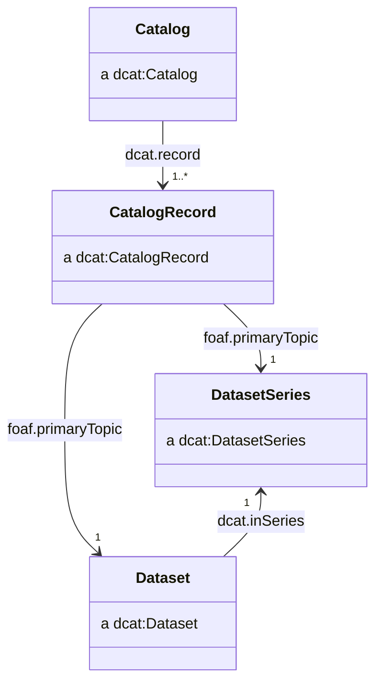
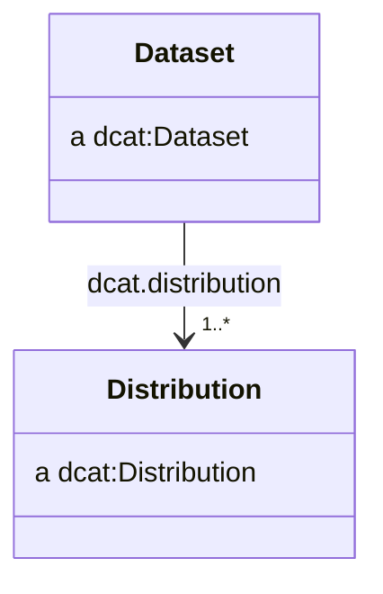
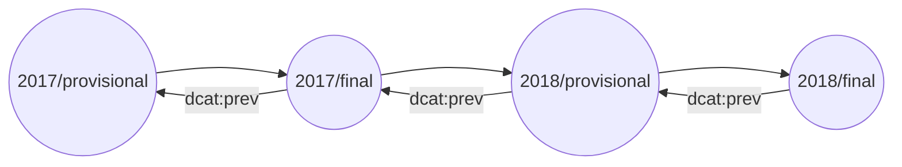

# Cataloguing

A catalogue is a collection of metadata about datasets which has been gathered and curated. Catalogues are often used to provide a single point of access to a collection of datasets, and to provide a means of discovering datasets. We adopt the [DCAT](https://www.w3.org/TR/vocab-dcat-3/) vocabulary for describing catalogues and their contents.

## Classes



We recommend the use of `dcat:Catalog`, `dcat:CatalogRecord`, `dcat:DatasetSeries` and `dcat:Dataset` classes.

## Catalog

We recommend catalogues have IRIs of the form:

- ```http://{domain}/catalogue```
- ```http://{domain}/catalogue/{catalogue_slug}```

For example:

- ```http://data.gov.uk/catalogue```
- ```http://data.gov.uk/catalogue/climate-change```

We recommend the use of the following properties:

| Property                | Requirement level | Notes                                                                      |
| ----------------------- | ----------------- | -------------------------------------------------------------------------- |
| `dcterms:title`         | mandatory         | See [titles](style.md#titles)                                                      |
| `dcterms:description`   | mandatory         | See [descriptions](style.md#descriptions)                                          |
| `dcterms:publisher`     | mandatory         | See [publishers, creators and contacts](style.md#publishers-creators-and-contacts) |
| `dcterms:creator`       | recommended       | See [publishers, creators and contacts](style.md#publishers-creators-and-contacts) |
| `dcat:contactPoint`     | recommended       | See [publishers, creators and contacts](style.md#publishers-creators-and-contacts) |
| `dcterms:issued`        | recommended       | See [dates and times](style.md#dates-and-times)                                    |
| `dcterms:modified`      | recommended       | See [dates and times](style.md#dates-and-times)                                     |
| `dcterms:themeTaxonomy` | optional          | See [themes](code-lists.md#themes)                                                      |

For example:

```ttl
@prefix dcat: <http://www.w3.org/ns/dcat#> .
@prefix dcterms: <http://purl.org/dc/terms/> .

<http://data.gov.uk/catalogue/climate-change> a dcat:Catalog ;
    dcterms:title "Climate change datasets"@en ;
    dcterms:description "A catalogue of datasets about climate change"@en ;
    dcterms:publisher <http://www.gov.uk/government/organisations/department-for-business-energy-and-industrial-strategy> ;
    dcterms:creator <http://www.gov.uk/government/organisations/department-for-business-energy-and-industrial-strategy> ;
    dcat:contactPoint <http://data.gov.uk/catalogue/climate-change/contact> ;
    dcterms:issued "2015-01-01"^^xsd:date ;
    dcterms:modified "2015-01-01"^^xsd:date ;
    dcterms:themeTaxonomy <http://data.gov.uk/themes> ;
    .
```

## Catalogue record

We recommend creaing a IRI for catalogue records by appending `/record` or `#record` to the IRI of the resource being described by the catalogue record:

- `http://{dataset_iri}/record`
- `http://{dataset_iri}#record`

For example:

- `http://data.gov.uk/dataset/my-dataset/record`
- `http://data.gov.uk/dataset/my-dataset#record`

| Property               | Requirement level | Notes                                                                          |
| ---------------------- | ----------------- | ------------------------------------------------------------------------------ |
| `dcterms:issued`       | mandatory         | See [dates and times](style.md#dates-and-times)                                        |
| `foaf:primaryTopic`    | mandatory         | This points to the IRI of the `dcat:Dataset` described by the catalogue record |
| `prov:wasAttributedTo` | recommended       |                                                                                |
| `dcterms:modified`     | recommended       | See [dates and times](style.md#dates-and-times)                                        |

## Dataset

We recommend standalone datasets have IRIs in the form of

- `http://{domain}/dataset/{dataset_slug}`

For example:

- `http://data.gov.uk/dataset/my-dataset`

For datasets belonging to a dataset series, we recommend extending the series IRI to form the dataset IRI. We recommend the `edition_slug` adopt identifiers from the [`reference.data.gov.uk` service](https://github.com/epimorphics/IntervalServer/blob/master/interval-uris.md).

- `http://{domain}/series/{series_slug}/dataset/{edition_slug}`

For example:

- `http://data.gov.uk/series/some-dataset-series/dataset/2018-Q3`

We recommend the use of the following properties:

| Property                     | Requirement level | Notes                                                                      |
| ---------------------------- | ----------------- | -------------------------------------------------------------------------- |
| `dcterms:title`              | mandatory         | See [titles](style.md#titles)                                                      |
| `dcterms:description`        | mandatory         | See [descriptions](style.md#descriptions)                                          |
| `dcterms:publisher`          | mandatory         | See [publishers, creators and contacts](style.md#publishers-creators-and-contacts) |
| `dcterms:license`            | mandatory         | See [licenses](style.md#licenses)                                                  |
| `dcat:distribution`          | recommended       | See [distributions](#distributions)                                        |
| `dcterms:creator`            | recommended       | See [publishers, creators and contacts](style.md#publishers-creators-and-contacts) |
| `dcat:contactPoint`          | recommended       | See [publishers, creators and contacts](style.md#publishers-creators-and-contacts) |
| `dcterms:issued`             | recommended       | See [dates and times](style.md#dates-and-times)                                    |
| `dcterms:modified`           | recommended       | See [dates and times](style.md#dates-and-times)                                    |
| `dcat:keyword`               | recommended       | See [keywords](style.md#keywords)                                                  |
| `dcat:theme`                 | recommended       | See [themes](code-lists.md#themes)                                                      |
| `dcterms:accrualPeriodicity` | recommended       | See [frequency](code-lists.md#frequency)                                                |
| `dcterms:spatial`            | recommended       | See [geography](code-lists.md#geography)                                                |
| `dcterms:temporal`           | recommended       | See [dates and times](style.md#dates-and-times)                                    |
| `dcat:inSeries`              | recommended       | See [editions](#editions)                                                  |
| `dcat:hasCurrentVersion`     | recommended       | See [versions](#versions)                                                  |
| `dcat:hasVersion`            | recommended       | See [versions](#versions)                                                  |
| `dcat:version`               | recommended       | See [versions](#versions)                                                  |
| `adms:versionNotes`          | recommended       | See [versions](#versions)                                                  |
| `dcat:prev`                  | recommended       | See [versions](#versions)                                                  |
| `dcat:landingPage`           | optional          |                                                                            |
| `dcterms:identifier`         | optional          |                                                                            |
| `dcterms:isReferencedBy`     | optional          |                                                                            |

For example:

```ttl
<http://data.gov.uk/series/greenhouse-gas-emissions/dataset/2018> a dcat:Dataset ;
    dcterms:title "Final UK greenhouse gas emissions national statistics: 1990 to 2018"@en ;
    dcterms:description "Final estimates of UK territorial greenhouse gas emissions..."@en ;
    dcterms:license <http://www.nationalarchives.gov.uk/doc/open-government-licence/version/3/> ;
    dcterms:publisher <http://www.gov.uk/government/organisations/department-for-business-energy-and-industrial-strategy> ;
    dcterms:issued "2020-02-04T09:30:00"^^xsd:dateTime ;
    dcterms:modified "2020-07-30T08:30:06"^^xsd:dateTime ;
    dcat:keyword "greenhouse gases"@en, "carbon emissions"@en, "greenhouse gas emissions"@en ;
    dcat:theme <http://osr.statisticsauthority.gov.uk/themes/transport-environment-climate-change/> ;
    dcat:contactPoint <http://data.gov.uk/series/greenhouse-gas-emissions/dataset/2018/contact> ;
    dcat:distribution <http://data.gov.uk/series/greenhouse-gas-emissions/dataset/2018/datacube>, 
        <http://data.gov.uk/series/greenhouse-gas-emissions/dataset/2018.csv>, 
        <http://data.gov.uk/series/greenhouse-gas-emissions/dataset/2018.json> ;
    dcterms:isReferencedBy <http://www.gov.uk/government/statistics/final-uk-greenhouse-gas-emissions-national-statistics-1990-to-2018> ;
    dcat:landingPage "http://data.gov.uk/series/greenhouse-gas-emissions/dataset/2018"^^xsd:anyURI ;
    dcterms:accrualPeriodicity <http://purl.org/cld/freq/annual> ;
    dcterms:spatial <http://statistics.data.gov.uk/id/statistical-geography/K02000001> ;
    dcterms:temporal <http://reference.data.gov.uk/id/gregorian-interval/1990-01-01T00:00:00/P28Y> ;
    dcat:inSeries <http://data.gov.uk/series/greenhouse-gas-emissions> ;
    dcat:hasCurrentVersion <http://data.gov.uk/series/greenhouse-gas-emissions/dataset/2018/version/2> ;
    dcat:hasVersion <http://data.gov.uk/series/greenhouse-gas-emissions/dataset/2018/version/1>, 
        <http://data.gov.uk/series/greenhouse-gas-emissions/dataset/2018/version/2> ;
    dcat:version 2 ;
    adms:versionNotes "Dataset was corrected following an error being recognised."@en ;
    dcat:prev <http://data.gov.uk/series/greenhouse-gas-emissions/dataset/2017> ;
    dcterms:identifier "ghg-2018" ;
    .
```

## Dataset series

Our use of dataset series is described in [editions](#editions).

We recommend dataset series have IRIs of the form:

- `http://{domain}/series/{series_slug}`

For example:

- `http://data.gov.uk/series/some-dataset-series`

We recommend the use of the following properties:

| Property                     | Requirement level | Notes                                                                      |
| ---------------------------- | ----------------- | -------------------------------------------------------------------------- |
| `dcterms:title`              | mandatory         | See [titles](style.md#titles)                                                      |
| `dcterms:description`        | mandatory         | See [descriptions](style.md#descriptions)                                          |
| `dcterms:publisher`          | mandatory         | See [publishers, creators and contacts](style.md#publishers-creators-and-contacts) |
| `dcterms:license`            | mandatory         | See [licenses](style.md#licenses)                                                  |
| `dcterms:creator`            | recommended       | See [publishers, creators and contacts](style.md#publishers-creators-and-contacts) |
| `dcat:contactPoint`          | recommended       | See [publishers, creators and contacts](style.md#publishers-creators-and-contacts) |
| `dcterms:issued`             | recommended       | See [dates and times](style.md#dates-and-times)                                    |
| `dcterms:modified`           | recommended       | See [dates and times](style.md#dates-and-times)                                    |
| `dcat:keyword`               | recommended       | See [keywords](style.md#keywords)                                                  |
| `dcat:theme`                 | recommended       | See [themes](code-lists.md#themes)                                                      |
| `dcterms:accrualPeriodicity` | recommended       | See [frequency](code-lists.md#frequency)                                                |
| `dcterms:spatial`            | recommended       | See [geography](code-lists.md#geography)                                                |
| `dcterms:temporal`           | recommended       | See [dates and times](style.md#dates-and-times)                                    |

For example:

```ttl
@prefix dcterms: <http://purl.org/dc/terms/> .
<http://data.gov.uk/series/greenhouse-gas-emissions> a dcat:DatasetSeries ;
    dcterms:title "UK territorial greenhouse gas emissions national statistics"@en ;
    dcterms:description "Final and provisional estimates of UK territorial greenhouse gas emissions from 1990."@en ;
    dcterms:publisher <http://www.gov.uk/government/organisations/department-for-business-energy-and-industrial-strategy> ;
    dcterms:license <http://www.nationalarchives.gov.uk/doc/open-government-licence/version/3/> ;
    dcterms:issued "2015-02-11T09:30:00"^^xsd:dateTime ;
    dcterms:modified "2022-03-31T08:30:14"^^xsd:dateTime ;
    .
```

Many of the properties which apply to dataset series are also applicable to datasets within that series. We recommend specifying properties for both resources.

## Distributions



> a `dcat:Distribution` represents an accessible form of a dataset such as a downloadable file.

We recommend distributions have IRIs which are identical to the dataset IRI, with file extension appended.

- `http://{dataset_iri}.{extension}`

The exception is when representing an RDF data cube as a distribution, for which there is no physical file and therefore no extension. In that instance, we recommend appending `/datacube` or `#datacube` to the dataset IRI (see [Data cube](rdf_cube.md)).

For example:

- `http://data.gov.uk/dataset/my-dataset.csv`
- `http://data.gov.uk/dataset/my-dataset.ttl`
- `http://data.gov.uk/dataset/my-dataset.json`
- `http://data.gov.uk/dataset/my-dataset/datacube`

| Property                | Requirement level | Notes                                                                          |
| ----------------------- | ----------------- | ------------------------------------------------------------------------------ |
| `dcterms:title`         | mandatory         | See [titles](style.md#titles)                                                          |
| `dcterms:description`   | mandatory         | See [descriptions](style.md#descriptions)                                              |
| `dcterms:license`       | mandatory         | See [licenses](style.md#licenses)                                                      |
| `dcterms:creator`       | recommended       | See [publishers, creators and contacts](style.md#publishers-creators-and-contacts)     |
| `dcterms:issued`        | recommended       | See [dates and times](style.md#dates-and-times)                                        |
| `dcterms:modified`      | recommended       | See [dates and times](style.md#dates-and-times)                                        |
| `dcat:isDistributionOf` | recommended       | See [CSVs as self contained datasets](README.md#csvs-as-self-contained-datasets)        |
| `dcat:mediaType`        | recommended       | See [media types](code-lists.md#media-types)                                                |
| `dcat:downloadURL`      | recommended       |                                                                                |
| `dcat:byteSize`         | recommended       |                                                                                |
| `spdx:checksum`         | recommended       | See [checksums](style.md#checksums)                                                    |
| `wdrs:describedby`      | optional          | For CSV distributions, we can relate the CSVW metadata using`wdrs:describedby` |

For example:

```ttl
@prefix dcterms: <http://purl.org/dc/terms/> .

<http://data.gov.uk/series/greenhouse-gas-emissions/dataset/2018.csv> a dcat:Distribution ;
    dcterms:title "Final UK greenhouse gas emissions national statistics: 1990 to 2018 (CSV)"@en ;
    dcterms:description "Final estimates of UK territorial greenhouse gas emissions..."@en ;
    dcterms:license <http://www.nationalarchives.gov.uk/doc/open-government-licence/version/3/> ;
    dcterms:issued "2020-02-04T09:30:00"^^xsd:dateTime ;
    dcterms:modified "2020-07-30T08:30:06"^^xsd:dateTime ;
    dcterms:title "2018.csv" ;
    wdrs:describedby <http://data.gov.uk/series/greenhouse-gas-emissions/dataset/2018.csv-metadata.json> ;
    dcat:mediaType <http://www.w3.org/ns/iana/media-types/text/csv#Resource> ;
    dcat:downloadURL <http://data.gov.uk/series/greenhouse-gas-emissions/dataset/2018.csv> ;
    dcat:byteSize "12345"^^xsd:nonNegativeInteger ;
    spdx:checksum [
        spdx:checksumValue "CE114E4501D2F4E2DCEA3E17B546F339"^^xsd:hexBinary ;
        spdx:checksumAlgorithm spdx:checksumAlgorithm_sha256 ;
    ] ;
    .
```

## Content negotiation of distributions

We recommend that data providers implement content negotiation as a method for clients to access the data in the format they require.

The IRI of the `dcat:Dataset` should be used as the generic IRI which a user can request different formats of the data from.

For example, a `dcat:Dataset` with an IRI of `http://data.gov.uk/dataset/my-dataset` may have a CSV distribution with its own IRI of `http://data.gov.uk/dataset/my-dataset.csv`. A user agent wishing to access the data in CSV format could navigate to `http://data.gov.uk/dataset/my-dataset.csv` directly, or content negotiate against the IRI of the `dcat:Dataset` to find the CSV distribution.

```sh
curl http://data.gov.uk/dataset/my-dataset -H "Accept: text/csv"
```

## Editions

> **Note**
> `dcat:DatasetSeries` is recommended as part of [DCAT v3](https://w3c.github.io/dxwg/dcat/), which is still in draft.

Many statistics producers publish sets of statistics at a regular frequency as monthly, quarterly, or annual releases.

We refer to these as _editions_, as opposed to [_versions_](#versions) which are used to specifically describe changes in a dataset resulting from a revision.

Each edition is a `dcat:Dataset`, with a unique IRI which typically contains the latest time period for which data is available.

For example, `http://data.gov.uk/series/name-of-my-statistical-series/dataset/2018` is the IRI of the 2018 edition of the series `name-of-my-statistical-series`.

Editions must be related to their associated `dcat:DatasetSeries`. The dataset series must have an IRI which does not reference particular time period and can represent the collection of editions.

For example, the following dataset series has two editions from 2017 and 2018.

```ttl
<http://data.gov.uk/series/name-of-my-statistical-series> a dcat:DatasetSeries .

<http://data.gov.uk/series/name-of-my-statistical-series/dataset/2018> a dcat:Dataset ;
    dcat:inSeries <http://data.gov.uk/series/name-of-my-statistical-series> ;
    dcat:prev <http://data.gov.uk/series/name-of-my-statistical-series/dataset/2017> ;
    .

<http://data.gov.uk/series/name-of-my-statistical-series/dataset/2017> a dcat:Dataset ;
    dcat:inSeries <http://data.gov.uk/series/name-of-my-statistical-series> ;
    dcat:prev <http://data.gov.uk/series/name-of-my-statistical-series/dataset/2016> ;
    .
```

## Scheduled revisions (provisional and final releases)

Statisticians may wish to release early or provisional estimates of statistics which are later revised as "final" statistics when additional data is available. The Government Statistical Service [refers to these as scheduled revisions](https://analysisfunction.civilservice.gov.uk/policy-store/communicating-quality-uncertainty-and-change/).

The IRIs of provisional and final datasets should contain `provisional` or `final`. Provisional and final statistics can both be attached to the same dataset series and related to one another by the `dcat:prev` property.



For example, the following dataset series has two editions from both 2017 and 2018, one provisional and one final.

```ttl
<http://data.gov.uk/series/name-of-my-statistical-series> a dcat:DatasetSeries .

<http://data.gov.uk/series/name-of-my-statistical-series/dataset/2018/final> a dcat:Dataset ;
    dcat:inSeries <http://data.gov.uk/series/name-of-my-statistical-series> ;
    dcat:prev <http://data.gov.uk/series/name-of-my-statistical-series/dataset/2018/provisional> ;
    .

<http://data.gov.uk/series/name-of-my-statistical-series/dataset/2018/provisional> a dcat:Dataset ;
    dcat:inSeries <http://data.gov.uk/series/name-of-my-statistical-series> ;
    dcat:prev <http://data.gov.uk/series/name-of-my-statistical-series/dataset/2017/final> ;
    .

<http://data.gov.uk/series/name-of-my-statistical-series/dataset/2017/final> a dcat:Dataset ;
    dcat:inSeries <http://data.gov.uk/series/name-of-my-statistical-series> ;
    dcat:prev <http://data.gov.uk/series/name-of-my-statistical-series/dataset/2017/provisional> ;
    .

<http://data.gov.uk/series/name-of-my-statistical-series/dataset/2017/provisional> a dcat:Dataset ;
    dcat:inSeries <http://data.gov.uk/series/name-of-my-statistical-series> ;
    dcat:prev <http://data.gov.uk/series/name-of-my-statistical-series/dataset/2016/final> ;
    .
```

## Versions

> **Note**
> `dcat:version` is recommended as part of [DCAT v3](https://w3c.github.io/dxwg/dcat/), which is still in draft.

Different versions of a dataset are the result of an unscheduled revision or correction.

We recommend the IRI of a `dcat:Dataset` is chosen to be generic and not specific to a particular version. A user should expect that the generic IRI of a dataset refers to the latest version of the dataset.

IRIs should be created to represent each specific version of a dataset. We should assert an equivalence between IRI of the generic dataset and the latest version of the dataset with an `owl:sameAs` relationship, for example:

```ttl
<http://data.gov.uk/series/name-of-my-statistical-series/dataset/2018>
    owl:sameAs
        <http://data.gov.uk/series/name-of-my-statistical-series/dataset/2018/version/2> ;
    .
```

| Property                 | Requirement level |
| ------------------------ | ----------------- |
| `dcat:hasCurrentVersion` | recommended       |
| `dcat:hasVersion`        | recommended       |
| `dcat:version`           | recommended       |
| `adms:versionNotes`      | recommended       |
| `dcat:prev`              | recommended       |

For specific versions, we recommend using the following properties:

| Property                | Requirement level |
| ----------------------- | ----------------- |
| `dcterms:issued`        | recommended       |
| `dcat:isVersionOf`      | recommended       |
| `dcat:previousVersion`  | recommended       |
| `prov:wasRevisionOf`    | recommended       |
| `prov:specializationOf` | recommended       |

```ttl
<http://data.gov.uk/series/name-of-my-statistical-series/dataset/2018> a dcat:Dataset ;
    dcat:hasCurrentVersion <http://data.gov.uk/series/name-of-my-statistical-series/dataset/2018/version/2> ;
    dcat:hasVersion <http://data.gov.uk/series/name-of-my-statistical-series/dataset/2018/version/1>, 
        <http://data.gov.uk/series/name-of-my-statistical-series/dataset/2018/version/2> ;
    dcat:version 2 ;
    adms:versionNotes "Dataset was corrected following an error being recognised."@en ;
    dcat:prev <http://data.gov.uk/series/name-of-my-statistical-series/dataset/2017> ;
    .

<http://data.gov.uk/series/name-of-my-statistical-series/dataset/2018/version/2> a dcat:Dataset ;
    dcterms:issued "2018-03-01T00:00:00Z"^^xsd:dateTime ;
    dcat:isVersionOf <http://data.gov.uk/series/name-of-my-statistical-series/dataset/2018> ;
    dcat:previousVersion <http://data.gov.uk/series/name-of-my-statistical-series/dataset/2018/version/1>;
    prov:wasRevisionOf <http://data.gov.uk/series/name-of-my-statistical-series/dataset/2018/version/1>;
    prov:specializationOf <http://data.gov.uk/series/name-of-my-statistical-series/dataset/2018>;
    .

<http://data.gov.uk/series/name-of-my-statistical-series/dataset/2018/version/1> a dcat:Dataset ;
    dcterms:issued "2018-01-01T00:00:00Z"^^xsd:dateTime ;
    dcat:isVersionOf <http://data.gov.uk/series/name-of-my-statistical-series/dataset/2018> ;
    prov:specializationOf <http://data.gov.uk/series/name-of-my-statistical-series/dataset/2018>;
    prov:invalidatedAtTime "2018-03-01T00:00:00Z"^^xsd:dateTime ;
    .
```
