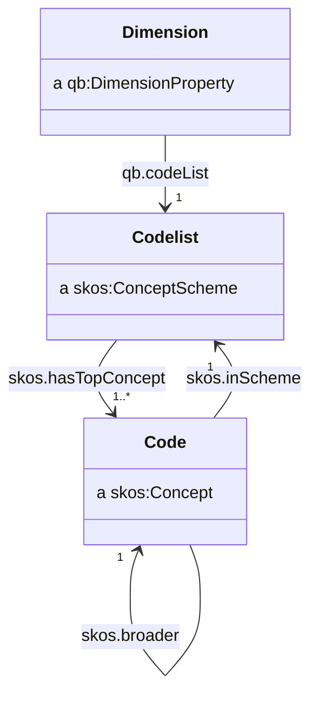
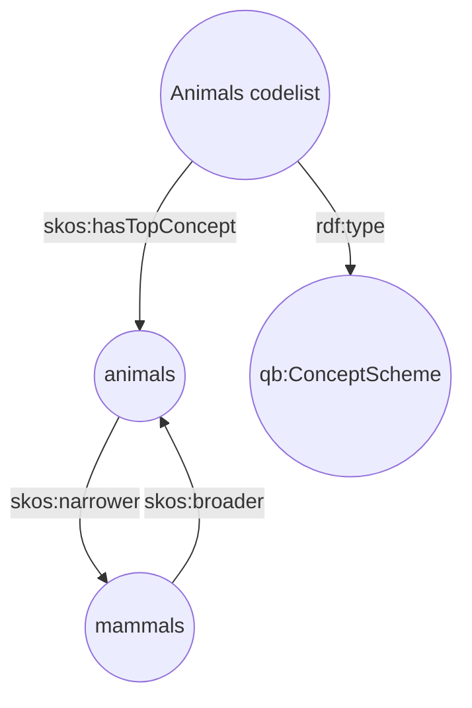

# Guidance for Code Lists

- [Guidance for Code Lists](#guidance-for-code-lists)
  - [Codelists](#codelists)
  - [Classes](#classes)
  - [Concept Scheme](#concept-scheme)
  - [Concept](#concept)
  - [Hierarchical codelists](#hierarchical-codelists)
  - [Relating codelists to statistical datasets](#relating-codelists-to-statistical-datasets)
  - [Extending codelists](#extending-codelists)
  - [Using CSVW to create a codelist](#using-csvw-to-create-a-codelist)
    - [Mixing codes from different namespaces](#mixing-codes-from-different-namespaces)
  - [Correspondence between codelists](#correspondence-between-codelists)
  - [Recommended code lists](#recommended-code-lists)
    - [Geography](#geography)
    - [Publication Frequency](#publication-frequency)
    - [Licenses](#licenses)
    - [Organisations](#organisations)
    - [Analysis function guidance on symbols and shorthand in tables](#analysis-function-guidance-on-symbols-and-shorthand-in-tables)
    - [Themes](#themes)
    - [Media types](#media-types)
  - [Reusable concepts in a CSV](#reusable-concepts-in-a-csv)
    - [Periods of time](#periods-of-time)
    - [Area code, label and type](#area-code-label-and-type)
    - [Age code and label](#age-code-and-label)
    - [Sex code and label](#sex-code-and-label)

## Codelists

Whereas a CSVW or a `qb:Dataset` is a distribution of a `dcat:Dataset`, so is a `skos:ConceptScheme`. We recommend that statisticians serialise code lists as CSV-W as their primary distribution, and generate other distributions from that source.

> TODO: Versioning of code lists is a hard problem to solve. As ONS doesn't directly control many code lists, we suggest we encourage people to adopt the versioning convention of the code list as the slug. E.g.  To encourage the reuse of code lists, we recommend adopting the naming convention of the competency UKSIC-2007 for the UK Standard Industrial Classification of Economic Activities 2007, or ISIC-4 for the International Standard Industrial Classification Revision 4 published by the United Nations in 2008.
> TODO: Some stuff [here](https://groups.niso.org/higherlogic/ws/public/download/12591/z39-19-2005r2010.pdf) around the styling of labels used in a taxonomy.
> TODO: Some UN best practices for creating classifications [here](https://unstats.un.org/unsd/classifications/bestpractices/Best_practice_Nov_2013.pdf).

Every `qb:DimensionProperty` must have a `skos:ConceptScheme` associated with it which is related using the `qb:codeList` property. The `skos:ConceptScheme` is used to define the list of codes used by the dimension.

All codes which are part of a codelist must have type `skos:Concept` and be related to the codelist using the `skos:inScheme` property.

## Classes



We recommend the use of `skos:ConceptScheme`, `skos:Concept`.

## Concept Scheme

We recommend dataset series have IRIs of the form:

- `http://{domain}/codelist/{codelist_slug}`
- `http://{domain}/codelist/{codelist_slug}/{edition_year}`

For example:

- `http://data.gov.uk/codelist/some-codelist`
- `http://data.gov.uk/codelist/sitc/2022`

| Property                                                                                       | Requirement level | Notes                                                                                    |
| ---------------------------------------------------------------------------------------------- | ----------------- | ---------------------------------------------------------------------------------------- |
| [`dcterms:title`](http://purl.org/dc/terms/title)                                              | mandatory         | See [title](http://purl.org/dc/terms/title)                                              |
| [`dcterms:description`](http://purl.org/dc/terms/description)                                  | mandatory         | See [description](http://purl.org/dc/terms/description)                                  |
| [`dcterms:publisher`](http://purl.org/dc/terms/publisher)                                      | mandatory         | See [publishers](http://purl.org/dc/terms/publisher)                                     |
| [`dcterms:license`](http://purl.org/dc/terms/license)                                          | mandatory         | See [license](http://purl.org/dc/terms/license)                                          |
| [`dcat:distribution`](https://www.w3.org/TR/vocab-dcat-3/#Property:dataset_distribution)       | mandatory         | See [distribution](https://www.w3.org/TR/vocab-dcat-3/#Property:dataset_distribution)    |
| [`dcterms:creator`](https://www.dublincore.org/specifications/dublin-core/dcmi-terms/#creator) | recommended       | See [creator](https://www.dublincore.org/specifications/dublin-core/dcmi-terms/#creator) |
| [`dcat:contactPoint`](https://www.w3.org/TR/vocab-dcat-3/#Property:resource_contact_point)     | recommended       | See [contact point](https://www.w3.org/TR/vocab-dcat-3/#Property:resource_contact_point) |
| [`dcterms:issued`](http://purl.org/dc/terms/issued)                                            | recommended       | See [issued](http://purl.org/dc/terms/issued)                                            |
| [`dcterms:modified`](http://purl.org/dc/terms/modified)                                        | recommended       | See [modified](http://purl.org/dc/terms/modified)                                        |
| [`dcat:keyword`](https://www.w3.org/TR/vocab-dcat-3/#Property:resource_keyword)                | recommended       | See [keyword](https://www.w3.org/TR/vocab-dcat-3/#Property:resource_keyword)             |
| [`dcat:theme`](https://www.w3.org/TR/vocab-dcat-3/#Property:resource_theme)                    | recommended       | See [themes](https://www.w3.org/TR/vocab-dcat-3/#Property:resource_theme)                |

## Concept

- `http://{domain}/codelist/{codelist_slug}/code/{code_slug}`

For example:

- `http://data.gov.uk/codelist/some-codelist/code/some-code`
- `http://data.gov.uk/codelist/standard-international-trade-classification/revision-4/code/01`

| Property           | Requirement level | Notes                                                                     |
| ------------------ | ----------------- | ------------------------------------------------------------------------- |
| `skos:inScheme`    | mandatory         | See [codelists](#codelists)                                               |
| `rdfs:label`       | mandatory         | See [titles](style.md#titles)                                             |
| `skos:prefLabel`   | mandatory         | See [titles](style.md#titles)                                             |
| `skos:notation`    | mandatory         |                                                                           |
| `skos:broader`     | recommended       | See [hierarchical codelists](#hierarchical-codelists)                     |
| `skos:narrower`    | recommended       | See [hierarchical codelists](#hierarchical-codelists)                     |
| `skos:related`     | recommended       | See [correspondence between codelists](#correspondence-between-codelists) |
| `skos:exactMatch`  | recommended       | See [correspondence between codelists](#correspondence-between-codelists) |
| `skos:closeMatch`  | recommended       | See [correspondence between codelists](#correspondence-between-codelists) |
| `skos:broadMatch`  | recommended       | See [correspondence between codelists](#correspondence-between-codelists) |
| `skos:altLabel`    | optional          |                                                                           |
| `skos:hiddenLabel` | optional          |                                                                           |

## Hierarchical codelists

Hierarchies in codelists must be indicated by using the `skos:broader` and `skos:narrower` predicates.

The codes at the top of the hierarchy (and so have no `skos:broader` relationships) must be related to the codelist using the `skos:hasTopConcept` property.



## Relating codelists to statistical datasets

Producers may use `dcat:qualifiedRelation` (or some sub-property of) to relate a codelist to a statistical dataset.

> TODO: Coin the IRI for relating a dataset to a codelist.

## Extending codelists

Wherever possible, statisticians should aim to reuse codes from common codelists, however, they may wish to combine or alter codes within a codelist for reasons of statistical suppression or quality. In doing so, they create a variant of some official codelist which is customised to suit their needs.

Codelists should be related to their variants using the `xkos:variant` property.

For example, some statistics which make use of the Standard Industrial Classification (SIC) have changed some categories and included the following notations for these codes within their statistical output:

- `11.01-06`
- `20.11 + 20.13`
- `20.14+20.16+20.17+20.6`
- `20.15 /1`
- `20.15 /2`
- `24.4-5 (not 24.42 nor 24.46)`
- `33 (not 33.15-16)`

> TODO: How to express these sorts of semantics using OWL?

Notations like these, while intending to be descriptive, may be consfusing or not be appropriate to be included in an IRI. When extending a codelist with custom codes, we recommend generating new notations which are:

- Similar in style and convention to the codelist which is being extended.
- Do not clash with any current (or future) notations which feature in the codelist.

We may achieve this in several ways:

- Assigning new codes to large unused digits (such as `99`) or unused letters (e.g. `X` or `Z`),
- Combining new or related digits with an unused character (e.g. `33x` or `33.15x`, `X.1`, `X.2` etc.),
- Appending `/1` through `/9` when creating new subdivisions of an already existing code.

When extending an already established codelist, the creator of the new codelist must familiarise themselves with the existing codelist, how it is structured and ensure their extension does not introduce any clashes with existing codes.

| Example                        | Possible notation         | Notes                                                                                                                      |
| ------------------------------ | ------------------------- | -------------------------------------------------------------------------------------------------------------------------- |
| `11.01-06`                     | `11.0X`, `11.0Z`, `11.9x` | Expresses the sum of`11.01` through to `11.06`, which are subdivisions of `11.0`. `11.07` is occupied by another category. |
| `20.15 /1`                     | `20.15/1`                 | Expresses a custom subdivision of an already existing category,`25.15`.                                                    |
| `20.14+20.16+20.17+20.6`       | `20.X`, `20.Z`, `20.9x`   | Expresses the sum of`20.14`, `20.16` and `20.17`, which are subdivisions of `20.1`, along with `20.6`.                     |
| `24.4-5 (not 24.42 nor 24.46)` | `24.X`, `24.Z`, `24.9x`   | Expresses the sum of`24.4` and `24.5` but excluding the subdivisions `24.42` and `24.46`.                                  |
| `33 (not 33.15-16)`            | `33X`, `33Z`, `33.9x`     | Expresses the sum of`33.1` and `33.2`, which are subdivisons of `33`, excluding `33.15` and `33.16`.                       |
|                                |                           |                                                                                                                            |

## Using CSVW to create a codelist

We can use CSVW as a convenient way to create a codelist, represented in RDF using SKOS.

For example, take the Standard Industrial Trade Classification (SITC):

```txt
0 Food and live animals
├─ 00 Live animals other than animals of division 03
│  ├─ 001 Live animals other than animals of division 03
├─ 01 Meat and meat preparations
│  ├─ 011 Meat of bovine animals, fresh, chilled or frozen
│  ├─ 012 Other meat and edible meat offal
│  ├─ 016 Meat, edible meat offal, salted, dried; flours, meals
│  ├─ 017 Meat, edible meat offal, prepared, preserved, n.e.s
│  ├─ ...
├─ 02 Dairy products and birds' eggs
│  ├─   022 Milk, cream and milk products (excluding butter, cheese)
│  ├─ ...
```

We can create a CSV representation of the different classifications along with the hierarchy as follows:

| notation | label                                                    | comment | parent |
| -------- | -------------------------------------------------------- | ------- | ------ |
| 0        | Food and live animals                                    | ...     |        |
| 00       | Live animals other than animals of division 03           | ...     | 0      |
| 001      | Live animals other than animals of division 03           | ...     | 00     |
| 01       | Meat and meat preparations                               | ...     | 0      |
| 011      | Meat of bovine animals, fresh, chilled or frozen         | ...     | 01     |
| 012      | Other meat and edible meat offal                         | ...     | 01     |
| 016      | Meat, edible meat offal, salted, dried; flours, meals    | ...     | 01     |
| 017      | Meat, edible meat offal, prepared, preserved, n.e.s      | ...     | 01     |
| ...      | ...                                                      | ...     |        |
| 02       | Dairy products and birds' eggs                           | ...     | 0      |
| 022      | Milk, cream and milk products (excluding butter, cheese) | ...     | 02     |
| ...      | ...                                                      | ...     |        |

We are able to create a CSVW file which can be used to create a codelist. Note the use of virtual columns to assert the type and the relationship between the concepts and the concept scheme.

```json
{
    "@context": "http://www.w3.org/ns/csvw",
    "@id": "http://data.gov.uk/codelist/standard-international-trade-classification/revision-4.csv",
    "@type": "Table",
    "url": "http://data.gov.uk/codelist/standard-international-trade-classification/revision-4.csv",
    "tableSchema": {
        "columns": [
            {
                "titles": "notation",
                "name": "notation",
                "required": true,
                "propertyUrl": "skos:notation"
            },
            {
                "titles": "label",
                "name": "label",
                "required": true,
                "propertyUrl": "rdfs:label"
            },
            {
                "titles": "comment",
                "name": "comment",
                "required": false,
                "propertyUrl": "rdfs:comment"
            },
            {
                "titles": "parent_notation",
                "name": "parent_notation",
                "required": false,
                "propertyUrl": "skos:broader",
                "valueUrl": "http://data.gov.uk/codelist/standard-international-trade-classification/revision-4/{+parent_notation}"
            },
            {
                "virtual": true,
                "propertyUrl": "skos:inScheme",
                "valueUrl": "http://data.gov.uk/codelist/standard-international-trade-classification/revision-4"
            },
            {
                "virtual": true,
                "propertyUrl": "rdf:type",
                "valueUrl": "skos:Concept"
            }
        ],
        "aboutUrl": "http://data.gov.uk/codelist/standard-international-trade-classification/revision-4/{+notation}"
    }
}
```

Performing `csv2rdf` on this CSVW produces RDF like:

```ttl
<http://data.gov.uk/codelist/standard-international-trade-classification/revision-4/0> a skos:Concept ;
    skos:notation "0" ;
    rdfs:label "Food and live animals" ;
    rdfs:comment "..." ;
    skos:inScheme <http://data.gov.uk/codelist/standard-international-trade-classification/revision-4> ;
    .

<http://data.gov.uk/codelist/standard-international-trade-classification/revision-4/00> a skos:Concept ;
    skos:notation "00" ;
    rdfs:label "Live animals other than animals of division 03" ;
    rdfs:comment "..." ;
    skos:broader <http://data.gov.uk/codelist/standard-international-trade-classification/revision-4/0> ;
    skos:inScheme <http://data.gov.uk/codelist/standard-international-trade-classification/revision-4> ;
    .

# etc...
```

A limitation of using CSVW to produce a `skos:ConceptScheme` is the inability to set both `skos:narrower` and `skos:broader` relationships concurrently, and to set the `skos:hasTopConcept` relationship. When loading a `skos:ConceptScheme` generated from CSVW in this way, we serialise these additional relationships using `CONSTRUCT` queries in SPARQL.

The following SPARQL query produces `skos:narrower` relationships:

```sparql
PREFIX skos: <http://www.w3.org/2004/02/skos/core#>

CONSTRUCT {
    ?broaderConcept skos:narrower ?concept.
}
WHERE {
    ?conceptScheme a skos:ConceptScheme .
    ?concept 
        skos:inScheme ?conceptScheme;
        skos:broader ?broaderConcept.
        FILTER NOT EXISTS {
            ?broaderConcept skos:narrower ?concept.
        }
}
```

The following SPARQL query produces `skos:hasTopConcept` relationships:

```sparql
PREFIX skos: <http://www.w3.org/2004/02/skos/core#>

CONSTRUCT {
    ?conceptScheme skos:hasTopConcept ?concept.
}
WHERE {
    ?conceptScheme a skos:ConceptScheme .
    ?concept skos:inScheme ?conceptScheme.
        FILTER NOT EXISTS {
            # Find concepts which don't have anything broader, they are by definition topConcepts.
            ?concept skos:broader ?broaderConcept.
        }
        FILTER NOT EXISTS {
            # Ensure we don't add topConcept where it is already set.
            ?conceptScheme skos:hasTopConcept ?concept.
        }
}
```

### Mixing codes from different namespaces

Statisticians may wish to report statistics against multiple classifications. Doing so may be difficult, as different classifications typically use different namespaces for their IRIs.

For example, consider a dataset which mixes codes from the NUTS geography codelist with codes from the ONS geography codelist.

| area_code | area_label          | value |
| --------- | ------------------- | ----- |
| UKC       | North East, England | ...   |
| UKD       | North West, England | ...   |
| E92000001 | England             | ...   |

The NUTS codes have IRIs which are maintained by Eurostat, such as `http://data.europa.eu/nuts/code/UKC`, whereas the ONS geography codes are maintained by the ONS at the `http://statistics.data.gov.uk/id/statistical-geography/E92000001` namespace.

We map the cells of the dataset to RDF by using the `valueUrl` CSVW property. Only a single `valueUrl` can be applied to all the cells in a column. This is problematic, as the IRIs we wish to map to have different bases. Setting `valueUrl` to `http://data.europa.eu/nuts/code/{area_code}` would result in a non-existant identifier `http://data.europa.eu/nuts/code/E92000001` appearing in the RDF output.

We address this by creating new identifiers for each of the codes under a shared namespace, and using `skos:exactMatch` relations to relate these new identifiers to the more commonly used identifiers. For example,

```ttl
<http://data.gov.uk/dataset/some-dataset/codelist/geography/code/E92000001>
    skos:exactMatch <http://statistics.data.gov.uk/id/statistical-geography/E92000001> ;
    .
```

If [using a CSVW to create a codelist](#using-csvw-to-create-a-codelist), then the `skos:exactMatch` relationships can be expressed by adding an additional column to the CSV:

| notation  | label               | same_as                                                            |     |
| --------- | ------------------- | ------------------------------------------------------------------ | --- |
| UKC       | North East, England | `http://data.europa.eu/nuts/code/UKC`                              | ... |
| UKD       | North West, England | `http://data.europa.eu/nuts/code/UKD`                              | ... |
| E92000001 | England             | `http://statistics.data.gov.uk/id/statistical-geography/E92000001` | ... |

The additional column would have the following specification inside the CSVW:

```json
{
    "titles": "same_as",
    "name": "same_as",
    "required": true,
    "propertyUrl": "skos:exactMatch",
    "valueUrl": "{+same_as}"
}
```

This would result in the following RDF:

```ttl
<http://data.gov.uk/dataset/some-dataset/codelist/geography/code/UKC> a skos:Concept ;
    skos:notation "UKC" ;
    rdfs:label "North East, England" ;
    skos:prefLabel "North East, England" ;
    skos:inScheme <http://data.gov.uk/dataset/some-dataset/codelist/geography> ;
    skos:exactMatch <http://data.europa.eu/nuts/code/UKC> ;
    .

# ...

<http://data.gov.uk/dataset/some-dataset/codelist/geography/code/E92000001> a skos:Concept ;
    skos:notation "E92000001" ;
    rdfs:label "England" ;
    skos:prefLabel "England" ;
    skos:inScheme <http://data.gov.uk/dataset/some-dataset/codelist/geography> ;
    skos:exactMatch <http://statistics.data.gov.uk/id/statistical-geography/E92000001> ;
    .
```

## Correspondence between codelists

> **Warning**
> This section needs further work.
>
> TODO: Add stuff about [xkos](https://rdf-vocabulary.ddialliance.org/xkos.html)
> TODO: Some example using [HMRC guidance](https://www.uktradeinfo.com/find-commodity-data/help-with-classifying-goods/)

For example, the Combined Nonclementure (CN8) is a classification of commodities of trade. These get updated in legislation each year.

HMRC publishes each annual edition of CN8 and [provides correspondence tables](https://www.trade-tariff.service.gov.uk/help/cn2021_cn2022) between the different year's editions.

| 2021 code  | 2022 code  |
| ---------- | ---------- |
| 0208 90 98 | 0208 90 98 |
| 0208 90 98 | 0410 10 10 |
| 0210 99 39 | 0210 99 39 |
| 0210 99 39 | 0410 10 99 |
| 0210 99 90 | 0210 99 90 |
| 0210 99 90 | 0410 10 91 |

```ttl
<> a xkos:Correspondence ;
    xkos:compares 
        <http://data.gov.uk/codelist/combined-nonclementure/2022>,
        <http://data.gov.uk/codelist/combined-nonclementure/2021> ;
    xkos:madeOf <> ;
    .

<> a xkos:ConceptAssociation ;
    xkos:sourceConcept <http://data.gov.uk/codelist/combined-nonclementure/02089098> ;
    xkos:targetConcept 
        <http://data.gov.uk/codelist/combined-nonclementure/02089098> ,
        <http://data.gov.uk/codelist/combined-nonclementure/04101010> ;
    .
```

## Recommended code lists

### Geography

Prefer using IRIs from the `http://statistics.data.gov.uk` vocabulary, based on ONS geography codes.

| Label             | IRI                                                                |
| ----------------- | ------------------------------------------------------------------ |
| United Kingdom    | `http://statistics.data.gov.uk/id/statistical-geography/K02000001` |
| Great Britain     | `http://statistics.data.gov.uk/id/statistical-geography/K03000001` |
| England and Wales | `http://statistics.data.gov.uk/id/statistical-geography/K04000001` |
| England           | `http://statistics.data.gov.uk/id/statistical-geography/E92000001` |
| Northern Ireland  | `http://statistics.data.gov.uk/id/statistical-geography/N92000002` |
| Scotland          | `http://statistics.data.gov.uk/id/statistical-geography/S92000002` |
| Wales             | `http://statistics.data.gov.uk/id/statistical-geography/W92000002` |

### Publication Frequency

Data providers should prefer using IRIs from the [Dublin core collection description frequency vocabulary](https://www.dublincore.org/specifications/dublin-core/collection-description/frequency/), `http://purl.org/cld/freq/`.

Common options include:

| Label     | IRI                                  |
| --------- | ------------------------------------ |
| Annual    | `http://purl.org/cld/freq/annual`    |
| Quarterly | `http://purl.org/cld/freq/quarterly` |
| Monthly   | `http://purl.org/cld/freq/monthly`   |
| Weekly    | `http://purl.org/cld/freq/weekly`    |
| Daily     | `http://purl.org/cld/freq/daily`     |

### Licenses

| Label                        | IRI                                                                         |
| ---------------------------- | --------------------------------------------------------------------------- |
| Open Government Licence v3.0 | `http://www.nationalarchives.gov.uk/doc/open-government-licence/version/3/` |
| Open Government Licence v2.0 | `http://www.nationalarchives.gov.uk/doc/open-government-licence/version/2/` |
| Open Government Licence v1.0 | `http://www.nationalarchives.gov.uk/doc/open-government-licence/version/1/` |

### Organisations

GOV.UK provides a [list of government organisations](https://www.gov.uk/government/organisations), which can be used to populate the `dcterms:publisher` and `dcterms:creator` properties.

For example: `https://www.gov.uk/government/organisations/office-for-national-statistics`.

### Analysis function guidance on symbols and shorthand in tables

Data providers should adopt the [analytical function guidance](https://analysisfunction.civilservice.gov.uk/policy-store/symbols-in-tables-definitions-and-help/) for statistical markers.

> TODO: realistically change this form Analyst Function to SDMX; as the latter will be around in 10 years guaranteed.

| Label                       | Notation | IRI                                                          |
| --------------------------- | -------- | ------------------------------------------------------------ |
| Break in time series        | `[b]`    | `http://data.gov.uk/codelist/statistical-markers/code/[b]`   |
| Confidential                | `[c]`    | `http://data.gov.uk/codelist/statistical-markers/code/[c]`   |
| Estimated                   | `[e]`    | `http://data.gov.uk/codelist/statistical-markers/code/[e]`   |
| Earliest revision           | `[er]`   | `http://data.gov.uk/codelist/statistical-markers/code/[er]`  |
| Forecast                    | `[f]`    | `http://data.gov.uk/codelist/statistical-markers/code/[f]`   |
| Low                         | `[low]`  | `http://data.gov.uk/codelist/statistical-markers/code/[low]` |
| Not significant             | `[ns]`   | `http://data.gov.uk/codelist/statistical-markers/code/[ns]`  |
| Provisional                 | `[p]`    | `http://data.gov.uk/codelist/statistical-markers/code/[p]`   |
| Revised                     | `[r]`    | `http://data.gov.uk/codelist/statistical-markers/code/[r]`   |
| Significance level of 0.05  | `[s]`    | `http://data.gov.uk/codelist/statistical-markers/code/[s]`   |
| Significance level of 0.01  | `[ss]`   | `http://data.gov.uk/codelist/statistical-markers/code/[ss]`  |
| Significance level of 0.001 | `[sss]`  | `http://data.gov.uk/codelist/statistical-markers/code/[sss]` |
| Low reliability             | `[u]`    | `http://data.gov.uk/codelist/statistical-markers/code/[u]`   |
| None recorded in survey     | `[w]`    | `http://data.gov.uk/codelist/statistical-markers/code/[w]`   |
| Not available               | `[x]`    | `http://data.gov.uk/codelist/statistical-markers/code/[x]`   |
| Not applicable              | `[z]`    | `http://data.gov.uk/codelist/statistical-markers/code/[z]`   |

### Themes

| Label                                         | IRI                                                                                     |
| --------------------------------------------- | --------------------------------------------------------------------------------------- |
| Business, Trade and International Development | `http://osr.statisticsauthority.gov.uk/themes/business-trade-international-development` |
| Children, Education and Skills                | `http://osr.statisticsauthority.gov.uk/themes/children-education-skills`                |
| Crime and Security                            | `http://osr.statisticsauthority.gov.uk/themes/crime-security`                           |
| Economy                                       | `http://osr.statisticsauthority.gov.uk/themes/economy`                                  |
| Health and Social Care                        | `http://osr.statisticsauthority.gov.uk/themes/health-social-care`                       |
| Housing, Planning and Local Services          | `http://osr.statisticsauthority.gov.uk/themes/housing-planning-local-services`          |
| Labour Market and Welfare                     | `http://osr.statisticsauthority.gov.uk/themes/labour-market-welfare`                    |
| Population and Society                        | `http://osr.statisticsauthority.gov.uk/themes/population-society`                       |
| Transport, Environment and Climate Change     | `http://osr.statisticsauthority.gov.uk/themes/transport-environment-climate-change`     |

### Media types

> TODO: Cover media types from [IANA](https://www.w3.org/ns/iana/media-types/)

| Label  | IRI                                                               |
| ------ | ----------------------------------------------------------------- |
| CSV    | `http://www.w3.org/ns/iana/media-types/text/csv#Resource`         |
| JSON   | `http://www.w3.org/ns/iana/media-types/application/json#Resource` |
| Turtle | `http://www.w3.org/ns/iana/media-types/text/turtle#Resource`      |

## Reusable concepts in a CSV

### Periods of time

There are a varieety of different ways that time can be represented in your data. Below are some examples:

| period_type | period_code | period_label     |
| ----------- | ----------- | ---------------- |
| day         | 1999-12-31  | 31-December-1999 |

For calendar day data we require the `period_type` to be day. In the `period_code` we require the year, the month followed by the day. For `period_label` we require the field to be the day, the month written fully and then the year. This will help with human readability.

| period_type | period_code | period_label |
| ----------- | ----------- | ------------ |
| month       | 2020-01     | January-2020 |

For monthly data that is from a calendar period we require the `period_type` to be month. In the `period_code` we require the year followed by the specified digit of the month. The `period_label` column is more human readble hence why it is showing the month's full name and the year.

| period_type | period_code | period_label |
| ----------- | ----------- | ------------ |
| quarter     | 2020-Q1     | 2020-Q1      |

For quarterly data that is from a calendar period we require the `period_type` to be quarter. In the `period_code` and `period_label` we require the field to be the same. The year followed by which quarter.

| period_type | period_code | period_label |
| ----------- | ----------- | ------------ |
| year        | 2020        | 2020         |

For calendar year data we require the `period_type` to be year. In the `period_code` and `period_label` we require the field to be the same. Just the year.

| period_type     | period_code | period_label |
| --------------- | ----------- | ------------ |
| government-year | 2020-2021   | 2020-2021    |

For government year which starts in April we require the `period_type` to be government-year. In the `period_code` and `period_label` we require the field to be the same. The year the period starts and the period where it ends.

| period_type        | period_code             | period_label |
| ------------------ | ----------------------- | ------------ |
| gregorian-interval | 2001-04-01 00:00:00/P3M | Apr-Jun 2001 |

Gregorian interval can be used if the time frame of your data does not conform to a standard time frame. This can be used for monthly, quarterly and yearly data. You need to enter the start date of when your dataset starts. Using the example above it is the 1st April 2001. The P3M refers to how much time has been captured. Using the example it is 3 months. You can add P1Y for yearly data to show the data is being captured for a year period.

### Area code, label and type

| area_code | area_label     | area_type                         |
| --------- | -------------- | --------------------------------- |
| K02000001 | United Kingdom | Country                           |
| E92000001 | England        | Nation                            |
| E12000001 | North East     | Region                            |
| E06000047 | County Durham  | County or Unitary Authority       |
| E08000037 | Gateshead      | Local Authority District          |
| E47000006 | Tees Valley    | Combined Authority or City Region |

The table above shows the variety of area types that can be represented in your data. The important thing is that in the area code column each entry has its own identifiable code.

### Age code and label

| age_code | age_label              |
| -------- | ---------------------- |
| Y_GE16   | Aged 16 years and over |
| Y16T24   | Aged 16 to 24          |
| Y25T34   | Aged 25 to 34          |
| Y35T44   | Aged 35 to 44          |
| Y45T54   | Aged 45 to 54          |
| Y55T74   | Aged 55 to 74          |
| Y_GE75   | Aged 75 and over       |

The examples in the table above show the best way to represent different age categories. his has come from the Statistical Data and Metadata eXchange (SDMX) guidelines [^1]

### Sex code and label

| sex_code | sex_label      |
| -------- | -------------- |
| F        | Female         |
| M        | Male           |
| _N       | Non response   |
| _O       | Other          |
| -U       | Unknown        |
| _Z       | Not applicable |

The examples in the table above show the best way to represent different sex categories. This has come from the Statistical Data and Metadata eXchange (SDMX) guidelines [^2]


[^1]: <https://sdmx.org/?page_id=3215>
[^2]: <https://sdmx.org/?page_id=3215>

