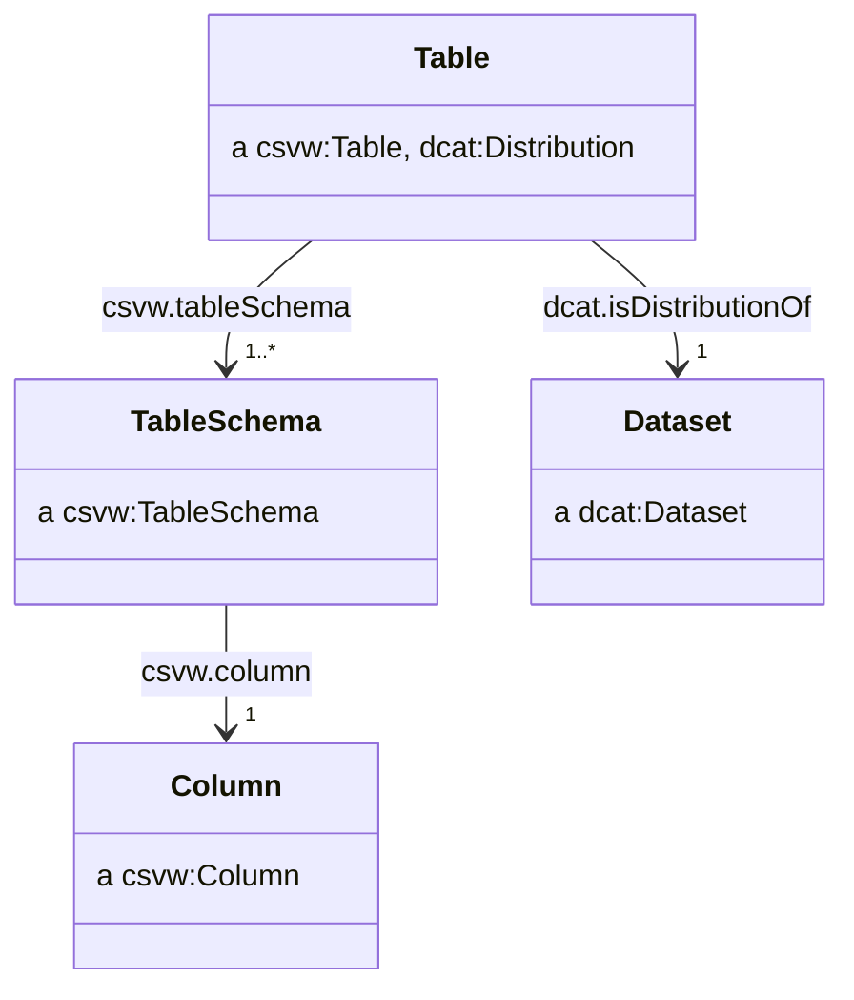

# Publish CSV on the web (CSVW)

Our aim is to publish metadata in a machine readable and structured format alongside the statistical data.

Structured data formats, such as JSON-LD can be understood by search engines and are used for [search engine optimisation](https://developers.google.com/search/docs/advanced/structured-data/intro-structured-data), with some search engines offering specific [dataset search functionality](https://developers.google.com/search/docs/advanced/structured-data/dataset) where structured metadata are provided using common vocabularies such as DCAT or [schema.org](https://schema.org/).

## Structural CSV metadata

The most basic of CSVW metadata will include the `tableSchema` properties with details of the columns in the CSV. Since the CSVW metadata specification includes several defaults for properties, a basic CSVW provides some implicit information, such as the file being comma delimited.

We can consider the following CSV file:

| area      | period                  | sex    | life_expectancy |
| --------- | ----------------------- | ------ | --------------- |
| W06000022 | 2004-01-01T00:00:00/P3Y | Male   | 76.7            |
| W06000022 | 2004-01-01T00:00:00/P3Y | Female | 80.7            |
| W06000015 | 2004-01-01T00:00:00/P3Y | Male   | 78.7            |
| W06000015 | 2004-01-01T00:00:00/P3Y | Female | 83.3            |
| ...       | ...                     | ...    | ...             |

Given the above CSV, a minimal CSVW metadata file would look as follows:

```json
{
    "@context": "http://www.w3.org/ns/csvw",
    "url": "http://data.gov.uk/dataset/life-expectancy-by-region-sex-and-time.csv",
    "tableSchema": {
        "columns": [
            {
                "name": "area",
                "titles": "area",
                "datatype": "string"
            },
            {
                "name": "period",
                "titles": "period",
                "datatype": "string"
            },
            {
                "name": "sex",
                "titles": "sex",
                "datatype": "string"
            },
            {
                "name": "life_expectancy",
                "titles": "life_expectancy",
                "datatype": "decimal"
            }
        ]
    }
}
```

## CSVs as self-contained datasets

A CSVW should provide all the necessary metadata that would be needed for a user of the data to feature it in a `dcat:Catalog`.

The subject resource of a CSVW metadata file is typically a `csvw:Table` which corresponds to a CSV file. This CSV file can be considered as a distribution of some `dcat:Dataset`.

When using a CSVW metadata file to describe some CSV, we recommend asserting the distribution relationship between the `csvw:Table` and the `dcat:Dataset`. The CSVW specification prohibits the use of the `@reverse` JSON-LD property, meaning we are unable to use the `dcat:distribution` property to achieve this, and instead rely upon its inverse `dcat:isDistributionOf`.



An example of a CSVW metadata file containing the relevant relationship with a `dcat:Dataset` could look as follows:

```json
{
    "@context": ["http://www.w3.org/ns/csvw", {"@language": "en"}],
    "@id": "http://data.gov.uk/dataset/life-expectancy-by-region-sex-and-time.csv",
    "url": "http://data.gov.uk/dataset/life-expectancy-by-region-sex-and-time.csv",
    "dcterms:title": "Life expectancy by local authority and sex (CSV)",
    "dcterms:description": "A CSV version of the life expectancy by local authority and sex dataset.",
    "dcat:isDistributionOf": {
        "@id": "http://data.gov.uk/dataset/life-expectancy-by-region-sex-and-time",
        "@type": "dcat:Dataset",
        "dcterms:title": "Life expectancy by local authority and sex",
        "dcterms:description": "The figures in this table are constructed from the estimated population and total deaths by single year / quinary age each year, based on a three year average. The expected years of life is the lifetime of a newborn person if they were subject throughout their lives to the average recorded death rate of the three year period. Such a calculation excludes future improvements to mortality rates."
    },
    "tableSchema": {
        "columns": [
            {
                "name": "area",
                "titles": "area",
                "datatype": "string"
            },
            {
                "name": "period",
                "titles": "period",
                "datatype": "string"
            },
            {
                "name": "sex",
                "titles": "sex",
                "datatype": "string"
            },
            {
                "name": "life_expectancy",
                "titles": "life_expectancy",
                "datatype": "decimal"
            }
        ]
    }
}
```

## Discoverability of CSVW

We recommend naming CSVW metadata files by appending `-metadata.json` to end the CSV's filename, so a CSV file named `countries.csv` would have a metadata file named `countries.csv-metadata.json`.

Where possible, we recommend serving CSV files with a `Link` header within the response with the `rel="describedby"` attribute pointing to the CSVW metadata file.

We recommend CSVW metadata is served with the media type `application/csvm+json`.

## Foreign-key constraints

Publishers may wish to use the `csvw:foreignKey` property to assert relationships between different CSVs.
