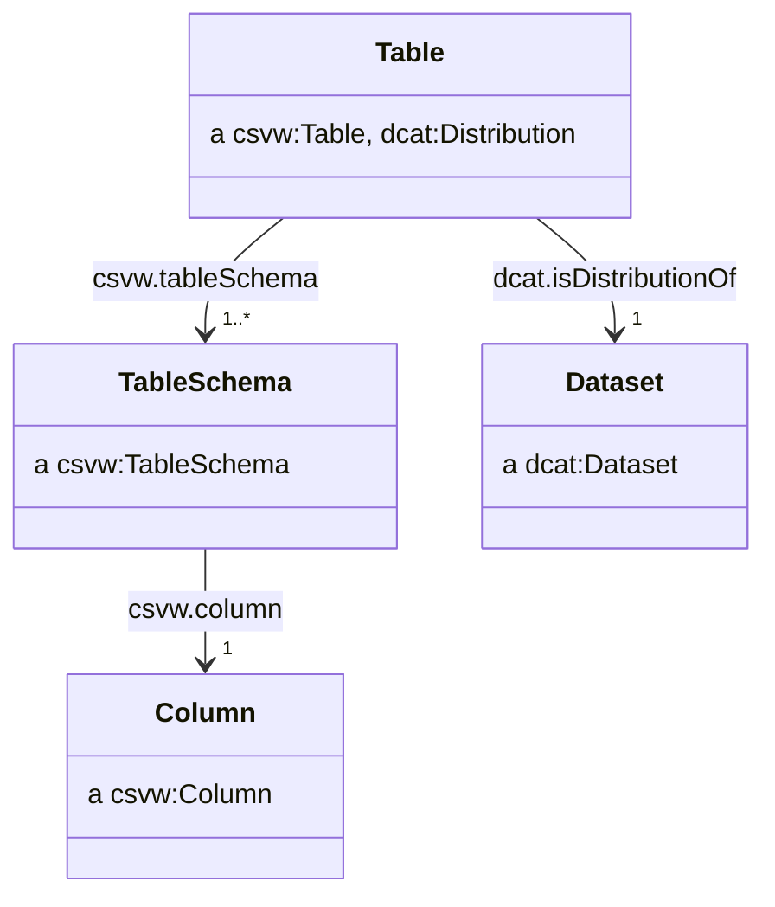

# Publish CSV on the web (CSVW)

Our aim is to publish metadata in a machine readable and structured format alongside the statistical data.

Structured data formats, such as JSON-LD can be understood by search engines and are used for [search engine optimisation](https://developers.google.com/search/docs/advanced/structured-data/intro-structured-data), with some search engines offering specific [dataset search functionality](https://developers.google.com/search/docs/advanced/structured-data/dataset) where structured metadata are provided using common vocabularies such as DCAT or [schema.org](https://schema.org/).

## Structural CSV metadata

The most basic of CSVW metadata will include the `tableSchema` properties with details of the columns in the CSV. Since the CSVW metadata specification includes several defaults for properties, a basic CSVW provides some implicit information, such as the file being comma delimited.

We can consider the following CSV file:

| area      | period                  | sex    | life_expectancy |
| --------- | ----------------------- | ------ | --------------- |
| W06000022 | 2004-01-01T00:00:00/P3Y | Male   | 76.7            |
| W06000022 | 2004-01-01T00:00:00/P3Y | Female | 80.7            |
| W06000015 | 2004-01-01T00:00:00/P3Y | Male   | 78.7            |
| W06000015 | 2004-01-01T00:00:00/P3Y | Female | 83.3            |
| ...       | ...                     | ...    | ...             |

Given the above CSV, a minimal CSVW metadata file would look as follows:

```json
{
    "@context": "http://www.w3.org/ns/csvw",
    "url": "http://data.gov.uk/dataset/life-expectancy-by-region-sex-and-time.csv",
    "tableSchema": {
        "columns": [
            {
                "name": "area",
                "titles": "area",
                "datatype": "string"
            },
            {
                "name": "period",
                "titles": "period",
                "datatype": "string"
            },
            {
                "name": "sex",
                "titles": "sex",
                "datatype": "string"
            },
            {
                "name": "life_expectancy",
                "titles": "life_expectancy",
                "datatype": "decimal"
            }
        ]
    }
}
```

## CSVs as self-contained datasets

A CSVW should provide all the necessary metadata that would be needed for a user of the data to feature it in a `dcat:Catalog`.

The subject resource of a CSVW metadata file is typically a `csvw:Table` which corresponds to a CSV file. This CSV file can be considered as a distribution of some `dcat:Dataset`.

When using a CSVW metadata file to describe some CSV, we recommend asserting the distribution relationship between the `csvw:Table` and the `dcat:Dataset`. The CSVW specification prohibits the use of the `@reverse` JSON-LD property, meaning we are unable to use the `dcat:distribution` property to achieve this, and instead rely upon its inverse `dcat:isDistributionOf`.



An example of a CSVW metadata file containing the relevant relationship with a `dcat:Dataset` could look as follows:

```json
{
    "@context": ["http://www.w3.org/ns/csvw", {"@language": "en"}],
    "@id": "http://data.gov.uk/dataset/life-expectancy-by-region-sex-and-time.csv",
    "url": "http://data.gov.uk/dataset/life-expectancy-by-region-sex-and-time.csv",
    "dcterms:title": "Life expectancy by local authority and sex (CSV)",
    "dcterms:description": "A CSV version of the life expectancy by local authority and sex dataset.",
    "dcat:isDistributionOf": {
        "@id": "http://data.gov.uk/dataset/life-expectancy-by-region-sex-and-time",
        "@type": "dcat:Dataset",
        "dcterms:title": "Life expectancy by local authority and sex",
        "dcterms:description": "The figures in this table are constructed from the estimated population and total deaths by single year / quinary age each year, based on a three year average. The expected years of life is the lifetime of a newborn person if they were subject throughout their lives to the average recorded death rate of the three year period. Such a calculation excludes future improvements to mortality rates."
    },
    "tableSchema": {
        "columns": [
            {
                "name": "area",
                "titles": "area",
                "datatype": "string"
            },
            {
                "name": "period",
                "titles": "period",
                "datatype": "string"
            },
            {
                "name": "sex",
                "titles": "sex",
                "datatype": "string"
            },
            {
                "name": "life_expectancy",
                "titles": "life_expectancy",
                "datatype": "decimal"
            }
        ]
    }
}
```

## Discoverability of CSVW

We recommend naming CSVW metadata files by appending `-metadata.json` to end the CSV's filename, so a CSV file named `countries.csv` would have a metadata file named `countries.csv-metadata.json`.

Where possible, we recommend serving CSV files with a `Link` header within the response with the `rel="describedby"` attribute pointing to the CSVW metadata file.

We recommend CSVW metadata is served with the media type `application/csvm+json`.

## Foreign-key constraints

Publishers may wish to use the `csvw:foreignKey` property to assert relationships between different CSVs.

## Data types

We use four main data types to describe data within our tabular data's columns. These four are strings, decimal, float and boolean.

By describing your columns data type, this will help you explicitly state what the types are.

If you do not specify the data type it will use a default. The default data type is a string (5.11.2 Derived dataypes - W3.org tabular data). This would mean the data is not being represented correctly.

### String

The string data type represents characters. The value space of string is the set of finite-length sequences of characters. 

Examples include: 
- `Dimension` columns are always strings. Examples include Year, Quarter, County and Region. Dimensions need to be represented by two columns. A coded column and a corresponding human readable version of the label.
- `Measure` column would contain values such as Index. 
- `Unit` column would contain values such as Unitless and Number.

```JSON
"columns": [
    {
        "title": "Period Type",
        "name": "period_type",
        "datatype": "string"
    }
]
```
### Why use strings for all dimensions? 

A cube of data is initially published only as annual data; however due to improvements in ingestion speeds it can now be released quarterly. By already defining the time_period_code dimension as strings, no changes are required to the schema to accept `2019-Q3` along with `2017`.

### Decimal

Decimal represents a subset of the real numbers, which can be represented by decimal numerals.

Decimals help with delivering full precision for numerical data. This helps with publications like Gross Domestic Product (GDP).

Examples include – 0.5, 1.7, 100.1.

```JSON
"columns": [
    {
        "title": "Observation",
        "name": "observation",
        "datatype": "decimal"
    }
]
```
### Float

[Float](https://en.wikipedia.org/wiki/Floating-point_arithmetic) is patterned after the IEEE single-precision 32-bit floating point type.

Float helps with high levels of precision.

Examples include – 0.1243, 12.5489 and 1000.63287.


```JSON
"columns": [
    {
        "title": "",
        "name": "",
        "datatype": "float"
    }
]
```

**Note** Using float in some databases; however where perfect accuracy is required we suggest you use the decimal datatype. Float calculations can differ between operating systems and computer architectures.

### Boolean

Boolean has the value space required to support the mathematical concept of binary-valued logic.

Examples include - True and False.

```JSON
"columns": [
    {
        "title": "",
        "name": "",
        "datatype": "boolean"
    }
]
```

**NOTE** : You need to be aware of whitespace. In both your csv and JSON file.

## How to write multiple csvs in JSON-LD

When writing your JSON-LD file to accompany your csv, you can write it in a way to include multiple csvs.

Below is an extract of two csv that will be described in the JSON-LD.

The first one is called football.csv.

| period_type | period_code | variable_name     | observation | measure | unit       |
| ----------- | ----------- | ----------------- | ----------- | ------- | ---------- |
| Year        | 2023        | Manchester United | 6           | billion | U.S dollar |
| Year        | 2023        | Liverpool         | 5.3         | billion | U.S dollar |
| Year        | 2023        | Manchester City   | 5           | billion | U.S dollar |
| Year        | 2023        | Chelsea           | 3.1         | billion | U.S dollar |
| Year        | 2023        | Tottenham Hotspur | 2.8         | billion | U.S dollar |

The second one is american_football.csv.

| period_type | period_code | variable_name        | observation | measure | unit       |
| ----------- | ----------- | -------------------- | ----------- | ------- | ---------- |
| Year        | 2023        | Dallas Cowboys       | 9           | billion | U.S dollar |
| Year        | 2023        | New England Patriots | 7           | billion | U.S dollar |
| Year        | 2023        | Los Angeles Rams     | 6.9         | billion | U.S dollar |
| Year        | 2023        | New York Giants      | 6.8         | billion | U.S dollar |
| Year        | 2023        | Chicago Bears        | 6.3         | billion | U.S dollar |

There are additional descriptors for human readability that you can add to your column sections. These include:

- `suppressOutput`  If this is true, it suppresses any output that would be generated when converting cells in this column. The value of this property becomes the suppress output annotation for the described column. The default is false.(from w.3/org-tabular-metadata)
For humans, we recommend keeping to a pattern of dimension_code, dimension_label in the csv; but when encoding for machines, we recommend suppressing the dimension_label if the dimension_code resolves to an existing resource with the label present.
-  `propertyuri`, `valueurl`, `aboutUrl`  This metadata creates a relationship model between data in each column by different combinations of aboutUrl, propertyUrl, and valueUrl on existing columns, and defining new virtual columns to supply additional information. (from w.3/org-tabular-metadata)
- `label` this can be used for additional context.

### Metadata

The metadata section, is an important component of your JSON-LD file.

It appears at the top of your JSON-LD file.

The purpose is to describe your data and provide additional context.

```JSON
 {
    "@language": "en",
    "@context": "./draft_ons_context.json",
    "title": "Value of different countries sports teams",
    "creator": "https://www.gov.uk/government/organisations/office-for-national-statistics",
    "summary": "Value of different sports teams from the United Kingdom and the United States.",
    "description": "This dataset contains the most valuable top 5 sports team. They are from the United Kingdom and the United States as of 2023.",
    "license": "http://www.nationalarchives.gov.uk/doc/open-government-licence/version/3/",
    "keywords": [],
    "publisher": "https://www.gov.uk/government/organisations/office-for-national-statistics",
    "themes": "https://www.ons.gov.uk/peoplepopulationandcommunity/crimeandjustice/datasets/crimeinenglandandwalesannualsupplementarytables",
 }
```
Here is a breakdown of what is contained within the metadata:

- `@language` You will be able to put the language of your choice.
- `@context`
- `title` This is the title of your dataset. You need to keep this brief.
- `creator` You put the url of the creator of the dataset.
- `summary` Another area to describe the dataset. This needs to be more detailed than the `title`.
- `description` This is used to provide all the information you want to provide for the dataset.
- `license` This is where you place which license you are using.
- `keywords` You use this provide keywords, that can be used as searcahable terms.
- `publisher` This is where you put the publisher of the dataset.
- `themes` If your dataset is part of an overreaching area. Such as Economy, Business, Industry and Trade. This is where you oput the url of where the dataset is.

### Table Breakdown

This section will help you how to write your table section of your JSON-LD file. But also, how to describe each column from your csv file. 

The first section will show you what needs to be done for each csv you are using.

The second section will go through a step by step process of writing and describing the columns in your csv.

### How to write the table section.

```JSON
"tables": [
    {
        "url": "football.csv",
        "tableSchema": {
            "columns": [
```                
                
``In order to write a JSON-LD to include mulitple csvs. You need to include the csvs column details within a tables [ ] section.`` 

`url` This link property gives the single URL of the CSV file that the table is held in, relative to the location of the metadata document. (from w.3/org-tabular-metadata)

`tableSchema` An object property that provides a single schema description, used as the default for all the tables in the group. This may be provided as an embedded object within the JSON metadata or as a URL reference to a separate JSON object that is a schema description.(from w.3/org-tabular-metadata)

`columns` This will be the area where you describe each column from your csv.

### How to write the column section.

The way you write your JSON-LD should follow the same layout as your csv.

You write the JSON-LD runs from top to bottom and you should read your csv from left to right.

For example the first entry in the JSON-LD should be the column that appears on the left hand side of the csv.

#### Time Period

```JSON              
                {
                    "title": "Period Type",
                    "name": "period_type",
                    "data_type": "string",
                    "suppressOutput": true
                },
```  
This section will look at the period type column. This entry should include a `title`, and `data type`. The title provies the human readable name of the column. The name provides the machine readable name of the column. This should be in `snake_case`. The data type provides the detail of what data type is being represented in the column. The suppress output uses the information you have provided.

```JSON                
                {
                    "title": "Period Code",
                    "name": "period_notation",
                    "data_type": "string",
                    "suppressOutput": true
                },
```
This section will look at the period code column. This entry should include a `title`, `name` and `data type` The title provies the human readable name of the column. The name provides the machine readable name of the column. This should be in `snake_case`. The data type provides the detail of what data type is being represented in the column. The suppress output uses the information you have provided.


```JSON
                {
                   "title": "Variable Name",
                    "name": "variable_name",
                    "data_type": "string",
                    "suppressOutput": true  
                },{
                    "title": "Observation",
                    "name": "observation",
                    "datatype": "decimal",
                    "label": "Score"
                },
                {
                    "title": "Measure",
                    "name": "measure",
                    "data_type": "string"
                },
                {
                    "title": "Unit",
                    "name": "unit",
                    "data_type": "string"
                },
                
```
### Putting it together

In this section, we combine the metadata of the overarching dataset, and its component tables; we provide details about the title of individual tables, and the table schema we have built before.

```JSON
{
    "@language": "en",
    "@context": "./draft_ons_context.json",
    "title": "Value of different countries sports teams",
    "creator": "https://www.gov.uk/government/organisations/office-for-national-statistics",
    "summary": "Value of different sports teams from the United Kingdom and the United States.",
    "description": "This dataset contains the most valuable top 5 sports team. They are from the United Kingdom and the United States as of 2023.",
    "license": "http://www.nationalarchives.gov.uk/doc/open-government-licence/version/3/",
    "keywords": [],
    "publisher": "https://www.gov.uk/government/organisations/office-for-national-statistics",
    "themes": "https://www.ons.gov.uk/peoplepopulationandcommunity/crimeandjustice/datasets/crimeinenglandandwalesannualsupplementarytables",
    "tables": [
        {
            "url": "football.csv",
            "tableSchema": {
                "columns": [
                    {
                        "title": "Period Type",
                        "name": "period_type",
                        "data_type": "string",
                        "suppressOutput": true
                    },
                    {
                        "title": "Period Code",
                        "name": "period_notation",
                        "data_type": "string",
                        "suppressOutput": true
                    },
                    {
                        "title": "Football Team",
                        "name": "variable_name",
                        "data_type": "string",
                        "suppressOutput": true
                    },
                    {
                        "title": "Observation",
                        "name": "observation",
                        "datatype": "decimal",
                        "label": "Score"
                    },
                    {
                        "title": "Measure",
                        "name": "measure",
                        "data_type": "string"
                    },
                    {
                        "title": "Unit",
                        "name": "unit",
                        "data_type": "string"
                    },
                ]
            }
        },
        {
            "url": "american_football.csv",
            "tableSchema": {
                "columns": [
                    {
                        "title": "Period Type",
                        "name": "period_type",
                        "data_type": "string",
                        "suppressOutput": true
                    },
                    {
                        "title": "Period Code",
                        "name": "period_notation",
                        "data_type": "string",
                        "suppressOutput": true
                    },
                    {
                        "title": "American Football Team",
                        "name": "variable_name",
                        "data_type": "string",
                        "suppressOutput": true
                    },
                    {
                        "title": "Observation",
                        "name": "observation",
                        "datatype": "decimal",
                        "label": "Score"
                    },
                    {
                        "title": "Measure",
                        "name": "measure",
                        "data_type": "string"
                    },
                    {
                        "title": "Unit",
                        "name": "unit",
                        "data_type": "string"
                    }
                ]
            }
        }
    ]
}
```