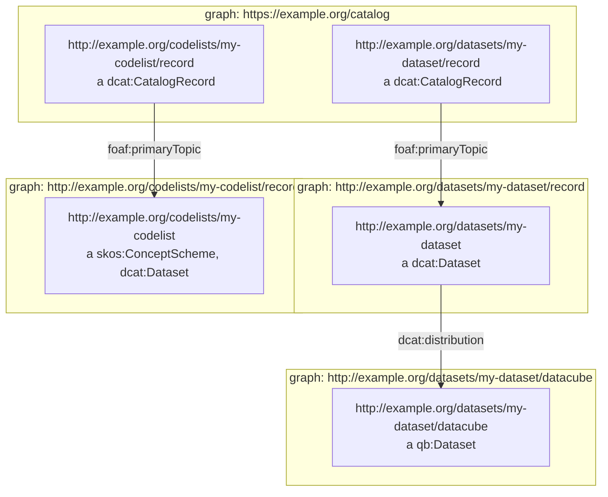

# Graphs

We represent data in RDF and compartmentalise it into graphs. This is a useful way of organising data, and is a key feature of RDF. It is also a useful way of organising data in a triple store, as it allows us to query for data in a particular graph.

To help visualise these concepts, we're going to be talking about `qb:Datasets` (i.e. tabular data), `skos:ConceptScheme` (i.e. a code list), and `dcat:CatalogRecord`. The `skos:ConceptScheme` is a `dcat:Dataset`, and the tabular dataset has distributions, which could be a `qb:Dataset` or an Excel file via `dcat:distribution`.

We recommend putting all catalog records in a single graph, and all datasets, concept schemes, and distributions in their own graphs. This is a useful way of organising data. It also allows us to query specific objets by limiting the query to a specific graph. With the overarching catalog graph, we can query for all records in the catalog, and with the dataset graph, we can query for all metadata and distributions for a specific dataset by limiting it to the subject of its record in the catalog.



## Named graphs for catalogue metadata

Where metadata is stored as RDF, such as being made available via a SPARQL endpoint, DCAT makes a recommendation about the names of graphs to use for catalogue records.

> If a catalog is represented as an RDF Dataset with named graphs (as defined in [[SPARQL11-QUERY]](https://www.w3.org/TR/sparql11-query/)), then it is appropriate to place the description of each dataset (consisting of all RDF triples that mention the dcat:Dataset, dcat:CatalogRecord, and any of its dcat:Distributions) into a separate named graph. The name of that graph SHOULD be the IRI of the catalog record.[^named-graphs]

```ttl
<http://example.org/datasets/my-dataset/record> {
    <http://example.org/datasets/my-dataset> a dcat:Dataset ;
        dcat:distribution <http://example.org/datasets/my-dataset/datacube> ;
        .
}
```

Doing this results in a neat ability to query for dataset metadata by limiting a SPARQL query to the IRI of the catalogue record.

```sparql
SELECT * 
FROM <http://example.org/datasets/my-dataset/record> 
WHERE {
    ?s ?p ?o .
}
```

## Named graphs for RDF Cube distributions

Where a `qb:Dataset` is a `dcat:distribution` is stored in a triplestore, such as being made available via a SPARQL endpoint, we recommend storing the `qb:Dataset` in a named graph with the same IRI as the distribution.

Storing multiple versions and editions of the same dataset is costly for a Triplestore, we recommend only storing a single set of observations which represents the cumulative state of the dataset (i.e. the latest version and edition of the dataset which has all observations).

```ttl
<http://example.org/datasets/my-dataset/datacube> {
    <http://example.org/datasets/my-dataset/datacube> a qb:Dataset .
    _:obs1 a qb:Observation ;
        qb:dataSet <http://example.org/datasets/my-dataset/datacube> ;
        # ... ;
        .
}
```

Doing this results in a neat ability to query for dataset by limiting a SPARQL query to the IRI of the distribution similar to the metadata query.

```sparql
SELECT * 
FROM <http://example.org/datasets/my-dataset/datacube>
WHERE {
    ?s ?p ?o .
}
```

## Named graphs for RDF code lists and concept schemes

Where a `skos:ConceptScheme` is stored in a triplestore, such as being made available via a SPARQL endpoint, we recommend storing the `skos:ConceptScheme` in a named graph with the same IRI as the concept scheme. Please note it will also be a `dcat:Dataset`.

```ttl
<http://example.org/datasets/my-codelist/record> {
    <http://example.org/codelists/my-codelist> a skos:ConceptScheme, dcat:Dataset ;
        # ...
}
```

Doing this results in a neat ability to query for code lists by limiting a SPARQL query to the IRI of the concept scheme.

```sparql
SELECT *
FROM <http://example.org/codelists/my-codelist/record>
WHERE {
    ?s ?p ?o .
}
```

[^named-graphs]: <https://www.w3.org/TR/vocab-dcat-3/#Class:Catalog_Record>

## Why do we use graphs to represent relationships

Graphs provide a powerful framework for understanding and representing relationships between entities in various domains. Here's how graphs allow us to understand relationships:

1. Graphs offer a visual representation of relationships, making it easier for humans to comprehend complex networks of connections. Nodes represent entities, while edges denote relationships between those entities. By visualising these connections, patterns and insights can be realised more intuitively.
2. Graphs allow us to understand relationships better by allowing us to determine the shortest path between two nodes or assess the overall connectedness of a network. This capability is valuable in fields such as transportation (finding optimal routes).
3. Dynamic graphs capture changes in relationships over time, enabling temporal analysis of evolving networks. By tracking how connections evolve, researchers can study the emergence of trends, patterns of influence, and the impact of external events on network dynamics.
4. Graph-based machine learning techniques, such as graph neural networks, leverage relational information encoded in graphs to make predictions or perform various tasks. By incorporating both node features and graph structure, these models can effectively capture complex relationships, enabling predictive analytics in diverse applications.

Overall, graphs serve as a versatile framework for understanding relationships in complex systems, providing both a conceptual model and a set of analytical tools for exploring the structure, dynamics, and implications of connections between entities.

## What are the advantages of using graphs

Graphs allows us to is custom-built a database to manage highly connected data. As the volume of modern data increases and it all becomes more connected, graphs present an opportunity to utilise and analyse data in a cost-effective way. Here are some advantages of using graphs:

### Flexibility

The schema and structure of graph models can change with your applications. Data analysts can add or modify existing graph structures without impacting existing functions. 

### Performance

Relational database models become less optimal as the volume and depth of relationships increase. This results in data duplication and redundancy, multiple tables need processing to discover query results. In contrast, using graphs improves performance by several orders of magnitude when querying relationships. Performance stays constant even when graph data volume increases.

### Efficiency

Graph queries are shorter and more efficient at generating the same reports compared to relational databases. Graph technologies take advantage of linked nodes. Traversing the joins or relationships is a very fast process, as the relationships between nodes are not calculated at query times but are persisted in the database.

## Back to our implementation

Reason we use graphs for a dataset and a concept scheme is because it makes it easier for us to compartmentalise these things. This makes it easier to update data and delete them in relatively straight forward way. Another benefit is the drafting functionality which allows the ability to share data to specific people (everybody, or select people with credentials), this gives us the ability to experiment with data before making it publicly available.