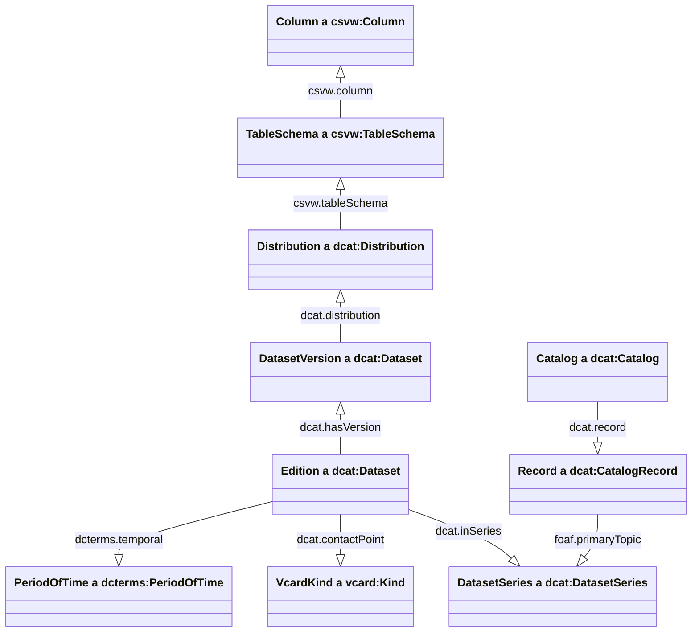
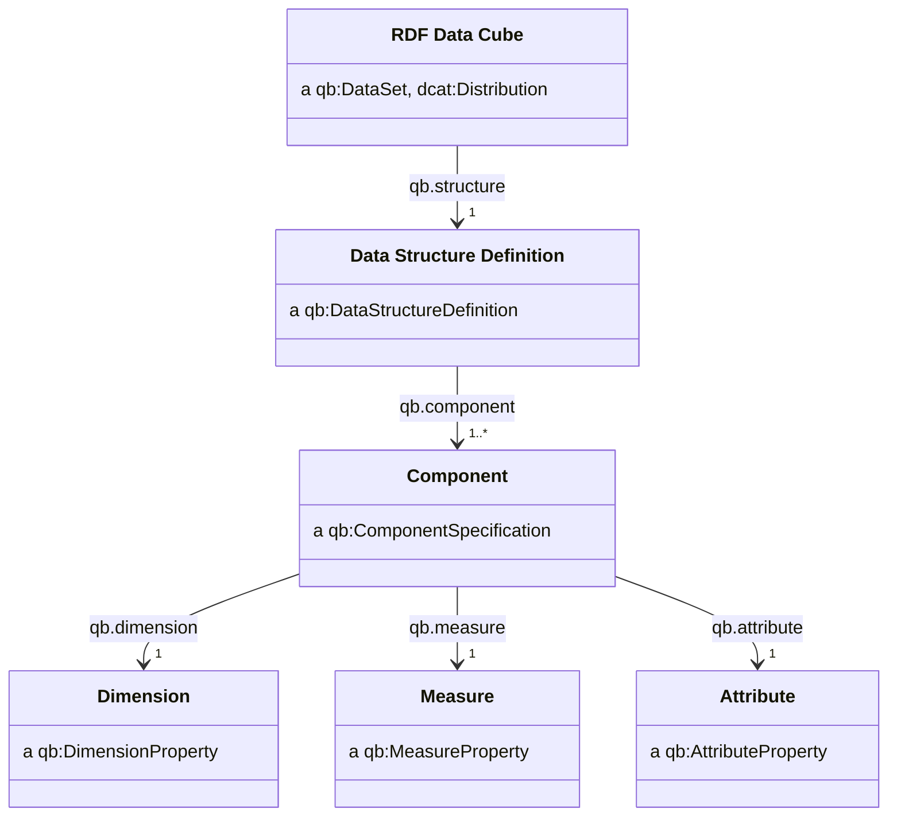
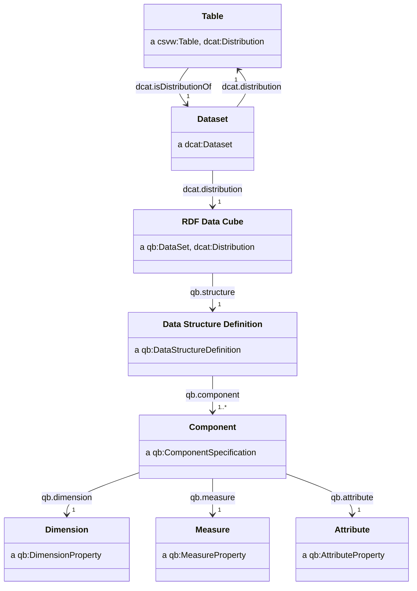

# RDF

We represent our metadata and data as RDF. This allows us to represent our data in a way which is machine-readable, and allows us to consepualise how data interrelates easier using existing vocabularies and ontologies.


## Class diagram



The [RDF data cube vocabulary](https://www.w3.org/TR/vocab-data-cube/) provides a way to provide an explicit linked-data representation of a tabular dataset.

## Classes in RDF



## Datacube

We recommend datacubes have IRIs of the form:

- `http://{dataset_iri}/datacube`
- `http://{dataset_iri}#datacube`

| Property       | Requirement level | Notes |
| -------------- | ----------------- | ----- |
| `qb:structure` | mandatory         |       |

For additional properties see [Distributions](cataloguing.md#distributions).

## Data structure definition

We recommend data structure definitions have IRIs of the form:

- `http://{dataset_iri}/datacube/structure`
- `http://{dataset_iri}#datacube/structure`

| Property       | Requirement level | Notes |
| -------------- | ----------------- | ----- |
| `qb:component` | mandatory         |       |

## Component specification

We recommend component specifications have IRIs of the form:

- `http://{dataset_iri}/datacube/component/{component_name}`
- `http://{dataset_iri}#datacube/component/{component_name}`

| Property       | Requirement level | Notes |
| -------------- | ----------------- | ----- |
| `qb:dimension` | mandatory         |       |
| `qb:measure`   | mandatory         |       |
| `qb:order`     | recommended       |       |
| `qb:attribute` | optional          |       |

## Components

The components of a data cube are its dimensions, measures and attributes.

- If components are used across many different data cubes (common dimensions such as time or geography) then we should assign an IRI which is sufficiently general and not tied to a particular dataset.
- If components are unlikely to be used across many different data cubes (for example if they are domain specific) but will be reused by cubes in the same series, then we can assign an IRI which is "local" to the dataset series.
- If components are likely to only be used within one dataset, then we can assign an IRI which is "local" to that dataset.

IRI schemes which follow this idea are:

- `http://{domain}/dimension/{dimension_name}` (example of a general IRI)
- `http://{domain}/series/name-of-my-statistical-series/dimension/{dimension_name}` (example of an IRI which is local to a dataset series)
- `http://{domain}/dataset/name-of-my-dataset/dimension/{dimension_name}` (example of an IRI which is local to a dataset)

## Measure

```ttl
ex:measure1 a qb:MeasureProperty ;
    rdfs:label "Measure 1"@en ;
    rdfs:comment "A measure property"@en ;
    rdfs:range xsd:decimal ;
    .
```

| Property             | Requirement level | Notes |
| -------------------- | ----------------- | ----- |
| `rdfs:label`         | mandatory         |       |
| `rdfs:comment`       | mandatory         |       |
| `rdfs:range`         | mandatory         |       |
| `qb:concept`         | recommended       |       |
| `rdfs:subPropertyOf` | optional          |       |

## Dimension

```ttl
ex:dimension1 a qb:DimensionProperty ;
    rdfs:label "Dimension 1"@en ;
    rdfs:comment "A dimension property"@en ;
    rdfs:range skos:Concept ;
    qb:codeList <http://data.gov.uk/codelist/some-codelist> ;
    .
```

| Property             | Requirement level | Notes                          |
| -------------------- | ----------------- | ------------------------------ |
| `rdfs:label`         | mandatory         |                                |
| `rdfs:comment`       | mandatory         |                                |
| `qb:codelist`        | recommended       | See [codelists](code-lists.md) |
| `rdfs:range`         | recommended       | Typically `skos:Concept`       |
| `qb:concept`         | recommended       |                                |
| `rdfs:subPropertyOf` | optional          |                                |

Dimensions should have an associated codelist (see [codelists](code-lists.md)).

## Attribute

```ttl
ex:attribute1 a qb:AttributeProperty ;
    rdfs:label "Attribute 1"@en ;
    rdfs:comment "An attribute property"@en ;
    rdfs:range skos:Concept ;
    qb:codeList <http://data.gov.uk/codelist/statistical-markers> ;
    .
```

| Property             | Requirement level | Notes                          |
| -------------------- | ----------------- | ------------------------------ |
| `rdfs:label`         | mandatory         |                                |
| `rdfs:comment`       | mandatory         |                                |
| `qb:codelist`        | recommended       | See [codelists](code-lists.md) |
| `rdfs:range`         | recommended       | Typically `skos:Concept`       |
| `qb:concept`         | recommended       |                                |
| `rdfs:subPropertyOf` | optional          |                                |

We allow attributes to be attached to a list of of values via `qb:codeList`.

## Observation

The dimensions form a composite key for each observation in the cube - meaning the combination of dimensions can be used to uniquely identify each observation in the cube. Note that a measure is a dimension.

We recommend IRIs for observations be of the form:

- `http://{domain}/datacube/obs/{dimension_1}-{...}-{dimension_n}`
- `http://{domain}#datacube/obs/{dimension_1}-{...}-{dimension_n}`

For example:

- `http://data.gov.uk/dataset/life-expectancy-by-region-sex-and-time/datacube/obs/W06000022-2004-01-01T00:00:00/P3Y-Male`

## Using CSVW to create a RDF data cube

A CSVW provides a way for the rows, cells and column headers of a CSV files to be mapped to RDF resources.

The CSVW specification also describes a method for [transforming CSV files into RDF](https://www.w3.org/TR/csv2rdf/). By doing so, we can generate an RDF data cube. The idea is to use the CSVW `aboutUrl`, `propertyUrl` and `valueUrl` to construct triples from the CSV data.

Given a CSVW with a column specification as follows:

```jsonc
    // ...
    "tableSchema": {
        "columns": [
            {
                "name": "geography",
                "titles": "geography",
                "datatype": "string",
                "propertyUrl": "http://data.gov.uk/dataset/life-expectancy-by-region-sex-and-time/dimension/geography",
                "valueUrl": "http://statistics.data.gov.uk/id/statistical-geography/{geography}"
            },
            // ...
        ],
        "aboutUrl": "http://data.gov.uk/dataset/life-expectancy-by-region-sex-and-time/datacube/obs/{+geography}-{+period}-{+sex}"
```

The `aboutUrl`, `propertyUrl` and `valueUrl` and the CSV data produce triples as follows:

```ttl
<http://data.gov.uk/dataset/life-expectancy-by-region-sex-and-time/datacube/obs/W06000022-2004-01-01T00:00:00/P3Y-Male>
  <http://data.gov.uk/dataset/life-expectancy-by-region-sex-and-time/dimension/geography>
    <http://statistics.data.gov.uk/id/statistical-geography/W06000022> ;
    # ...
    .
```

For example, we can represent the relationships between the following resources within a single CSVW metadata file:

- a dataset: `<http://data.gov.uk/dataset/my-dataset>`
- a CSV distribution of that dataset: `<http://data.gov.uk/dataset/my-dataset.csv>`
- an RDF data cube distribution of that dataset: `<http://data.gov.uk/dataset/my-dataset/datacube>`

Our recommended format for a CSVW is as follows. Note the use of virtual columns within the CSVW `columns` definition to assert additional RDF relationships when converting CSV to RDF.

```jsonc
{
    "@context": "http://www.w3.org/ns/csvw",
    "@id": "http://data.gov.uk/dataset/my-dataset.csv",
    "url": "http://data.gov.uk/dataset/my-dataset.csv",
    "tableSchema": {
        "columns": [
            // CSVW column definitions,
            // ...
            {
                "virtual": true,
                "propertyUrl": "rdf:type",
                "valueUrl": "qb:Observation"
            },
            {
                "virtual": true,
                "propertyUrl": "qb:dataSet",
                "valueUrl": "http://data.gov.uk/dataset/my-dataset/datacube"
            }
        ]
    },
    "dcat:mediaType": {
        "@id": "http://www.w3.org/ns/iana/media-types/text/csv#Resource"
    },
    "dcat:isDistributionOf": {
        "@id": "http://data.gov.uk/dataset/my-dataset",
        "@type": "dcat:Dataset",
        "dcat:distribution": [
            {
                "@id": "http://data.gov.uk/dataset/my-dataset.csv",
                "@type": "dcat:Distribution"
            },
            {
                "@id": "http://data.gov.uk/dataset/my-dataset/datacube",
                "@type": [
                    "qb:DataSet",
                    "dcat:Distribution"
                ],
                "qb:structure": {
                    "@id": "http://data.gov.uk/dataset/my-dataset/datacube/structure",
                    "@type": "qb:DataStructureDefinition",
                    "qb:component": [
                        // dimension, measures, attributes...
                    ]
                }
            }
        ]
    }
}
```

Diagramatically, the CSV distribution, the dataset and the RDF data cube distribution (and its components) are related in the following way:



We may then generate an RDF representation of the data which describes an RDF data cube, using a CSVW and following the approach as set out in [Generating RDF from Tabular Data on the Web](https://www.w3.org/TR/csv2rdf/).

## Multiple measures

We adopt the [measure dimension](https://www.w3.org/TR/vocab-data-cube/#dfn-measure-dimension) approach as, unlike the [multi-measure observations](https://www.w3.org/TR/vocab-data-cube/#dsd-mm-obs) approach, this allows us to specify measure-specific and observation-specific attributes.

We include a column in the CSV which specifies the measure for each observation.

| geography      | period                  | sex    | measure_type                    | value | marker |
| --------- | ----------------------- | ------ | ------------------------------- | ----- | ------ |
| W06000022 | 2004-01-01T00:00:00/P3Y | Male   | life-expectancy                 | 76.7  |        |
| W06000022 | 2004-01-01T00:00:00/P3Y | Female | life-expectancy                 | 80.7  |        |
| W06000022 | 2004-01-01T00:00:00/P3Y | Male   | disability-free-life-expectancy | 70.1  |        |
| W06000022 | 2004-01-01T00:00:00/P3Y | Female | disability-free-life-expectancy | 80.2  | [p]    |
| W06000015 | 2004-01-01T00:00:00/P3Y | Male   | life-expectancy                 | 78.7  |        |
| W06000015 | 2004-01-01T00:00:00/P3Y | Female | life-expectancy                 |       | [x]    |
| ...       | ...                     | ...    | ...                             | ...   |        |

Within the CSVW metadata, we add a column definition for the measure dimension and values columns look as follows:

```json
{
    "titles": "measure_type",
    "name": "measure_type",
    "propertyUrl": "qb:measureType",
    "valueUrl": "http://{domain}/dataset/name-of-my-dataset/measure/{measure_type}"
},
{
    "titles": "value",
    "name": "value",
    "propertyUrl": "http://{domain}/dataset/name-of-my-dataset/measure/{measure_type}"
}
```

```ttl
<http://data.gov.uk/dataset/life-expectancy-by-region-sex-and-time/datacube/obs/W06000022-2004-01-01T00:00:00/P3Y-Male> a qb:Observation ;
    # geography, period, sex, ...
    qb:measureType
        <http://data.gov.uk/dataset/life-expectancy-by-region-sex-and-time/measure/life-expectancy> ;
    <http://data.gov.uk/dataset/life-expectancy-by-region-sex-and-time/measure/life-expectancy>
        76.7 ;
    .
```
