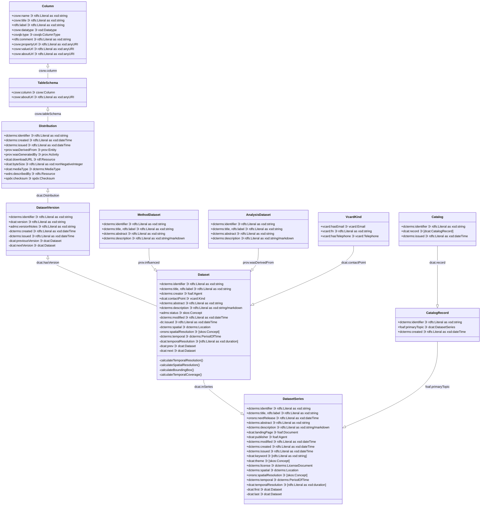

# Object Model

## Some definitions
### Dataset metadata surrounding the publication, issuance, modification, etc.

We make the following assumptions, that a dataset will be created prior to its publications.

For datasetVersion:
* `dcterms:created` - the date the dataset earliest version was created in system
* `dcterms:issued` - the date the dataset was published for public consumption

For dataset:
* `dcterms:created` - the date the earliest dataset version created in system
* `dcterms:issued` - the date the earliest dataset version was first published for public consumption
* `dcterms:modified` - the date the newest dataset version created in system

For datasetSeries:
* `dcterms:created` - the date the earliest dataset created in system
* `dcterms:issued` - the date the earliest dataset was first published for public consumption
* `dcterms:modified` - the date the newest dataset created in system